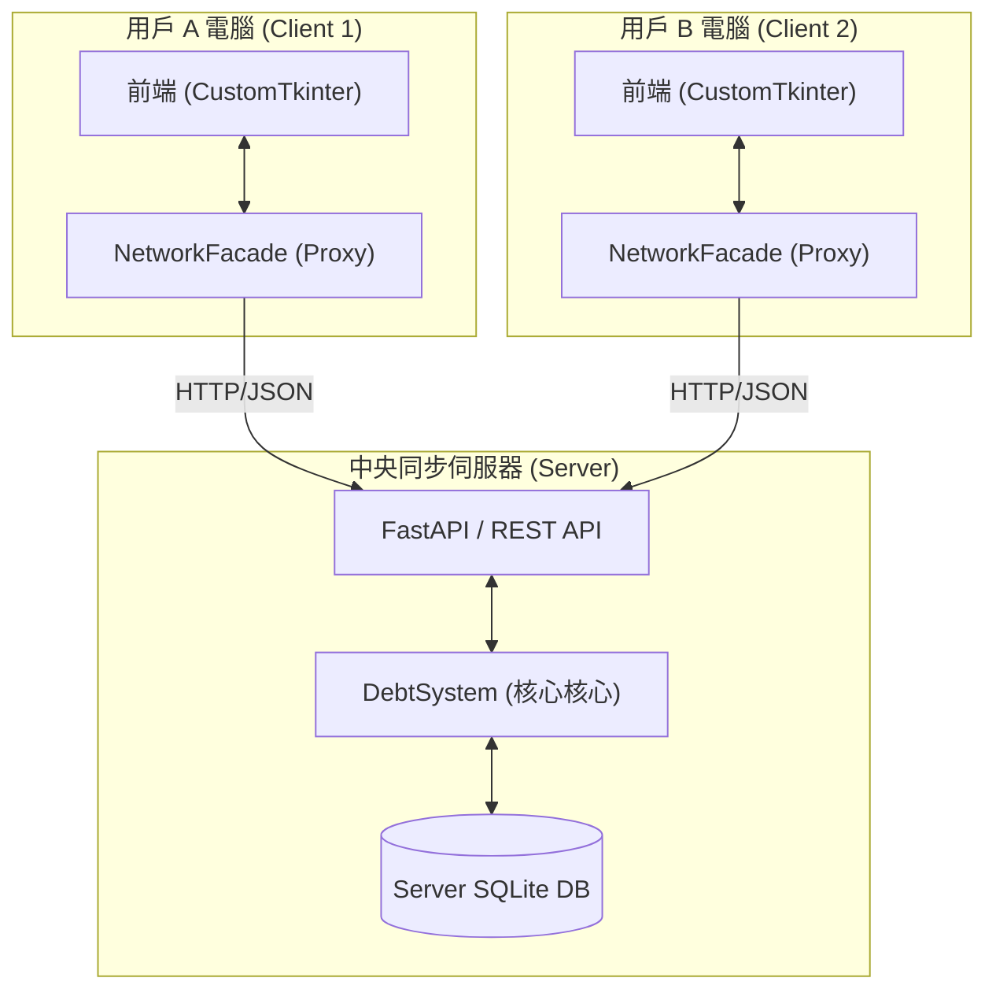

# 多人群組本地帳務系統 (Hybrid Mode)
## 1. 專案情境與價值

在多人共同活動（如集體旅遊、朋友聚餐、合租生活）中，消費記錄與後續的債務結算往往是件繁瑣且容易出錯的事。雖然市面上已有許多分帳 App，但往往面臨隱私外洩、介面過於複雜、或必須依賴雲端伺服器才能運作的限制。

**「多人群組本地帳務系統 (group ledger)」** 提供了一個 **「隱私優先、可選同步」** 的個人與群組記帳平台。

### 專案價值主張：
1. **數據主權與隱私 (Privacy First)**
   - 預設數據儲存在本地 SQLite。
   - 使用者可選擇啟動私有的中央伺服器進行同步，數據不經由第三方商業平台。

2. **[NEW] 多端即時同步 (Multi-device Sync)**
   - 透過全新的 **FastAPI 伺服器** 架構，多個使用者可以同時在不同裝置上記帳，並即時看到夥伴的更新。

3. **從個人到群組的無縫切換 (Dual-mode Integration)**
   - 使用者可在同一個介面管理私密開銷與共享分帳，無需切換 App。

4. **狀態化債務管理 (Lifecycle Management)**
   - 每筆交易具備 PENDING/CONFIRMED/SETTLED 完整生命週期，降低帳務糾葛。

---

## 2. 系統架構圖 (System Architecture)

### [NEW] 連網同步模式 (Online Mode)

---

## 3. [NEW] 核心技術實作與概念

### 3.1 [NEW] 代理人模式與 REST API (Proxy Pattern)
系統導入了 **NetworkFacade** 作為網絡代理。前端介面代碼無需修改，只需更換注入的物件，即可從「讀取本地文件」切換為「發送 HTTP 請求」至遠端伺服器，實現無縫的連網轉型。

### 3.2 高可靠 UUID 全域標識碼
為了支援多端併發操作，交易 ID 採用 12 位 UUID，確保不同電腦同時記帳時不會產生 ID 衝突。

### 3.3 現代化桌面介面 (CustomTkinter GUI)
採用 **CustomTkinter** 框架，支援跨平台的高 DPI 縮放與原生深色模式。

---

## 4. 特色功能與演算法

### 4.1 債務生命週期狀態機 (Debt State Machine)
- **Pending (待確認)**：代付後等待相關成員勾選確認。
- **Confirmed (已確認)**：債務正式生效，列入結算清單。
- **Settled (已結清)**：還款完成，紀錄存檔。

### 4.2 智慧結算與抵銷 (Simplified Settlement)
內建貪婪演算法，自動將網狀的「A欠B、B欠C」抵銷為「A欠C」，將轉帳次數極小化。

### 4.3 數據分析與視覺化 (Data Analysis)
利用 Matplotlib 產生消費分布圓餅圖與趨勢報表。

---

## 5. 總結

**「多人群組本地帳務系統」** 證明了在追求便利同步的同時，依然能保有數據隱私的控制權。不管是離線旅記還是多人長期合租，系統都能提供最穩健且清晰的帳務支援。