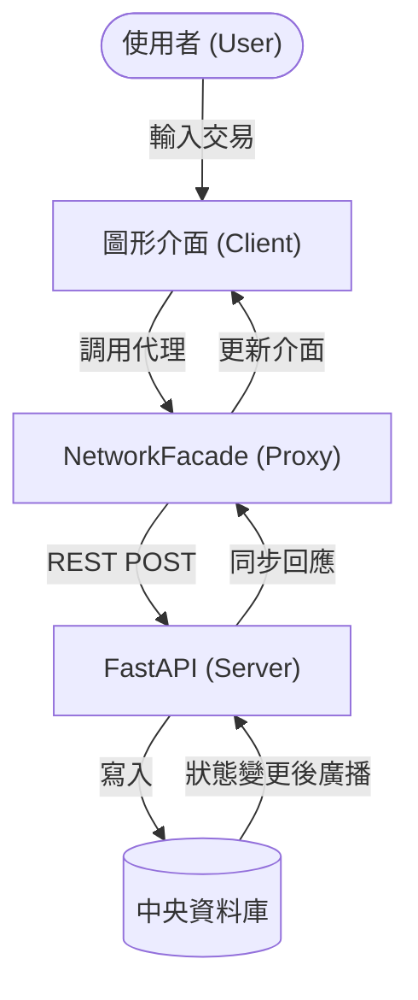

# 多人分帳系統：連網同步機制與債務抵銷演算法實作
## 專題計畫書

### 摘要
本系統以 Python + Tkinter 桌面應用程式為實作基礎。針對多人群組中頻繁發生的代墊款項結算問題，設計了一套具備 **[NEW] 多端連網同步** 與 **非同步確認流程** 的分帳系統。

系統的核心設計包含三個面向：
1. **[NEW] 多人網路同步 (Sync Mode)**：透過 FastAPI 實作中央伺服器，解決跨裝置數據不一致的問題。
2. **非同步驗證機制**：採用交易狀態機（Pending → Confirmed），確保帳務透明。
3. **債務抵銷演算法**：利用圖論簡化算法將複雜債務極簡化。

---

### 1. 前言
在多人群租或社交情境中，代墊款項本質上是高度碎片化的交易。本系統透過 **[NEW] FastAPI 後端同步架構**，不僅解決了本地端紀錄的局限性，更實現了即時的群組動態對帳。

---

### 2. 執行方法及步驟

#### 2.1 資料蒐集與分析
*   **使用者與群組模型**：採用 UUID 作為唯一識別碼。
*   **資料庫建置**：同時維護本地與伺服器端的 SQLite 資料庫。

#### 2.2 [NEW] 多人同步與隔離機制
*   **[NEW] 代理人模式 (Proxy Pattern)**：實作 `network_facade.py`，將所有 GUI 呼叫透明地導向伺服器。
*   **[NEW] REST API 封裝**：定義完整的 REST 控制器，處理群組建立、加入與交易同步。

#### 2.3 分帳計算與交易狀態機
*   **交易驗證**：交易預設為 Pending，須經成員確認才轉為 Confirmed。
*   **狀態機自動躍遷**：一旦全員點擊確認，伺服器自動更新主表狀態。

#### 2.4 自動化催告與期限控管
*   **動態還款期限**：依金額建議還款天數。
*   **[NEW] 線上連通檢查**：客戶端啟動時自動檢查伺服器連線狀態。

---

### 3. [NEW] 連網模式數據流圖 (DFD)



---

### 4. [NEW] 技術棧總整理

| 類別 | 技術 / 套件 | [NEW] 標註 |
| :--- | :--- | :--- |
| **後端框架** | FastAPI / Uvicorn | [NEW] |
| **網路通訊** | Requests (HTTP/JSON) | [NEW] |
| **GUI 框架** | CustomTkinter | |
| **資料庫** | SQLite 3 | |
| **演算法** | 貪婪抵銷演算法 | |

---

### 5. 預期成果 (已達成)
1. **[NEW] 多人即時同步**：解決了「對話紀錄翻不完」的痛點，多裝置即時同步。
2. **三階狀態機帳本**：確保每筆支出的確認透明度。
3. **極簡化還款路徑**：自動計算最優還款建議。
4. **現代化視覺 UI**：支援深色模式與動態報表。
" --> Service
    Service -- "5. 顯示待確認項目" --> GUI
    User -- "6. 點擊確認交易" --> GUI
    GUI -- "7. 更新確認狀態" --> Service
    Service -- "8. 標記為已入帳 (CONFIRMED)" --> DB

    %% 3. 結算流程
    User -- "9. 發起債務結算" --> GUI
    GUI -- "10. 執行抵銷計算" --> Service
    DB -- "11. 取得所有淨額報表" --> Service
    Service -- "12. 運行抵銷演算法 (Greedy)" --> Service
    Service -- "13. 建立還款交易並結案" --> DB

    %% 4. 統計與報表
    DB -- "14. 提取歷史帳務" --> Service
    Service -- "15. 彙整統計數據" --> Viz
    Viz -- "16. 繪製視覺化圖表" --> GUI
    GUI -- "17. 呈現財務報表" --> User
```

### 資料流關鍵說明：
1.  **狀態機轉換**：數據的核心狀態流向為 `PENDING` (待確認) -> `CONFIRMED` (已入帳/待結) -> `SETTLED` (已結清)。
2.  **非同步確認**：交易發起後不會立即改變餘額，必須經過 `transaction_participants` 表中的成員確認後，數據才會流向「待結算」池。
3.  **抵銷邏輯**：在結算過程中，數據會先匯總成淨額 (Net Balances)，再由演算法計算出最精簡的轉帳路徑，產生類型為 `SETTLEMENT` 的新交易流。

##### 4.6.2 債務抵銷演算法介紹
本系統採用的簡化結算模式（SIMPLIFIED）核心使用了 **貪婪演算法 (Greedy Algorithm)** 來極小化群組動態結算時的轉帳次數。

## 1. 演算法名稱
我們稱之為 **「多方淨額抵銷演算法」(Greedy Debt Minimization)**。

## 2. 核心原理
該演算法的核心思想是：**不論中間經過多少次代墊，最後只需要讓「應付出的總額」流向「應收到的總額」即可。**

這是一個典型的抵銷邏輯：
- 如果 A 欠 B 100 元，B 欠 C 100 元。
- 傳統方式：需要兩次轉帳（A->B, B->C）。
- 抵銷方式：只需要 A 轉帳 100 元給 C。其餘債務自動消失。

## 3. 運行步驟
系統在 `group_service.py` 中的 `settle_debts` 方法按以下步驟執行：

1.  **計算淨餘額 (Net Balance)**：
    統計群組內每個人所有的應收與應付，算出一個最終數字。正數代表應收（債權人），負數代表應付（債務人）。
2.  **分類與排序**：
    將所有人分為「債務人清單」與「債權人清單」，並根據金額大小進行排序。
3.  **貪婪匹配 (Greedy Matching)**：
    讓金額最大的債務人優先配對金額最大的債權人，直接進行轉帳操作。
4.  **動態更新**：
    每次配對後，更新該兩人的餘額，若有人歸零則移出清單，重複直到所有人餘額都處理完畢。

## 4. 為何選擇此演算法？
-   **直觀高效**：演算法時間複雜度為 $O(N \log N)$，對於一般群組（數十人以內）可以在毫秒內完成。
-   **最小轉帳次數**：在大多數情況下，能從網狀的 $N(N-1)$ 個交易路徑縮減到不超過 $N-1$ 次交易。

---
> [!TIP]
> 這種演算法與知名分帳 App "Splitwise" 的結算邏輯非常相似，能有效降低社交場合中频繁轉帳的尷尬與麻煩。

---

### 5. 技術棧總整理

| 類別 | 技術 / 套件 | 用途 |
| :--- | :--- | :--- |
| **程式語言** | Python 3.x | 全端開發語言[cite: 4] |
| **GUI 框架** | Tkinter | 桌面應用程式介面[cite: 4] |
| **日曆元件** | tkcalendar | 日曆視圖介面[cite: 4] |
| **資料庫** | SQLite | 本地端帳本資料儲存[cite: 4] |
| **視覺化** | matplotlib | 圖表生成[cite: 4] |
| **QR Code** | qrcode | 個人識別與加好友[cite: 4] |
| **版本控制** | Git | 程式碼管理與協作[cite: 4] |

---

### 6. 預期成果
1. **非同步驗證帳本**：解決多人記帳的時序混亂與確認衝突[cite: 4]。
2. **UX 核心結算模組**：保留原始債權，並提供可選的債務化簡模式[cite: 4]。
3. **自動到期提醒系統**：啟動時自動掃描，以客觀文字提醒清償項目[cite: 4]。
4. **視覺化月度報表**：提供圖表統計與完整的技術文件[cite: 4]。
5. **全局記帳與私帳功能**：提供隨時可用的快速記帳按鈕，並支持個人私密消費紀錄[cite: 4]。

---

### 參考文獻
[1] Leslie Lamport, Time, Clocks, and the Ordering of Events in a Distributed System, 1978.[cite: 4]
[2] Andrew S. Tanenbaum, Distributed Systems: Principles and Paradigms, 2017.[cite: 4]
[3] Jakob Nielsen, Usability Engineering, 1994.[cite: 4]
[4] SQLite Documentation, https://www.sqlite.org/docs.html[cite: 4]
[5] Tkinter Documentation, Python Software Foundation.[cite: 4]
[6] matplotlib Documentation, https://matplotlib.org/stable/index.html[cite: 4]