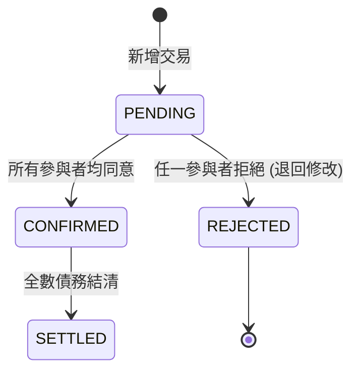
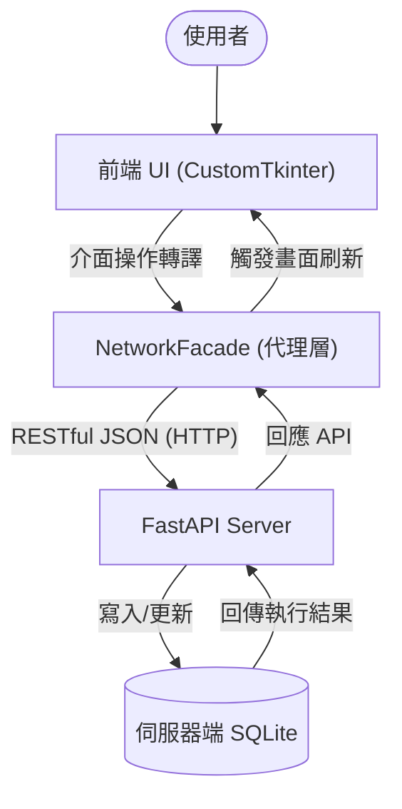

# Group Ledger - 專案技術手冊與完整說明文件

> [!IMPORTANT]
> 本文件為 Group Ledger 專案的權威技術手冊，所有內容皆對應實際的 Python 原始碼，不含任何未實作之提案構想。

---

## 1. 專案總覽 (Project Overview)

### 1.1 系統介紹
在多人共同活動（如集體旅遊、朋友聚餐、合租生活）中，消費記錄與後續的債務結算往往是件繁瑣的事。
**「多人群組本地帳務系統 (Group Ledger)」** 透過 **CustomTkinter** 現代化桌面介面與 **SQLite** 資料持久化，提供了一個整合個人記帳與群組分帳的解決方案。

### 1.2 確切實作價值
1. **多端即時同步 (Multi-device Sync)**：基於 **FastAPI** 構建的中央伺服器與 REST API，解決多裝置資料不一致的問題。
2. **狀態化帳本 (Lifecycle Management)**：每筆交易強制遵循 `PENDING` -> `CONFIRMED` -> `SETTLED` 生命週期，支援防呆的「一票否決 (REJECTED)」保護機制。
3. **智慧結算 (Greedy Debt Minimization)**：內建多方淨額抵銷演算法，自動將網狀的「A欠B、B欠C」化簡為最少次數的還款建議。
4. **高併發防護 (UUID)**：捨棄傳統自增整數，全面採用 UUID v4 作為交易與用戶的唯一識別碼，實現分散式離線也能無衝突新增帳務。

---

## 2. 系統架構 (System Architecture)

本系統採「本地為輔，伺服器為主」之混合架構（Hybrid Mode），透過代理人模式降低前端耦合：

### 2.1 連網模式數據流圖


---

## 3. 核心技術與演算法實作 (Core Implementations)

### 3.1 三階狀態機 (State Machine)
系統在 `shared/models.py` 中嚴格定義了交易的三大狀態。只有在參與者按下「確認」後，款項才會正式列入「待結算」餘額。若任意參與者發現異常點擊「拒絕」，將會退回重整。



### 3.2 代理人網路同步 (Network Facade)
原先系統將所有邏輯緊耦合於本地資料庫。為達到連網多端同步，我們實作了 `app/intelligence/network_facade.py` 作為中介 Proxy：
- 攔截前端所有 `propose_transaction` 或 `settle_debts` 呼叫。
- 利用 Python `requests` 模組透過 HTTP 將資料傳遞給位於 `backend/server/app.py` 的 FastAPI 服務器。

### 3.3 智慧結算與抵銷演算法 (Greedy Algorithm)
在 `app/groups/group_service.py` 中使用的算法核心：
1. **計算淨值 (Net Balance)**：收支相抵的總額。
2. **分離陣營**：將參與者分為「總負債人(Debtors)」與「總債權人(Creditors)」。
3. **貪婪配對**：由欠最多錢的人，優先還給代墊最多錢的人。持續循環，將原本最多需 N(N-1) 次的轉帳降到極簡次數。

---

## 4. 模組化目錄結構 (Modular Architecture) [UPDATED]

專案已完成模組化遷移，以下為新版結構說明：

- **`auth/`** : 認證模組 (Login/Auth)
- **`personal/`** : 個人模組 (Personal UI & Service)
- **`groups/`** : 群組模組 (Group UI & Service)
- **`intelligence/`** : 門面與智慧核心 (DebtSystem Facade)
- **`analysis/`** : 數據分析模組 (Charts & Calendar)
- **`shared/`** : 共享資源、模型與數據 (Data, Models, BaseService)
- **`doc/`** : 存放本說明文件與資料庫 SQL 紀錄
- **`tools/`** : 存放拉取、上傳與維護用的自動化工具

---

## 5. 專案開發協作與完整 SOP

### 5.1 每日開工同步規範
1. **基線同步 (`tools/sync_latest.bat`)**：每天寫程式前，請執行以取得最新版本與資料庫更新。
2. **連網上傳 (`tools/upload_changes.bat`)**：開發完成後，以此工具自動化提交變更。


# Group Ledger - 專案技術手冊與完整說明文件

> [!IMPORTANT]
> 本文件為 Group Ledger 專案的權威技術手冊，所有內容皆對應實際的 Python 原始碼，不含任何未實作之提案構想。

---

## 1. 專案總覽 (Project Overview)

### 1.1 系統介紹
在多人共同活動（如集體旅遊、朋友聚餐、合租生活）中，消費記錄與後續的債務結算往往是件繁瑣的事。
**「多人群組本地帳務系統 (Group Ledger)」** 透過 **CustomTkinter** 現代化桌面介面與 **SQLite** 資料持久化，提供了一個整合個人記帳與群組分帳的解決方案。

### 1.2 確切實作價值
1. **多端即時同步 (Multi-device Sync)**：基於 **FastAPI** 構建的中央伺服器與 REST API，解決多裝置資料不一致的問題。
2. **狀態化帳本 (Lifecycle Management)**：每筆交易強制遵循 `PENDING` -> `CONFIRMED` -> `SETTLED` 生命週期，支援防呆的「一票否決 (REJECTED)」保護機制。
3. **智慧結算 (Greedy Debt Minimization)**：內建多方淨額抵銷演算法，自動將網狀的「A欠B、B欠C」化簡為最少次數的還款建議。
4. **高併發防護 (UUID)**：捨棄傳統自增整數，全面採用 UUID v4 作為交易與用戶的唯一識別碼，實現分散式離線也能無衝突新增帳務。

---

## 2. 系統架構 (System Architecture)

本系統採「本地為輔，伺服器為主」之混合架構（Hybrid Mode），透過代理人模式降低前端耦合：

### 2.1 連網模式數據流圖


---

## 3. 核心技術與演算法實作 (Core Implementations)

### 3.1 三階狀態機 (State Machine)
系統在 `backend/core/models.py` 中嚴格定義了交易的三大狀態。只有在參與者按下「確認」後，款項才會正式列入「待結算」餘額。若任意參與者發現異常點擊「拒絕」，將會退回重整。


### 3.2 代理人網路同步 (Network Facade)
原先系統將所有邏輯緊耦合於本地資料庫。為達到連網多端同步，我們實作了 `backend/core/network_facade.py` 作為中介 Proxy：
- 攔截前端所有 `propose_transaction` 或 `settle_debts` 呼叫。
- 利用 Python `requests` 模組透過 HTTP 將資料傳遞給位於 `backend/server/app.py` 的 FastAPI 服務器。

### 3.3 智慧結算與抵銷演算法 (Greedy Algorithm)
在 `backend/core/group_service.py` 中使用的算法核心：
1. **計算淨值 (Net Balance)**：收支相抵的總額。
2. **分離陣營**：將參與者分為「總負債人(Debtors)」與「總債權人(Creditors)」。
3. **貪婪配對**：由欠最多錢的人，優先還給代墊最多錢的人。持續循環，將原本最多需 N(N-1) 次的轉帳降到極簡次數。

### 3.4 精準交易均分邏輯 (Remainder Logic)
處理除不盡的餘數（如 100 元三人分時的加 1 補償）。
```python
# 系統將前 rem 位參與者的帳務多分配 1 元，確保總分配金額絕對精確無誤差
splits[uid] = base + (1 if i < rem else 0)
```

### 3.5 隨機高強度邀請碼 (Random Join Code)
為防止暴力遞推破解，系統生成 6 碼大寫英文字母與數字的組合。
```python
join_code = ''.join(random.choices(string.ascii_uppercase + string.digits, k=6))
```

### 3.6 前端依賴注入架構設計 (Dependency Injection)
為了維持「高內聚、低耦合」，前端框架捨棄了各組件各自連線資料庫的設計。
所有繼承 `CTkFrame` 的子介面在實例化時，都會透過主視窗 `AccountingGUI` 被強制注入 `system` 物件。這使得所有 UI 介面層皆不再處理連線底層，而是透過 `self.system` 來觸發網路請求與數據撈取。

---

## 4. 目錄結構與深度模組拆解

本專案採前端展示與後端業務切割的模組化概念，以下為系統各個模組的深度技術解析：

### 4.1 後端核心 (Backend / Core)
#### 1. `models.py` ：狀態與型別枚舉 (Enums)
全域定義，確保系統語義一致：
- **TransactionStatus**: `PENDING`(待驗證)、`CONFIRMED`(已確認)、`REJECTED`(已拒絕)、`SETTLED`(已結清)。
- **TransactionType**: `EXPENSE`(消費)、`SETTLEMENT`(還款)。

#### 2. `base.py` ：資料庫基礎設施
- **連線管理 (`_get_connection`)**：集中封裝 SQLite 連接邏輯，確保系統所有的服務層皆連動至同一個本地資料庫路徑，維持資料一致性。
- **結構初始化 (`_init_db`)**：負責建立群組、成員、交易及參與者等核心資料表，定義欄位約束，啟動即可自動佈署。

#### 3. `group_service.py` ：核心業務邏輯
負責處理分帳、預算與貪婪結算：
- **餘額分析 (`get_group_balances`)**：遍歷所有已確認交易，動態匯總每位成員的債權與債務，為結算演算法提供基準數據。
- **清單摘要 (`generate_group_bill_summary`)**：將枯燥資料轉化為清晰的人讀摘要，包含應收/付明細與路徑，方便複製轉傳至通訊軟體。
- **異步狀態同步 (`confirm_transaction`)**：狀態機防呆觸發邏輯，當最後一位成員提交確認後，系統自動將整筆交易提升至已確認狀態。
- **催帳通知 (`get_notification_message`)**：針對特定交易生成包含金額、時間與未確認成員名單的格式化訊息。

#### 4. `network_facade.py` ：連網代理模式 (Proxy)
- **REST 封裝**：將所有 `GroupService` 的本地端調用轉換為 HTTP JSON API 請求。前端零感知即可與遠端 `FastAPI` 伺服器對接。

#### 5. `db_update.py` ：資料庫動態校驗更新
- **校驗機制 (`update_schema`)**：透過 `PRAGMA table_info` 檢查各表結構，若發現遺漏欄位則自動觸發發起 `ALTER TABLE` 補齊。

#### 6. `main.py` ：系統整合門面 (Facade)
繼承並整合 `PersonalService` 與 `GroupService`，為 UI 提供統一接口：
- **批量結算 (`settle_specific_debts`)**：支援一鍵結清，自動產生 `SETTLEMENT` 的對應還款記錄。
- **累積餘額計算 (`calculate_balances`)**：運算出各群組的最終損益點滴。
- **逾期掃描 (`check_overdue_transactions`)**：自動化期限提醒系統，依金額大小判斷合適的還款期限警示。

#### 7. `personal_service.py` ：個人社交與帳務管理
- **交接整合 (`generate_qr_path`)**：將 User ID 編碼為名片 QR Code 圖片，便於確認身份。
- **獨立債務匯總 (`get_personal_debts`)**：區分「應付」與「應收」，從全域中過濾出與自己直接相關的財務項。
- **結清申請 (`request_settlement`)**：點對點發起還款。

---

### 4.2 前端介面 (Frontend / UI)
#### 1. `AccountingGUI.py` ：系統主入口與跨頁驅動
- **數據聯動 (`refresh_ui`)**：使用依賴注入架構。切換不同群組時同步觸發各 UI Frame 的刷新以防資料撕裂。
- **背景執行緒 (`run_scheduler`)**：啟動獨立 Thread 行使背景任務，防止 CustomTkinter 的主渲染圈被阻塞。

#### 2. `analysis/` ：數據分析與圖表繪製
- **動態圖餅圖 (`update_chart`)**：透過 `Matplotlib` 的 `FigureCanvasTkAgg`，抓取歷史紀錄後將資料轉換成漂亮的圓餅分佈鑲崁進視窗中。

#### 3. `components / dialogs.py` ：解耦彈窗組件
- **回調機制 (Callback)**：將使用者的動作封裝後透過 callback 觸發，保證了 UI 負責圖形，不會偷藏商業邏輯。

#### 4. `group_frame.py` ：群組空間面板
- **智慧結算交互 (`handle_settle`)**：讓使用者能夠自選「逐筆結算」或是打開「貪婪抵銷算法」。
- **動態佈告與催款 (`handle_notify`)**：生成預算超出紅綠燈燈號，以及擷取逾期資訊。

#### 5. `personal_frame.py` ：個人主控儀表板
- **淨資產計算 (`load_real_data`)**：統整所有關聯群組數字算出一總結資產。
- **一鍵確認行為 (`do_confirm`)**：把交易推進 `CONFIRMED` 狀態。

#### 6. `friends_frame.py` ：單向好友列表
- **優先權排序 (`refresh`)**：基於財務相關數值絕對值大小自動將最重要的欠款對象排序置頂。
- **結清指引 (`open_repay_dialog`)**：專注一對一的人際還款指引。

---

### 4.3 伺服器與資料庫定義 (Server & Doc)
#### 1. `server/app.py` 
伺服器端核心。使用 FastAPI 與 Uvicorn 提供遠端 `sqlite` 連線，透過 Pydantic 定義 JSON 格式保障寫入規範。
#### 2. `doc/*.sql`
定義 `groups`, `transactions` 的 `schema.sql` 與儲存疊代異動歷史的 `migrations.sql`。

---

## 5. 實戰情境模擬與聯測 (Testing & Scenarios)

為了驗證系統在大型活動中的狀態一致性，定義了以下標準**「日本五人旅遊」**情境：

### 階段一：聯網環境準備
- **伺服啟動**：雙擊 `start_server.bat`。
- **多端客戶連線**：開啟 5 個客戶端 (`run_online.bat`)，分別登入 User A、B、C、D、E。

### 階段二：大型支出預付 (同步測試)
- **情境發起**：User_A 發起了 $100,000 元的機票費用。
- **[NEW] 即時同步驗證**：B, C, D, E 客戶端須在進入群組後立刻看見推播過來的 `PENDING` 帳單，全員點擊確認後轉為 `CONFIRMED`。

### 階段三：防呆與異常阻絕 (一票否決測試)
- **情境發起**：User_B 發起新宿拉麵 $5,000 的消費。
- **異常攔截**：User_C 從客戶端點擊「有誤拒絕 (`REJECTED`)」。
- **全域連動回傳**：全網的這筆交易應立即轉為**紅色標記**，且系統必須禁止將此筆交易列入個人的預算圖表計算內。

### 階段四：返台一鍵結算 (Greedy Algorithm 驗證)
- **最佳化與多筆核銷**：系統必須能在千絲萬縷的互相代墊下，準確結算出不多於 $(N-1)$ 次的還款建議路徑。當完成所有步驟，主介面上的總負債金額將自動歸零 (`SETTLED`)。

---

## 6. 技術棧清單 (True Tech Stack)

| 技術名稱 | 用途說明 | 實際套件名稱 |
| :--- | :--- | :--- |
| **FastAPI** | 實作高效能非同步 API 端點，使多端設備能同時向伺服器寫入帳務 | `fastapi`, `uvicorn` |
| **HTTP Client** | 負責串接 FastAPI，將 GUI 動作包裹為 REST 請求 | `requests` |
| **CustomTkinter** | 提供現代化、支援 DPI 與深色模式的圖形介面 | `customtkinter` |
| **SQLite 3** | 免安裝伺服器的關聯式資料持久化解決方案 | Python 內建 `sqlite3` |
| **Matplotlib** | 圖表生成，將後端匯總的報表動態畫至 UI | `matplotlib` |
| **Tkcalendar** | 在登錄消費時提供直觀的圖形化日曆選擇器 | `tkcalendar` |
| **Pillow / QRcode**| 生成使用者 ID 二維碼交接名片功能 | `pillow`, `qrcode` |

---

## 7. 專案開發協作與完整 SOP

為確保多人開發時程式碼不受污染，嚴格訂定以下操作流程：

### 7.1 開發角色劃分 (Roles)
- **開發者 Role A (個人模組)**：修改 `ui/personal/`、`core/personal_service.py`。
- **開發者 Role B (群組模組)**：修改 `ui/group/`、`core/group_service.py` 與 `AccountingGUI.py`。
- **開發者 Role S (伺服開發)**：專職修改 `server/app.py` 路由與 `NetworkFacade`。

### 7.2 每日開工同步規範 (Daily Pre-work)
1. **環境連通**：新 clone 專案時，須執行 `pip install -r requirements.txt`。
2. **基線同步 (`sync_latest.bat`)**：每天寫程式前，**強制**雙擊 `sync_latest.bat` 取得最新 master 版本與 `schema` 更新。
3. **連網服務開啟**：進行包含網路請求的修改前，必須先啟動 `start_server.bat`，再透過 `run_online.bat` 觀察客戶端連線狀況。

### 7.3 開發完成後提交流水線 (Post-work Pipeline)
1. **編譯檢驗**：若更動資料庫，必須主動將更新後的 DDL 內容儲存至 `doc/schema.sql`，與實體 `.db` 一同提供。個人測試 `.db` 檔不應參與 Git 提交。
2. **連網回歸測試**：利用測試案例，再做一次 API 本地發送與接收健康度檢查。
3. **自動化上傳 (`upload_changes.bat`)**：
   - 雙擊執行 `upload_changes.bat` 自動將結果推上 Git 遠端。
   - 提交日誌嚴格遵守 `[類別]: 內容` 填寫（例：`feat: 完善了貪婪演算法的餘數修正`）。
