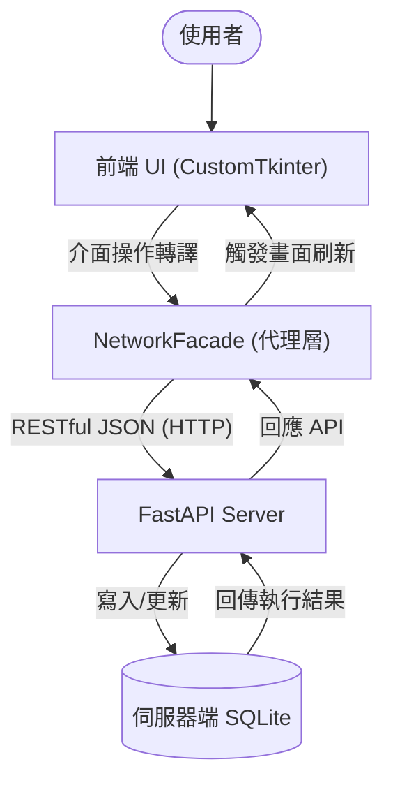
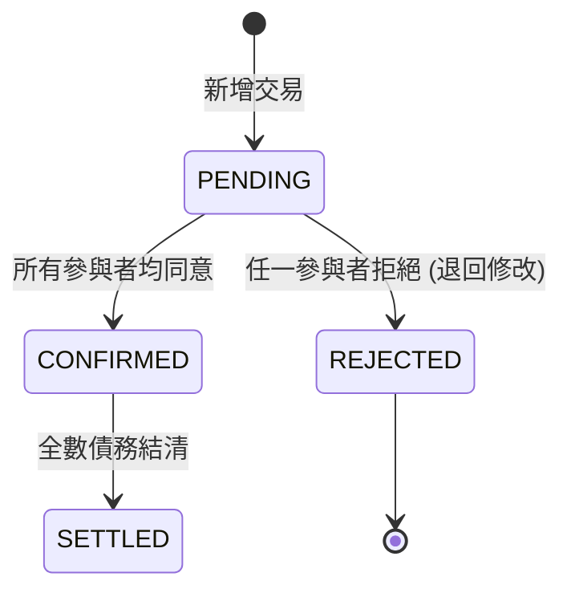

# Group Ledger - 專案技術手冊與完整說明文件

> [!IMPORTANT]
> 本文件為 Group Ledger 專案的權威技術手冊，所有內容皆對應實際的 Python 原始碼，不含任何未實作之提案構想。

---

## 1. 專案總覽 (Project Overview)

### 1.1 系統介紹
在多人共同活動（如集體旅遊、朋友聚餐、合租生活）中，消費記錄與後續的債務結算往往是件繁瑣的事。
**「多人群組本地帳務系統 (Group Ledger)」** 透過 **CustomTkinter** 現代化桌面介面與 **SQLite** 資料持久化，提供了一個整合個人記帳與群組分帳的解決方案。

### 1.2 確切實作價值
1. **多端即時同步 (Multi-device Sync)**：基於 **FastAPI** 構建的中央伺服器與 REST API，解決多裝置資料不一致的問題。
2. **狀態化帳本 (Lifecycle Management)**：每筆交易強制遵循 `PENDING` -> `CONFIRMED` -> `SETTLED` 生命週期，支援防呆的「一票否決 (REJECTED)」保護機制。
3. **智慧結算 (Greedy Debt Minimization)**：內建多方淨額抵銷演算法，自動將網狀的「A欠B、B欠C」化簡為最少次數的還款建議。
4. **高併發防護 (UUID)**：捨棄傳統自增整數，全面採用 UUID v4 作為交易與用戶的唯一識別碼，實現分散式離線也能無衝突新增帳務。

---

## 2. 系統架構 (System Architecture)

本系統採「本地為輔，伺服器為主」之混合架構（Hybrid Mode），透過代理人模式降低前端耦合：

### 2.1 連網模式數據流圖


---

## 3. 核心技術與演算法實作 (Core Implementations)

### 3.1 三階狀態機 (State Machine)
系統在 `shared/models.py` 中嚴格定義了交易的三大狀態。只有在參與者按下「確認」後，款項才會正式列入「待結算」餘額。若任意參與者發現異常點擊「拒絕」，將會退回重整。



### 3.2 代理人網路同步 (Network Facade)
我們實作了 `intelligence/network_facade.py` 作為中介 Proxy：
- 攔截前端所有 `propose_transaction` 或 `settle_debts` 呼叫。
- 利用 Python `requests` 模組透過 HTTP 將資料傳遞給位於 `server/api_server.py` 的 FastAPI 服務器。

### 3.3 智慧結算與抵銷演算法 (Greedy Algorithm)
在 `groups/group_service.py` 中使用的算法核心：
1. **計算淨值 (Net Balance)**：收支相抵的總額。
2. **分離陣營**：將參與者分為「總負債人(Debtors)」與「總債權人(Creditors)」。
3. **貪婪配對**：由欠最多錢的人，優先還給代墊最多錢的人。持續循環，將原本最多需 N(N-1) 次的轉帳降到極簡次數。

### 3.4 精準交易均分邏輯 (Remainder Logic)
處理除不盡的餘數（如 100 元三人分時的加 1 補償）。
```python
# 系統將前 rem 位參與者的帳務多分配 1 元，確保總分配金額絕對精確無誤差
splits[uid] = base + (1 if i < rem else 0)
```

---

## 4. 目錄結構與深度模組拆解

本專案採前端展示與後端業務切割的模組化概念，以下為系統各個模組的深度技術解析：

### 4.1 後端核心 (Backend / Core)
#### 1. `models.py` ：狀態與型別枚舉 (Enums)
全域定義，確保系統語義一致。
#### 2. `base_service.py` ：資料庫基礎設施
- **連線管理 (`_get_connection`)**：集中封裝 SQLite 連接邏輯。
- **結構初始化 (`_init_db`)**：負責建立群組、成員、交易及參與者等核心資料表。
#### 3. `group_service.py` ：核心業務邏輯
負責處理分帳、預算與貪婪結算。
#### 4. `network_facade.py` ：連網代理模式 (Proxy)
- **REST 封裝**：將所有本地端調用轉換為 HTTP JSON API 請求。
#### 5. `debt_system.py` ：系統整合門面 (Facade)
繼承並整合 `PersonalService` 與 `GroupService`，為 UI 提供統一接口。
#### 6. `personal_service.py` ：個人帳務管理
- **獨立債務匯總 (`get_personal_debts`)**：區分「應付」與「應收」。

### 4.2 前端介面 (Frontend / UI)
#### 1. `main_gui.py` ：系統主入口與跨頁驅動
- **數據聯動 (`refresh_ui`)**：使用依賴注入架構。
#### 2. `personal_frame.py` ：個人主控儀表板
- **淨資產計算 (`load_real_data`)**：統整所有關聯群組數字算出一總結資產。
#### 3. `group_frame.py` ：群組空間面板
- **智慧結算交互 (`handle_settle`)**：讓使用者能夠自選「逐筆結算」或是打開「貪婪抵銷算法」。

---

## 5. 技術棧清單 (True Tech Stack)

| 技術名稱 | 用途說明 | 實際套件名稱 |
| :--- | :--- | :--- |
| **FastAPI** | 實作高效能非同步 API 端點 | `fastapi`, `uvicorn` |
| **HTTP Client** | 負責串接 FastAPI | `requests` |
| **CustomTkinter** | 提供現代化圖形介面 | `customtkinter` |
| **SQLite 3** | 資料持久化解決方案 | Python 內建 `sqlite3` |
| **Matplotlib** | 圖表生成 | `matplotlib` |
| **Tkcalendar** | 圖形化日曆選擇器 | `tkcalendar` |
| **Pillow / QRcode**| 生成使用者 ID 二維碼 | `pillow`, `qrcode` |

---

## 6. 專案開發協作與完整 SOP

### 6.1 每日開工同步規範
1. **基線同步 (`tools/sync_latest.bat`)**：每天寫程式前，請執行以取得最新版本。
2. **連網服務開啟**：啟動 `server/api_server.py` (或 `start_server.bat`)。

### 6.2 開發完成後提交
1. **自動化上傳 (`tools/upload_changes.bat`)**：執行此腳本自動提交並推送到遠端。
