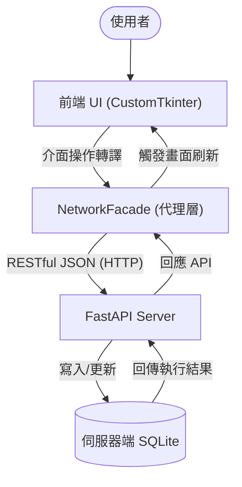
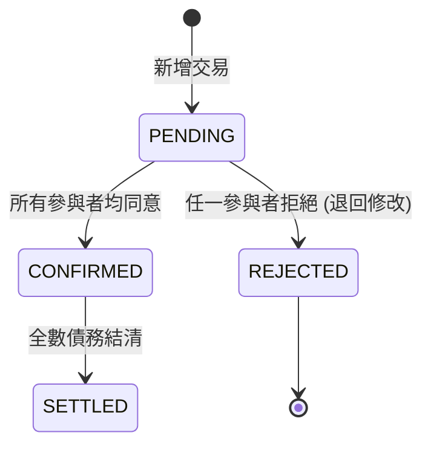

# Group Ledger - 專案技術手冊與完整說明文件

> [!IMPORTANT]
> 本文件為 Group Ledger 專案的權威技術手冊，所有內容皆對應實際的 Python 原始碼，不含任何未實作之提案構想。

---

## 1. 專案總覽 (Project Overview)

### 1.1 系統介紹
在多人共同活動（如集體旅遊、朋友聚餐、合租生活）中，消費記錄與後續的債務結算往往是件繁瑣的事。
**「多人群組本地帳務系統 (Group Ledger)」** 透過 **CustomTkinter** 現代化桌面介面與 **SQLite** 資料持久化，提供了一個整合個人記帳與群組分帳的解決方案。

### 1.2 確切實作價值
1. **多端即時同步 (Multi-device Sync)**：基於 **FastAPI** 構建的中央伺服器與 REST API，解決多裝置資料不一致的問題。
2. **狀態化帳本 (Lifecycle Management)**：每筆交易強制遵循 `PENDING` -> `CONFIRMED` -> `SETTLED` 生命週期，支援防呆的「一票否決 (REJECTED)」保護機制。
3. **智慧結算 (Greedy Debt Minimization)**：內建多方淨額抵銷演算法，自動將網狀的「A欠B、B欠C」化簡為最少次數的還款建議。
4. **高併發防護 (UUID)**：捨棄傳統自增整數，全面採用 UUID v4 作為交易與用戶的唯一識別碼，實現分散式離線也能無衝突新增帳務。

---

## 2. 系統架構 (System Architecture)

本系統採「本地為輔，伺服器為主」之混合架構（Hybrid Mode），透過代理人模式降低前端耦合：

### 2.1 連網模式數據流圖


---

## 3. 核心技術與演算法實作 (Core Implementations)

### 3.1 三階狀態機 (State Machine)
系統在 `shared/models.py` 中嚴格定義了交易的三大狀態。只有在參與者按下「確認」後，款項才會正式列入「待結算」餘額。若任意參與者發現異常點擊「拒絕」，將會退回重整。



### 3.2 代理人網路同步 (Network Facade)
我們實作了 `intelligence/network_facade.py` 作為中介 Proxy：
- 攔截前端所有 `propose_transaction` 或 `settle_debts` 呼叫。
- 利用 Python `requests` 模組透過 HTTP 將資料傳遞給位於 `server/api_server.py` 的 FastAPI 服務器。

### 3.3 智慧結算與抵銷演算法 (Greedy Algorithm)
在 `groups/group_service.py` 中使用的算法核心：
1. **計算淨值 (Net Balance)**：收支相抵的總額。
2. **分離陣營**：將參與者分為「總負債人(Debtors)」與「總債權人(Creditors)」。
3. **貪婪配對**：由欠最多錢的人，優先還給代墊最多錢的人。持續循環，將原本最多需 N(N-1) 次的轉帳降到極簡次數。

### 3.4 精準交易均分邏輯 (Remainder Logic)
處理除不盡的餘數（如 100 元三人分時的加 1 補償）。
```python
# 系統將前 rem 位參與者的帳務多分配 1 元，確保總分配金額絕對精確無誤差
splits[uid] = base + (1 if i < rem else 0)
```

---

## 4. 目錄結構與深度模組拆解

本專案採前端展示與後端業務切割的模組化概念，以下為系統各個模組的深度技術解析：

### 4.1 後端核心 (Backend / Core)
#### 1. `models.py` ：狀態與型別枚舉 (Enums)
全域定義，確保系統語義一致。
#### 2. `base_service.py` ：資料庫基礎設施
- **連線管理 (`_get_connection`)**：集中封裝 SQLite 連接邏輯。
- **結構初始化 (`_init_db`)**：負責建立群組、成員、交易及參與者等核心資料表。
#### 3. `group_service.py` ：核心業務邏輯
負責處理分帳、預算與貪婪結算。
#### 4. `network_facade.py` ：連網代理模式 (Proxy)
- **REST 封裝**：將所有本地端調用轉換為 HTTP JSON API 請求。
#### 5. `debt_system.py` ：系統整合門面 (Facade)
繼承並整合 `PersonalService` 與 `GroupService`，為 UI 提供統一接口。
#### 6. `personal_service.py` ：個人帳務管理
- **獨立債務匯總 (`get_personal_debts`)**：區分「應付」與「應收」。

### 4.2 前端介面 (Frontend / UI)
#### 1. `main_gui.py` ：系統主入口與跨頁驅動
- **數據聯動 (`refresh_ui`)**：使用依賴注入架構。
#### 2. `personal_frame.py` ：個人主控儀表板
- **淨資產計算 (`load_real_data`)**：統整所有關聯群組數字算出一總結資產。
#### 3. `group_frame.py` ：群組空間面板
- **智慧結算交互 (`handle_settle`)**：讓使用者能夠自選「逐筆結算」或是打開「貪婪抵銷算法」。

---

## 5. 技術棧清單 (True Tech Stack)

| 技術名稱 | 用途說明 | 實際套件名稱 |
| :--- | :--- | :--- |
| **FastAPI** | 實作高效能非同步 API 端點 | `fastapi`, `uvicorn` |
| **HTTP Client** | 負責串接 FastAPI | `requests` |
| **CustomTkinter** | 提供現代化圖形介面 | `customtkinter` |
| **SQLite 3** | 資料持久化解決方案 | Python 內建 `sqlite3` |
| **Matplotlib** | 圖表生成 | `matplotlib` |
| **Tkcalendar** | 圖形化日曆選擇器 | `tkcalendar` |
| **Pillow** | 處理圖片資源與介面圖示 | `pillow` |

---

## 6. 專案開發協作與完整 SOP

### 6.1 每日開工同步規範
1. **基線同步 (`tools/sync_latest.bat`)**：每天寫程式前，請執行以取得最新版本。
2. **連網服務開啟**：啟動 `server/api_server.py` (或 `start_server.bat`)。

### 6.2 開發完成後提交
1. **自動化上傳 (`tools/upload_changes.bat`)**：執行此腳本自動提交並推送到遠端。


---

# 程式碼副函式清單與說明

---

## 檔案：main_gui.py

### 函式: __init__ (Line 39 - 63)
**系統作用**：系統入口與環境初始化。
作為 GUI 的建構子，它負責定義視窗物理屬性、初始化核心數據引擎（DebtSystem）、配置主容器，並啟動背景調度執行緒以維持系統異步任務（如逾期檢查）的運行。

```python
    def __init__(self, system_instance=None):
        super().__init__()
        self.title("group ledger - 多人群組本地記帳系統")
        self.geometry("1150x900")
        ctk.set_appearance_mode("dark")
        ctk.set_default_color_theme("dark-blue")
        
        # 核心數據系統初始化 (本地或網路)
        self.system = system_instance if system_instance else DebtSystem()
        self.current_user = None
        self.current_group_id = None
        self.current_group_name = "未選擇"
        self.current_group_code = "----"
        
        # 主容器配置
        self.main_container = ctk.CTkFrame(self, fg_color="transparent")
        self.main_container.pack(fill="both", expand=True)
        
        # 啟動排程執行緒
        self.stop_scheduler = threading.Event()
        self.scheduler_thread = threading.Thread(target=self.run_scheduler, daemon=True)
        self.scheduler_thread.start()
        
        # 檢查自動登入狀態
        self.check_auto_login()
```

### 函式: run_scheduler (Line 65 - 70)
**簡介**：背景執行 schedule 任務

```python
    def run_scheduler(self):
        """背景執行 schedule 任務"""
        schedule.every().day.at("10:00").do(self.background_check)
        while not self.stop_scheduler.is_set():
            schedule.run_pending()
            time.sleep(10)
```

### 函式: background_check (Line 72 - 77)
**簡介**：例行性背景檢查 (可擴充發送外部通知邏輯)

```python
    def background_check(self):
        """例行性背景檢查 (可擴充發送外部通知邏輯)"""
        if self.current_user:
            overdue = self.system.check_overdue_transactions()
            # 這裡簡單以 Print 示意，實際可實作系統通知
            print(f"Daily Check: Found {len(overdue)} overdue items.")
```

### 函式: check_auto_login (Line 79 - 89)
**簡介**：啟動時檢查是否存在記住身分的功能

```python
    def check_auto_login(self):
        """啟動時檢查是否存在記住身分的功能"""
        if os.path.exists(CONFIG_PATH):
            try:
                with open(CONFIG_PATH, "r") as f:
                    c = json.load(f)
                    if c.get("remember_me"): 
                        self.login(c["user_id"], True)
                        return
            except: pass
        self.show_login_screen()
```

### 函式: show_login_screen (Line 91 - 95)
**簡介**：顯示登入頁面

```python
    def show_login_screen(self):
        """顯示登入頁面"""
        for w in self.main_container.winfo_children(): w.destroy()
        self.login_p = LoginFrame(self.main_container, self.login)
        self.login_p.pack(fill="both", expand=True)
```

### 函式: login (Line 97 - 104)
**簡介**：處理登入邏輯

```python
    def login(self, user, remember):
        """處理登入邏輯"""
        self.current_user = str(user) # 強制轉為字串避免與資料庫 TEXT 型別不配
        if remember:
            os.makedirs(os.path.dirname(CONFIG_PATH), exist_ok=True)
            with open(CONFIG_PATH, "w") as f: 
                json.dump({"user_id": user, "remember_me": True}, f)
        self.show_main_app()
```

### 函式: logout (Line 106 - 110)
**簡介**：執行登出並清除自動登入設定

```python
    def logout(self):
        """執行登出並清除自動登入設定"""
        if os.path.exists(CONFIG_PATH): os.remove(CONFIG_PATH)
        self.current_user = None
        self.show_login_screen()
```

### 函式: show_main_app (Line 112 - 118)
**簡介**：登入後載入主應用程式界面

```python
    def show_main_app(self):
        """登入後載入主應用程式界面"""
        for w in self.main_container.winfo_children(): w.destroy()
        self.setup_ui()
        self.update_idletasks() # 確保介面容器已建立再載入數據
        self.load_initial_data()
        self.after(1000, self.check_overdue_and_remind)
```

### 函式: check_overdue_and_remind (Line 120 - 130)
**簡介**：啟動檢查逾期帳務並彈窗提醒

```python
    def check_overdue_and_remind(self):
        """啟動檢查逾期帳務並彈窗提醒"""
        overdue = self.system.check_overdue_transactions()
        my_overdue = [o for o in overdue if o["user"] == self.current_user]
        if my_overdue:
            msg = "逾期未處理提醒\n\n"
            for o in my_overdue[:5]:
                msg += f"- {o['desc']} (金額: {o['amount']}, 已逾期 {o['days']} 天)\n"
            if len(my_overdue) > 5: msg += "...等更多項目\n"
            msg += "\n請盡速至「我的帳單」或相關群組進行確認與結清。"
            mbox.showwarning("逾期帳務提醒", msg)
```

### 函式: setup_ui (Line 132 - 188)
**簡介**：建構主畫面佈局：側邊欄與分頁系統

```python
    def setup_ui(self):
        """建構主畫面佈局：側邊欄與分頁系統"""
        self.sidebar = ctk.CTkFrame(self.main_container, width=200, corner_radius=0)
        self.sidebar.pack(side="left", fill="y")
        
        self.user_label = ctk.CTkLabel(self.sidebar, text=f"使用者: {self.current_user}", font=ctk.CTkFont(size=16, weight="bold"))
        self.user_label.pack(pady=(30, 5))
        
        self.logout_btn = ctk.CTkButton(self.sidebar, text="登出系統", command=self.logout, 
                                    fg_color="transparent", border_width=1, border_color="#e74c3c", 
                                    text_color="#e74c3c", hover_color="#2c2c2c", height=28)
        self.logout_btn.pack(pady=(0, 25), padx=20)
        
        self.quick_add_btn = ctk.CTkButton(self.sidebar, text="快速記帳 (Quick Add)", 
                                        command=self.open_global_add_tx,
                                        fg_color="#3498db", hover_color="#2980b9", height=45, font=ctk.CTkFont(weight="bold"))
        self.quick_add_btn.pack(pady=15, padx=15, fill="x")
        
        ctk.CTkLabel(self.sidebar, text="選擇群組", font=ctk.CTkFont(size=12)).pack(pady=(10, 0))
        self.group_opt = ctk.CTkOptionMenu(self.sidebar, values=[], command=self.switch_group)
        self.group_opt.set("(尚無群組)")
        self.group_opt.pack(padx=10, pady=5)
        
        ctk.CTkButton(self.sidebar, text="+ 加入群組", command=self.open_join_group).pack(pady=5, padx=10, fill="x")
        ctk.CTkButton(self.sidebar, text="+ 建立新群組", command=self.open_create_group).pack(pady=5, padx=10, fill="x")
        
        self.tabview = ctk.CTkTabview(self.main_container)
        self.tabview.pack(side="right", fill="both", expand=True, padx=20, pady=20)
        
        tab_personal = self.tabview.add("個人中心")
        scroll_p = ctk.CTkScrollableFrame(tab_personal, fg_color="transparent")
        scroll_p.pack(fill="both", expand=True)
        
        self.tab_p = PersonalFrame(scroll_p, self.system, self.current_user)
        self.tab_p.pack(fill="x", pady=(0, 30))
        
        ctk.CTkFrame(scroll_p, height=2, fg_color="#34495e").pack(fill="x", padx=40, pady=10)
        
        self.tab_c = CalendarFrame(scroll_p, self.system, self.current_user)
        self.tab_c.pack(fill="x", pady=30)
        
        tab_group = self.tabview.add("群組中心")
        scroll_g = ctk.CTkScrollableFrame(tab_group, fg_color="transparent")
        scroll_g.pack(fill="both", expand=True)
        
        self.tab_g = GroupFrame(scroll_g, self.system)
        self.tab_g.pack(fill="x", pady=(0, 30))
        
        ctk.CTkFrame(scroll_g, height=2, fg_color="#34495e").pack(fill="x", padx=40, pady=10)
        
        self.tab_a = AnalysisFrame(scroll_g, self.system, self.current_user)
        self.tab_a.pack(fill="x", pady=30)
```

### 函式: load_initial_data (Line 190 - 200)
**簡介**：初始數據載入：取得使用者所屬群組並設定首個群組

```python
    def load_initial_data(self, target_gid=None):
        """初始數據載入：取得使用者所屬群組並設定首個群組"""
        groups = self.system.get_user_groups(self.current_user)
        if groups:
            g = next((x for x in groups if x["id"] == target_gid), groups[0])
            self.current_group_id, self.current_group_name, self.current_group_code = g["id"], g["name"], g["code"]
        else:
            self.current_group_id = None
            self.current_group_name = "(尚無群組)"
            self.current_group_code = "----"
        self.refresh_ui()
```

### 函式: refresh_ui (Line 202 - 230)
**簡介**：刷新全局界面：更新側邊欄群組選單與各分頁內容

```python
    def refresh_ui(self):
        """刷新全局界面：更新側邊欄群組選單與各分頁內容"""
        groups = self.system.get_user_groups(self.current_user)
        names = [g["name"] for g in groups]
        self.group_opt.configure(values=names)
        
        if names:
            if self.current_group_name in names:
                self.group_opt.set(self.current_group_name)
            else:
                self.group_opt.set(names[0])
        else:
            self.group_opt.set("(尚無群組)")
        
        # 分別刷新各分頁，避免單一組件報錯導致後續分頁無法刷新
        try: self.tab_p.refresh()
        except Exception as e: print(f"Refresh Personal Error: {e}")
        
        try: self.tab_g.refresh(self.current_group_id, self.current_group_name, self.current_group_code, self.current_user)
        except Exception as e: print(f"Refresh Group Error: {e}")
        
        try: self.tab_a.refresh(self.current_group_id)
        except Exception as e: print(f"Refresh Analysis Error: {e}")
        
        try: self.tab_c.refresh(self.current_group_id)
        except Exception as e: print(f"Refresh Calendar Error: {e}")
```

### 函式: switch_group (Line 232 - 237)
**簡介**：切換目前活動群組

```python
    def switch_group(self, name):
        """切換目前活動群組"""
        g = next((x for x in self.system.get_user_groups(self.current_user) if x["name"] == name), None)
        if g: 
            self.current_group_id, self.current_group_name, self.current_group_code = g["id"], g["name"], g["code"]
            self.refresh_ui()
```

### 函式: open_join_group (Line 239 - 241)
**簡介**：開啟加入群組視窗

```python
    def open_join_group(self): 
        """開啟加入群組視窗"""
        JoinGroupDialog(self, self.join_group_cb)
```

### 函式: join_group_cb (Line 243 - 249)
**簡介**：加入群組成功後的回調處理

```python
    def join_group_cb(self, code):
        """加入群組成功後的回調處理"""
        if self.system.join_group_by_code(self.current_user, code): 
            mbox.showinfo("成功", f"已成功加入群組碼: {code}", parent=self)
            self.load_initial_data()
        else:
            mbox.showerror("失敗", "找不到該群組，或是您已在群組中。", parent=self)
```

### 函式: open_create_group (Line 251 - 253)
**簡介**：開啟建立群組視窗

```python
    def open_create_group(self): 
        """開啟建立群組視窗"""
        CreateGroupDialog(self, self.create_group_cb)
```

### 函式: create_group_cb (Line 255 - 262)
**簡介**：建立群組成功後的回調處理

```python
    def create_group_cb(self, name):
        """建立群組成功後的回調處理"""
        gid, code = self.system.create_group_with_code(self.current_user, name)
        if gid: 
            mbox.showinfo("群組已建立", f"成功建立群組: {name}\n邀群碼: {code}", parent=self)
            self.load_initial_data(target_gid=gid)
        else:
            mbox.showerror("錯誤", "建立群組時發生未知錯誤。", parent=self)
```

### 函式: open_global_add_tx (Line 264 - 270)
**簡介**：側邊欄全局快速記帳：直接與當前群組功能綁定

```python
    def open_global_add_tx(self):
        """側邊欄全局快速記帳：直接與當前群組功能綁定"""
        if not self.current_group_id:
            from tkinter import messagebox
            messagebox.showwarning("提示", "請先選擇右上角群組！", parent=self)
            return
        self.open_add_tx()
```

### 函式: open_add_tx (Line 272 - 275)
**簡介**：(原有的) 針對特定群組開啟新增交易對話框

```python
    def open_add_tx(self, force_participant=None):
        """(原有的) 針對特定群組開啟新增交易對話框"""
        mems = self.system.get_group_members(self.current_group_id)
        AddTransactionDialog(self, mems, self.add_tx_cb, pre_selected=force_participant)
```

### 函式: add_tx_cb (Line 277 - 299)
**簡介**：交易對話框提交後的回調

```python
    def add_tx_cb(self, amt, sel, custom, desc, loc, is_private=False, tx_type="EXPENSE", payer=None, date=None):
        """交易對話框提交後的回調"""
        # 使用 UUID 替代純時間戳，避免高頻操作衝突
        tid = f"tx_{uuid.uuid4().hex[:12]}"
        target_gid = "PERSONAL" if is_private else self.current_group_id
        
        if not target_gid: target_gid = "PERSONAL"
        actual_payer = payer if payer else self.current_user

        # 統一處理時間戳：若有指定日期則轉為 datetime 物件並包含當前時刻
        if date:
             try:
                 # date 預期格式為 YYYY-MM-DD
                 d = datetime.strptime(date, "%Y-%m-%d")
                 now = datetime.now()
                 actual_date = d.replace(hour=now.hour, minute=now.minute, second=now.second, microsecond=now.microsecond)
             except Exception:
                 actual_date = datetime.now()
        else:
             actual_date = datetime.now()

        if self.system.propose_transaction(tid, actual_payer, amt, sel, target_gid, custom, tx_type=tx_type, description=desc, location=loc, timestamp=actual_date): 
            self.refresh_ui()
```

### 函式: open_edit_tx (Line 301 - 334)
**簡介**：開啟特定帳單的編輯對話框

```python
    def open_edit_tx(self, tid):
        """開啟特定帳單的編輯對話框"""
        details = self.system.get_transaction_details(tid)
        if not details: return
        members = self.system.get_group_members(details['group_id']) if details['group_id'] != 'PERSONAL' else [self.current_user]
        
        def commit_edit(amt, sel, custom, desc, loc, is_private=False, tx_type="EXPENSE", payer=None, date=None):
            from tkinter import messagebox
            from datetime import datetime
            
            # Timestamp parsing mimicking add_tx_cb
            actual_date = datetime.now()
            if date:
                 try:
                     d = datetime.strptime(date, "%Y-%m-%d")
                     now = datetime.now()
                     actual_date = d.replace(hour=now.hour, minute=now.minute, second=now.second, microsecond=now.microsecond)
                 except: pass

            if self.system.update_transaction(
                transaction_id=tid, 
                amount_float=amt, 
                participants=sel, 
                custom_splits=custom, 
                description=desc, 
                location=loc,
                timestamp=actual_date
            ):
                messagebox.showinfo("更新成功", "這筆帳單已經更新，並重置為「待確認」狀態退回給相關參與者。", parent=self)
                self.refresh_ui()
            else:
                messagebox.showerror("錯誤", "更新失敗，請檢查資料庫狀態。", parent=self)
                
        AddTransactionDialog(self, members, commit_edit, initial_data=details)
```

### 函式: commit_edit (Line 307 - 332)
**系統作用**：編輯事務的原子化提交邏輯。
這是定義在 open_edit_tx 內部的閉包函式，負責解析使用者修改後的日期與金額，並呼叫後端 API 更新資料庫。它確保了「修改即重置」的工程邏輯：一旦帳單被編輯，所有參與者的狀態會回歸 PENDING，需重新確認以維護數據一致性。

```python
        def commit_edit(amt, sel, custom, desc, loc, is_private=False, tx_type="EXPENSE", payer=None, date=None):
            from tkinter import messagebox
            from datetime import datetime
            
            # Timestamp parsing mimicking add_tx_cb
            actual_date = datetime.now()
            if date:
                 try:
                     d = datetime.strptime(date, "%Y-%m-%d")
                     now = datetime.now()
                     actual_date = d.replace(hour=now.hour, minute=now.minute, second=now.second, microsecond=now.microsecond)
                 except: pass

            if self.system.update_transaction(
                transaction_id=tid, 
                amount_float=amt, 
                participants=sel, 
                custom_splits=custom, 
                description=desc, 
                location=loc,
                timestamp=actual_date
            ):
                messagebox.showinfo("更新成功", "這筆帳單已經更新，並重置為「待確認」狀態退回給相關參與者。", parent=self)
                self.refresh_ui()
            else:
                messagebox.showerror("錯誤", "更新失敗，請檢查資料庫狀態。", parent=self)
```

### 函式: confirm_tx (Line 336 - 339)
**簡介**：確認交易狀態

```python
    def confirm_tx(self, tid): 
        """確認交易狀態"""
        self.system.confirm_transaction(self.current_user, tid)
        self.refresh_ui()
```

### 函式: reject_tx (Line 341 - 348)
**簡介**：拒絕/退回交易

```python
    def reject_tx(self, tid):
        """拒絕/退回交易"""
        from tkinter import messagebox
        if hasattr(self.system, "reject_transaction") and self.system.reject_transaction(self.current_user, tid):
            messagebox.showinfo("拒絕", "[ 退回 ] 已退回這筆帳款，請付款人修正。")
            self.refresh_ui()
        else:
            messagebox.showinfo("拒絕", "[X] 已拒絕此筆帳款。(目前後端尚未實作退件機制，僅為前端展示)")
```

### 函式: run_settlement (Line 350 - 355)
**簡介**：執行結算邏輯

```python
    def run_settlement(self, mode="ORIGINAL"):
        """執行結算邏輯"""
        if self.current_group_id:
            if self.system.settle_debts(self.current_group_id, self.current_user, mode=mode): 
                self.refresh_ui()
                mbox.showinfo("結算成功", f"此群組已依照「{mode}」模式完成結算！", parent=self)
```


---

## 檔案：analysis\analysis_frame.py

### 函式: __init__ (Line 8 - 12)
**系統作用**：分析模組的依賴注入與初始化。
將全域的系統實例與當前使用者資訊注入分析分頁，建立視覺化元件所需的基礎屬性。

```python
    def __init__(self, parent, system, current_user):
        super().__init__(parent, fg_color="transparent")
        self.system = system
        self.current_user = current_user
        self.setup_ui()
```

### 函式: setup_ui (Line 14 - 23)
**系統作用**：數據佈局容器配置。
定義分析頁面的網格權重與圖表容器（chart_container），為 Matplotlib 圖表的嵌入預留動態顯示空間。

```python
    def setup_ui(self):
        self.grid_columnconfigure((0, 1), weight=1)
        self.grid_rowconfigure(1, weight=1)
        
        ctk.CTkLabel(self, text="[數據統計與分析]", font=ctk.CTkFont(size=22, weight="bold")).grid(row=0, column=0, columnspan=2, pady=20)
        
        self.chart_container = ctk.CTkFrame(self, fg_color="transparent")
        self.chart_container.grid(row=1, column=0, columnspan=2, sticky="nsew", padx=20, pady=10)
        self.chart_container.grid_columnconfigure((0, 1), weight=1)
        self.chart_container.grid_rowconfigure(0, weight=1)
```

### 函式: refresh (Line 25 - 39)
**系統作用**：數據視覺化狀態切換門戶。
負責清除舊圖表並根據目前是否選擇了「特定群組」來判斷要觸發「個人全域統計」還是「群組內部分析」，並統一設定支援中文顯示的繪圖風格。

```python
    def refresh(self, group_id=None):
        for w in self.chart_container.winfo_children(): w.destroy()
        
        # 設定整體畫布風格
        plt.rcParams['text.color'] = 'white'
        plt.rcParams['axes.labelcolor'] = 'white'
        plt.rcParams['xtick.color'] = 'white'
        plt.rcParams['ytick.color'] = 'white'
        plt.rcParams['font.sans-serif'] = ['Microsoft JhengHei', 'Arial'] # 支援中文

        if not group_id:
            self.show_personal_stats()
            return

        self.show_group_stats(group_id)
```

### 函式: show_personal_stats (Line 41 - 82)
**簡介**：顯示全域個人消費統計

```python
    def show_personal_stats(self):
        """顯示全域個人消費統計"""
        history = self.system.get_personal_history(self.current_user)
        if not history:
            ctk.CTkLabel(self.chart_container, text="目前尚無任何個人消費紀錄").pack(expand=True)
            return

        # 1. 按群組分類統計
        group_sums = {}
        daily_sums = {}
        for tx in history:
            g_id = tx["group_name"]  # group_name 由 SQL 已處理「個人私帳」對應
            amt = tx["amount"]
            group_sums[g_id] = group_sums.get(g_id, 0) + amt
            
            # 日期趨勢
            date_str = str(tx["timestamp"])[:10]
            daily_sums[date_str] = daily_sums.get(date_str, 0) + amt

        fig, (ax1, ax2) = plt.subplots(1, 2, figsize=(10, 5), dpi=100)
        fig.patch.set_facecolor('#1a1a1a')

        # 圓餅圖：各群組支出比例
        ax1.pie(group_sums.values(), labels=group_sums.keys(), autopct='%1.1f%%', 
                startangle=140, colors=['#3498db', '#9b59b6', '#2ecc71', '#e67e22', '#f1c40f'])
        ax1.set_title("各群組支出佔比", pad=10)

        # 折線圖：消費趨勢
        sorted_dates = sorted(daily_sums.items())
        dates = [d[0] for d in sorted_dates]
        amts = [d[1] for d in sorted_dates]
        ax2.plot(dates, amts, marker='o', color='#3498db', linewidth=2)
        ax2.set_title("近期消費趨勢")
        ax2.set_ylabel("金額 ($)")
        plt.setp(ax2.get_xticklabels(), rotation=45, ha='right')
        ax2.set_facecolor('#1a1a1a')

        plt.tight_layout()
        canvas = FigureCanvasTkAgg(fig, master=self.chart_container)
        canvas.draw()
        plt.close(fig)  # 釋放 matplotlib 記憶體，避免切換分頁時持續累積
        canvas.get_tk_widget().pack(fill="both", expand=True)
```

### 函式: show_group_stats (Line 84 - 123)
**簡介**：顯示特定群組內的統計

```python
    def show_group_stats(self, group_id):
        """顯示特定群組內的統計"""
        txs = self.system.get_group_transactions(group_id)
        if not txs:
            ctk.CTkLabel(self.chart_container, text="該群組目前尚無交易數據").pack(expand=True)
            return

        payers = {}
        total_by_user = {}
        for tx in txs:
            if tx["type"] == "EXPENSE":
                p = tx["payer"]
                amt = tx["amount"]
                payers[p] = payers.get(p, 0) + 1
                total_by_user[p] = total_by_user.get(p, 0) + amt

        if not total_by_user:
            ctk.CTkLabel(self.chart_container, text="該群組目前尚無支出紀錄").pack(expand=True)
            return

        fig, (ax1, ax2) = plt.subplots(1, 2, figsize=(10, 5), dpi=100)
        fig.patch.set_facecolor('#1a1a1a')

        # 圓餅圖：支出金額佔比
        ax1.pie(total_by_user.values(), labels=total_by_user.keys(), autopct='%1.1f%%', 
                startangle=140, colors=['#1abc9c', '#3498db', '#f1c40f', '#e74c3c'])
        ax1.set_title("群組成員支出佔比", pad=10)

        # 長條圖：墊付頻率
        ax2.bar(payers.keys(), payers.values(), color='#3498db', alpha=0.8)
        ax2.set_title("成員墊付次數")
        ax2.set_ylabel("次數")
        ax2.set_facecolor('#1a1a1a')
        ax2.tick_params(colors='w')

        plt.tight_layout()
        canvas = FigureCanvasTkAgg(fig, master=self.chart_container)
        canvas.draw()
        plt.close(fig)  # 釋放 matplotlib 記憶體
        canvas.get_tk_widget().pack(fill="both", expand=True)
```

---

## 檔案：analysis\calendar_frame.py

### 函式: __init__ (Line 7 - 11)
**系統作用**：日曆視圖元件初始化。
初始化日曆功能所需的後端連結，確保分頁具備查詢歷史紀錄的能力。

```python
    def __init__(self, parent, system, current_user):
        super().__init__(parent, fg_color="transparent")
        self.system = system
        self.current_user = current_user
        self.setup_ui()
```

### 函式: setup_ui (Line 13 - 37)
**系統作用**：交互式日曆介面建構。
整合 tkcalendar 元件並綁定點擊事件，配置下方的滾動區域以顯示特定日期的交易明細卡片。

```python
    def setup_ui(self):
        self.grid_columnconfigure(0, weight=1)
        self.grid_rowconfigure(2, weight=1)
        
        ctk.CTkLabel(self, text="帳務日曆", font=ctk.CTkFont(size=22, weight="bold")).grid(row=0, column=0, pady=20)
        
        # 日曆元件
        self.cal = Calendar(self, selectmode='day', 
                           year=datetime.now().year, 
                           month=datetime.now().month, 
                           day=datetime.now().day,
                           background="#242424", 
                           foreground="white", 
                           selectbackground="#1f538d")
        self.cal.grid(row=1, column=0, pady=10, padx=20, sticky="ew")
        self.cal.bind("<<CalendarSelected>>", self.on_date_select)
        
        # 該日明細
        self.detail_label = ctk.CTkLabel(self, text="選定日期交易明細", font=ctk.CTkFont(size=14, weight="bold"), text_color="gray")
        self.detail_label.grid(row=2, column=0, pady=(10,0), padx=20, sticky="w")
        self.detail_scroll = ctk.CTkFrame(self)
        self.detail_scroll.grid(row=3, column=0, pady=(0,10), padx=20, sticky="nsew")
        
        # 修正 grid 權重以因應新 row
        self.grid_rowconfigure(3, weight=1)
```

### 函式: on_date_select (Line 39 - 40)
**系統作用**：事件驅動更新監聽。
當使用者在日曆上點擊不同日期時，觸發資料刷新流程，實現「點選即看」的交互體驗。

```python
    def on_date_select(self, event=None):
        self.refresh()
```

### 函式: refresh (Line 42 - 109)
**簡介**：刷新日曆分頁，顯示目前點選日期的所有帳務紀錄

```python
    def refresh(self, group_id=None):
        """刷新日曆分頁，顯示目前點選日期的所有帳務紀錄"""
        # 使用 selection_get() 直接取得 date 物件，避免字串解析失敗
        try:
            selected_date = self.cal.selection_get()
            search_date = selected_date.strftime('%Y-%m-%d')
            display_date = selected_date.strftime('%Y/%m/%d')
        except:
            # 備用方案：若尚未點選任何日期，預設為今天
            from datetime import date
            selected_date = date.today()
            search_date = selected_date.strftime('%Y-%m-%d')
            display_date = selected_date.strftime('%Y/%m/%d')
            
        # 清空舊畫面
        for w in self.detail_scroll.winfo_children(): w.destroy()
        
        # 設定標題顯示日期
        if hasattr(self, 'detail_label'):
            self.detail_label.configure(text=f"[日期: {display_date}] 交易明細")
        
        # 取得整體歷史紀錄並排序
        txs = self.system.get_personal_history(self.current_user)
        txs.sort(key=lambda x: str(x['timestamp']), reverse=True)
        
        found = False
        for tx in txs:
            # 判斷是否為該日交易 (timestamp 前 10 個字元為 YYYY-MM-DD)
            ts = str(tx["timestamp"])
            if ts.startswith(search_date):
                found = True
                # 建立交易卡片列 (比照 PersonalFrame 網格化)
                f = ctk.CTkFrame(self.detail_scroll, fg_color="#2c3e50" if tx.get('status') != 'SETTLED' else "transparent")
                f.pack(fill="x", pady=2, padx=5)
                f.grid_columnconfigure(1, weight=1) # 描述欄位拉伸
                
                # 1. 群組標籤 (小小的灰色)
                group_name = tx.get('group_name', '一般')
                ctk.CTkLabel(f, text=f"[{group_name}]", font=ctk.CTkFont(size=12)).grid(row=0, column=0, padx=10, pady=10, sticky="w")
                
                # 2. 描述
                ctk.CTkLabel(f, text=tx['description'] or "一般支出", font=ctk.CTkFont(size=14), anchor="w").grid(row=0, column=1, padx=5, sticky="ew")
                
                # 3. 金額明細
                is_payer = (tx.get('payer_id') == self.current_user)
                amt_color = "#2ecc71" if is_payer else "#e74c3c"
                amt_text = f"+${tx['amount']}" if is_payer else f"-${tx['amount']}"
                
                amt_frame = ctk.CTkFrame(f, fg_color="transparent")
                amt_frame.grid(row=0, column=2, padx=15, sticky="e")
                
                ctk.CTkLabel(amt_frame, text=amt_text, text_color=amt_color, font=ctk.CTkFont(size=15, weight="bold")).pack(anchor="e")
                
                status_map = {"CONFIRMED": "已確認", "PENDING": "待確認", "SETTLED": "已結清", "REJECTED": "已拒絕"}
                status_text = status_map.get(tx['status'], tx['status'])
                ctk.CTkLabel(amt_frame, text=status_text, font=ctk.CTkFont(size=11), text_color="gray").pack(anchor="e")

                # 4. 點擊與懸停互動邏輯 (精準感測優化)
                def on_click(event, tid=tx['id']):
                    self.show_detail(tid)
                
                def on_enter(event, frame=f):
                    frame.configure(fg_color="#34495e")
                
                def on_leave(event, frame=f, original_color="#2c3e50" if tx.get('status') != 'SETTLED' else "transparent"):
                    frame.configure(fg_color=original_color)

                # 遞迴將事件綁定到容器及其所有子元件上，並啟用 hand2 游標
                for widget in [f, gl, dl, amt_frame]:
                    widget.bind("<Button-1>", on_click)
                    widget.bind("<Enter>", on_enter)
                    widget.bind("<Leave>", on_leave)
                    widget.configure(cursor="hand2")

        if not found:
            ctk.CTkLabel(self.detail_scroll, text="該日無任何交易明細記錄", text_color="gray").pack(pady=30)
```

### 函式: show_detail (Line 111 - 120)
**簡介**：顯示交易詳情彈窗

```python
    def show_detail(self, tid):
        """顯示交易詳情彈窗"""
        details = self.system.get_transaction_details(tid)
        if details:
            TransactionDetailDialog(
                self.winfo_toplevel(), details,
                system=self.system,
                current_user=self.current_user,
                refresh_cb=self.winfo_toplevel().refresh_ui
            )
```

---

## 檔案：auth\auth_ui.py

### 函式: __init__ (Line 6 - 17)
**系統作用**：身分驗證介面配置。
建構系統登入畫面，包含使用者輸入框、自動登入勾選框以及進入系統的觸發按鈕，是系統安全性的第一道入口。

```python
    def __init__(self, parent, login_callback):
        super().__init__(parent, fg_color="transparent")
        self.login_callback = login_callback
        ctk.CTkLabel(self, text="記帳系統", font=ctk.CTkFont(size=32, weight="bold")).pack(pady=(100, 20))
        ctk.CTkLabel(self, text="歡迎回來，請輸入帳號進入系統", font=ctk.CTkFont(size=14), text_color="gray70").pack(pady=(0, 40))
        self.user_entry = ctk.CTkEntry(self, placeholder_text="使用者名稱", width=300, height=45); self.user_entry.pack(pady=10)
        self.remember_var = ctk.BooleanVar(value=False)
        ctk.CTkCheckBox(self, text="記住帳號，下次自動登入", variable=self.remember_var).pack(pady=10)
        
        self.login_btn = ctk.CTkButton(self, text="進入系統", width=300, height=50, command=self.submit, 
        fg_color="#1f538d", hover_color="#14375e", font=ctk.CTkFont(weight="bold"))
        self.login_btn.pack(pady=30)
```

### 函式: submit (Line 18 - 20)
**系統作用**：登入意圖轉發。
獲取輸入框中的帳號資訊，並透過回呼函式（Callback）將驗證請求傳遞回主程式處理。

```python
    def submit(self):
        user = self.user_entry.get().strip()
        if user: self.login_callback(user, self.remember_var.get())
```

---

## 檔案：groups\group_frame.py

### 函式: __init__ (Line 8 - 12)
**系統作用**：群組管理介面初始化。
設定群組操作所需的狀態變數（如預算值），並調用 UI 建構程序。

```python
    def __init__(self, parent, system):
        super().__init__(parent, fg_color="transparent")
        self.system = system
        self.budget_val = 0  # 預先初始化避免 AttributeError
        self.setup_ui()
```

### 函式: setup_ui (Line 14 - 63)
**系統作用**：群組功能控制台配置。
佈置群組頁面的工具欄（包含記帳、結算、預算、匯出等功能按鈕）與成員清單顯示區，建立使用者與群組數據互動的中心。

```python
    def setup_ui(self):
        self.header = ctk.CTkFrame(self, fg_color="transparent")
        self.header.pack(fill="x", padx=20, pady=10)
        
        # 設定 grid 欄位：label 固定，按鈕欄均分彈性空間
        self.header.columnconfigure(0, weight=0)  # label (固定)
        for col in range(1, 7):
            self.header.columnconfigure(col, weight=1)  # 按鈕欄 (自適應)
        
        self.info_label = ctk.CTkLabel(self.header, text="群組動態", font=ctk.CTkFont(size=20, weight="bold"))
        self.info_label.grid(row=0, column=0, sticky="w", padx=(0, 20))
        
        self.add_btn = ctk.CTkButton(self.header, text="+ 記一筆", command=self.open_add_tx)
        self.add_btn.grid(row=0, column=1, sticky="ew", padx=4)
        
        self.refresh_btn = ctk.CTkButton(self.header, text="刷新", command=self.handle_refresh, fg_color="#3498db", hover_color="#2980b9")
        self.refresh_btn.grid(row=0, column=2, sticky="ew", padx=4)
        
        self.settle_btn = ctk.CTkButton(self.header, text="一般結算", command=lambda: self.handle_settle("ORIGINAL"), fg_color="#2ecc71", hover_color="#27ae60")
        self.settle_btn.grid(row=0, column=3, sticky="ew", padx=4)
        
        self.simplify_btn = ctk.CTkButton(self.header, text="智慧結算", command=lambda: self.handle_settle("SIMPLIFIED"), fg_color="#1abc9c", hover_color="#16a085")
        self.simplify_btn.grid(row=0, column=4, sticky="ew", padx=4)
        
        self.export_btn = ctk.CTkButton(self.header, text="匯出帳單", command=self.handle_export_bill, fg_color="#f39c12", hover_color="#e67e22")
        self.export_btn.grid(row=0, column=5, sticky="ew", padx=4)
        
        self.delete_btn = ctk.CTkButton(self.header, text="刪除群組", command=self.handle_delete, fg_color="#e74c3c", hover_color="#c0392b")
        self.delete_btn.grid(row=0, column=6, sticky="ew", padx=4)

        # 成員名單顯示區
        self.members_info = ctk.CTkFrame(self, fg_color="transparent")
        self.members_info.pack(fill="x", padx=30)
        self.members_label = ctk.CTkLabel(self.members_info, text="成員: 加載中...", font=ctk.CTkFont(size=13), text_color="gray")
        self.members_label.pack(side="left")
        
        ctk.CTkLabel(self, text="最近活動", font=ctk.CTkFont(size=14, weight="bold"), text_color="gray").pack(padx=20, pady=(10,0), anchor="w")
        self.scroll = ctk.CTkFrame(self)
        self.scroll.pack(fill="both", expand=True, padx=20, pady=10)

        # 預算卡片：改為在頂部資訊區 pack，避免遮擋長清單
        self.budget_card = ctk.CTkFrame(self, fg_color="#2c3e50", corner_radius=10, border_width=1, border_color="#34495e")
        self.budget_card.pack(fill="x", padx=20, pady=5)
        
        self.budget_label = ctk.CTkLabel(self.budget_card, text="預算: 加載中...", font=ctk.CTkFont(size=14, weight="bold"), text_color="#2ecc71")
        self.budget_label.pack(side="left", padx=15, pady=8)
        
        # 綁定點擊事件以設定預算
        self.budget_card.bind("<Button-1>", lambda e: self.open_set_budget())
        self.budget_label.bind("<Button-1>", lambda e: self.open_set_budget())
```

### 函式: refresh (Line 65 - 177)
**系統作用**：這個 refresh 函式就像是群組畫面的「大管家」，它的工作就是確保你點進群組時，看到的資訊是最新的，而且操作按鈕都符合你現在的身分。

```python
    def refresh(self, gid, gname, gcode, current_user):
        self.gid, self.current_user = gid, current_user
        
        # 處理無群組顯示邏輯
        if not gid:
            self.info_label.configure(text="(尚無群組)")
            self.members_info.pack_forget()
            self.settle_btn.grid_remove()
            self.simplify_btn.grid_remove()
            self.delete_btn.grid_remove()
            self.add_btn.grid_remove()
            self.refresh_btn.grid_remove()
            self.budget_card.pack_forget()
            for w in self.scroll.winfo_children(): w.destroy()
            return
        
        # 有群組時恢復顯示按鈕與資訊
        self.info_label.configure(text=f"{gname} (代碼: {gcode})")
        
        # 為確保佈局順序正確 (標題 -> 成員 -> 活動捲動區)，先暫時移開捲動區再重新放入
        self.scroll.pack_forget()
        self.members_info.pack(fill="x", padx=30, pady=(0, 5))
        self.scroll.pack(fill="both", expand=True, padx=20, pady=10)
        
        # 恢復按鈕 (使用 grid 與 setup_ui 保持一致)
        self.add_btn.grid(row=0, column=1, sticky="ew", padx=4)
        self.refresh_btn.grid(row=0, column=2, sticky="ew", padx=4)
        self.settle_btn.grid(row=0, column=3, sticky="ew", padx=4)
        self.simplify_btn.grid(row=0, column=4, sticky="ew", padx=4)
        self.export_btn.grid(row=0, column=5, sticky="ew", padx=4)
        self.delete_btn.grid(row=0, column=6, sticky="ew", padx=4)
        
        # 載入並顯示成員名單
        members = self.system.get_group_members(gid)
        self.members_label.configure(text=f"成員: {', '.join(members)}")
        
        # 載入並刷新預算資訊
        budget_info = self.system.get_group_budget_status(gid)
        self.budget_val = budget_info["budget"]
        # 使用者要求格式：預算：$XX,XXX元 (僅顯示剩餘預算數字)
        self.budget_label.configure(text=f"預算: ${budget_info['remaining']:,}元")
        
        for w in self.scroll.winfo_children(): w.destroy()
        
        txs = self.system.get_group_transactions(gid)
        last_date = None
        for tx in txs:
            # 取得並格式化日期
            raw_time = tx['time']
            try:
                if isinstance(raw_time, str):
                    dt = datetime.fromisoformat(raw_time) if " " in raw_time or "T" in raw_time else datetime.strptime(raw_time[:10], '%Y-%m-%d')
                else:
                    dt = raw_time
                date_str = dt.strftime('%m月%d日')
            except:
                date_str = str(raw_time)[:10].replace('-', '/')

            # 插入日期分隔線
            if date_str != last_date:
                sep_frame = ctk.CTkFrame(self.scroll, fg_color="transparent")
                sep_frame.pack(fill="x", pady=(15, 5))
                ctk.CTkLabel(sep_frame, text=f"{date_str} ---------------------------------", 
                             font=ctk.CTkFont(size=12, weight="bold"), text_color="gray70").pack(side="left", padx=10)
                last_date = date_str

            f = ctk.CTkFrame(self.scroll); f.pack(fill="x", pady=5)
            
            # --- 左側：狀態標籤 ---
            st_color, st_text = self._get_status_info(tx['status'])
            status_tag = ctk.CTkLabel(f, text=st_text, font=ctk.CTkFont(size=10, weight="bold"),
                                    fg_color=st_color, text_color="white", corner_radius=4, width=60)
            status_tag.pack(side="left", padx=(10, 5), pady=5)

            # --- 中間：交易描述 ---
            prefix = "償還了" if tx['type'] == 'SETTLEMENT' else "支出"
            l = ctk.CTkLabel(f, text=f"{tx['payer']} {prefix} ${tx['amount']:,} - {tx['description'] or ''}")
            l.pack(side="left", padx=10)
            
            # 綁定雙擊事件
            f.bind("<Double-1>", lambda e, tid=tx['id']: self.show_details(tid))
            l.bind("<Double-1>", lambda e, tid=tx['id']: self.show_details(tid))
            status_tag.bind("<Double-1>", lambda e, tid=tx['id']: self.show_details(tid))
            
            if current_user in tx['pending_confirmations']:
                right_btns = ctk.CTkFrame(f, fg_color="transparent")
                right_btns.pack(side="right", padx=5)
                
                # 有誤 (Reject)
                ctk.CTkButton(right_btns, text="有誤", width=60, fg_color="#c0392b", hover_color="#e74c3c",
                              command=lambda tid=tx['id']: self.winfo_toplevel().reject_tx(tid)).pack(side="left", padx=5)
                              
                # 確認
                btn_text = "確認收錢" if tx['type'] == 'SETTLEMENT' else "確認"
                ctk.CTkButton(right_btns, text=btn_text, width=60, fg_color="#27ae60", hover_color="#2ecc71",
                              command=lambda tid=tx['id']: self.winfo_toplevel().confirm_tx(tid)).pack(side="left", padx=5)
            
            # 只有付款人可以針對帳單的狀態進行特定處置
            if current_user == tx['payer']:
                # 只有未完全確認 (PENDING) 或被退回 (REJECTED) 的帳單才可以被重新編輯
                if tx['status'] in ['PENDING', 'REJECTED']:
                    ctk.CTkButton(f, text="重新編輯", width=80, fg_color="#3498db", hover_color="#2980b9",
                                  command=lambda tid=tx['id']: self.winfo_toplevel().open_edit_tx(tid)).pack(side="right", padx=5)
                                  
                if tx['status'] == 'REJECTED':
                    # 付款人看到帳單被退回，可以選擇作廢（刪除）
                    ctk.CTkButton(f, text="作廢(刪除)", width=80, fg_color="#c0392b", hover_color="#922b21",
                                  command=lambda tid=tx['id']: self.handle_void_tx(tid)).pack(side="right", padx=5)
                elif tx['pending_confirmations']:
                    # 付款人針對尚未確認的帳單進行催收
                    remind_text = "提醒確認" if tx['type'] == 'SETTLEMENT' else "催帳"
                    ctk.CTkButton(f, text=remind_text, width=80, fg_color="#d35400", hover_color="#a04000",
                                  command=lambda tid=tx['id']: self.handle_notify(tid)).pack(side="right", padx=5)
```

### 函式: open_add_tx (Line 179 - 180)
**系統作用**：跨組件功能調度。
作為一個代理介面，直接調用父視窗（Main GUI）的記帳對話框，確保群組內部的「記一筆」行為與全域系統邏輯同步。

```python
    def open_add_tx(self):
        self.winfo_toplevel().open_add_tx()
```

### 函式: handle_void_tx (Line 182 - 195)
**簡介**：處理作廢帳款的請求

```python
    def handle_void_tx(self, tid):
        """處理作廢帳款的請求"""
        from tkinter import messagebox
        confirm = messagebox.askyesno(
            "作廢帳單", 
            "此筆帳單已被某位成員標記為「有誤」。\n您是否要作廢(徹底刪除)這筆帳單？\n\n(若需補收，請在作廢後重新發起一筆新的帳單)", 
            parent=self.winfo_toplevel()
        )
        if confirm:
            if self.system.delete_transaction(tid):
                messagebox.showinfo("作廢成功", "已成功作廢並刪除該筆錯誤帳單。", parent=self.winfo_toplevel())
                self.winfo_toplevel().refresh_ui()
            else:
                messagebox.showerror("錯誤", "作廢失敗，請確認您的伺服器或資料庫狀態。", parent=self.winfo_toplevel())
```

### 函式: handle_refresh (Line 197 - 199)
**簡介**：手動刷新介面：重新查詢群組清單，可偵測到他人刪除群組的變化

```python
    def handle_refresh(self):
        """手動刷新介面：重新查詢群組清單，可偵測到他人刪除群組的變化"""
        self.winfo_toplevel().load_initial_data(target_gid=self.gid)
```

### 函式: show_details (Line 201 - 210)
**簡介**：顯示交易明細彈窗（含欠款人還款按鈕）

```python
    def show_details(self, tid):
        """顯示交易明細彈窗（含欠款人還款按鈕）"""
        details = self.system.get_transaction_details(tid)
        if details:
            TransactionDetailDialog(
                self.winfo_toplevel(), details,
                system=self.system,
                current_user=self.current_user,
                refresh_cb=self.winfo_toplevel().refresh_ui
            )
```

### 函式: handle_notify (Line 212 - 222)
**簡介**：處理催帳按鈕：顯示通知文字並提供複製

```python
    def handle_notify(self, tid):
        """處理催帳按鈕：顯示通知文字並提供複製"""
        from tkinter import messagebox
        import pyperclip
        msg = self.system.get_notification_message(tid)
        if messagebox.askyesno("生成催帳訊息", f"已生成針對該筆交易的提醒文字：\n\n{msg}\n\n是否將此文字複製到剪貼簿？", parent=self.winfo_toplevel()):
            try:
                pyperclip.copy(msg)
                messagebox.showinfo("成功", "催帳訊息已複製到剪貼簿，您可以直接貼上至 Line 或其他通訊軟體。", parent=self.winfo_toplevel())
            except Exception:
                messagebox.showerror("錯誤", "無法存取剪貼簿。", parent=self.winfo_toplevel())
```

### 函式: handle_export_bill (Line 224 - 234)
**簡介**：匯出群組帳單摘要

```python
    def handle_export_bill(self):
        """匯出群組帳單摘要"""
        from tkinter import messagebox
        import pyperclip
        summary = self.system.generate_group_bill_summary(self.gid)
        if messagebox.askyesno("匯出帳單摘要", f"即將生成的帳單內容如下：\n\n{summary}\n\n是否將此摘要複製到剪貼簿？", parent=self.winfo_toplevel()):
            try:
                pyperclip.copy(summary)
                messagebox.showinfo("成功", "帳單摘要已複製到剪貼簿。", parent=self.winfo_toplevel())
            except Exception:
                messagebox.showerror("錯誤", "無法存取剪貼簿。", parent=self.winfo_toplevel())
```

### 函式: handle_settle (Line 236 - 253)
**簡介**：處理結算按鈕點擊

```python
    def handle_settle(self, mode):
        """處理結算按鈕點擊"""
        from tkinter import messagebox
        
        confirm = messagebox.askyesno("確認結算", f"確定要執行「{ '一般' if mode=='ORIGINAL' else '智慧' }結算」嗎？\n這將會產生還款單並將目前的消費標記為已結清。", parent=self.winfo_toplevel())
        if not confirm: return
        
        plan = self.system.settle_debts(self.gid, self.current_user, mode=mode)
        if not plan:
            messagebox.showinfo("結算結果", "目前沒有已確認且未結算的交易項目。", parent=self.winfo_toplevel())
            return
            
        # 顯示結算計畫結果
        result_str = "\n".join([f"· {p['from']} 應給 {p['to']} ${p['amount']:,}元" for p in plan])
        messagebox.showinfo("結算計畫已生成", 
            f"已使用「{mode}」模式完成計算，建議還款方式如下：\n\n{result_str}\n\n"
            "上述還款紀錄已正式登錄於系統活動紀錄中。\n所有相關支出已標記為已結清。", parent=self.winfo_toplevel())
        self.winfo_toplevel().refresh_ui()
```

### 函式: handle_delete (Line 255 - 266)
**簡介**：處理刪除群組按鈕點擊：實作二次確認

```python
    def handle_delete(self):
        """處理刪除群組按鈕點擊：實作二次確認"""
        from tkinter import messagebox
        confirm = messagebox.askyesno("確認刪除", f"確定要徹底刪除群組「{self.winfo_toplevel().current_group_name}」嗎？\n\n這將會抹除該群組內所有的交易紀錄與參與者資料，且無法復原。", parent=self.winfo_toplevel())
        
        if confirm:
            if self.system.delete_group(self.gid):
                messagebox.showinfo("成功", "群組已成功移除。", parent=self.winfo_toplevel())
                # 強制主視窗重新載入群組數據（會切換到剩餘的第一個群組）
                self.winfo_toplevel().load_initial_data()
            else:
                messagebox.showerror("錯誤", "刪除群組時發生錯誤。", parent=self.winfo_toplevel())
```

### 函式: open_set_budget (Line 268 - 270)
**簡介**：開啟預算設定對話框

```python
    def open_set_budget(self):
        """開啟預算設定對話框"""
        BudgetDialog(self.winfo_toplevel(), self.budget_val, self.save_budget_cb)
```

### 函式: _get_status_info (Line 272 - 281)
**簡介**：根據狀態回傳顏色與顯示文字

```python
    def _get_status_info(self, status):
        """根據狀態回傳顏色與顯示文字"""
        from shared.models import TransactionStatus
        mapping = {
            TransactionStatus.PENDING.name: ("#e67e22", "待確認"),
            TransactionStatus.CONFIRMED.name: ("#2ecc71", "已確認"),
            TransactionStatus.SETTLED.name: ("#7f8c8d", "已結清"),
            TransactionStatus.REJECTED.name: ("#e74c3c", "有誤"),
        }
        return mapping.get(status, ("#34495e", status))
```

### 函式: save_budget_cb (Line 283 - 289)
**簡介**：儲存預算後的回調

```python
    def save_budget_cb(self, amount):
        """儲存預算後的回調"""
        if self.system.set_group_budget(self.gid, amount):
            self.refresh(self.gid, self.winfo_toplevel().current_group_name, self.winfo_toplevel().current_group_code, self.current_user)
        else:
            from tkinter import messagebox
            messagebox.showerror("錯誤", "無法存取資料庫設定預算。", parent=self.winfo_toplevel())
```

---

## 檔案：groups\group_service.py

### 函式: create_group_with_code (Line 12 - 25)
**簡介**：建立群組並產生 6 位英數邀群碼

```python
    def create_group_with_code(self, creator_id, group_name):
        """建立群組並產生 6 位英數邀群碼"""
        join_code = ''.join(random.choices(string.ascii_uppercase + string.digits, k=6))
        group_id = f"g_{uuid.uuid4().hex[:8]}"
        try:
            with self._get_connection() as conn:
                cursor = conn.cursor()
                while cursor.execute("SELECT 1 FROM groups WHERE join_code = ?", (join_code,)).fetchone():
                    join_code = ''.join(random.choices(string.ascii_uppercase + string.digits, k=6))
                
                cursor.execute("INSERT INTO groups (group_id, name, join_code) VALUES (?, ?, ?)", (group_id, group_name, join_code))
                cursor.execute("INSERT INTO group_members (group_id, user_id) VALUES (?, ?)", (group_id, creator_id))
                return group_id, join_code
        except Exception: return None, None
```

### 函式: join_group_by_code (Line 27 - 42)
**簡介**：透過 4 位代碼加入群組

```python
    def join_group_by_code(self, user_id, join_code):
        """透過 4 位代碼加入群組"""
        join_code = join_code.upper()
        with self._get_connection() as conn:
            cursor = conn.cursor()
            cursor.execute("SELECT group_id FROM groups WHERE join_code = ?", (join_code,))
            row = cursor.fetchone()
            if not row: return False
            
            group_id = row[0]
            try:
                cursor.execute("INSERT INTO group_members (group_id, user_id) VALUES (?, ?)", (group_id, user_id))
                conn.commit()
                return True
            except sqlite3.IntegrityError: return True
            except Exception: return False
```

### 函式: get_user_groups (Line 44 - 54)
**簡介**：獲取使用者參加的所有群組

```python
    def get_user_groups(self, user_id):
        """獲取使用者參加的所有群組"""
        with self._get_connection() as conn:
            cursor = conn.cursor()
            cursor.execute("""
                SELECT g.group_id, g.name, g.join_code 
                FROM groups g
                JOIN group_members gm ON g.group_id = gm.group_id
                WHERE gm.user_id = ?
            """, (user_id,))
            return [{"id": r[0], "name": r[1], "code": r[2]} for r in cursor.fetchall()]
```

### 函式: get_group_members (Line 56 - 61)
**簡介**：獲取指定群組的所有成員 ID

```python
    def get_group_members(self, group_id):
        """獲取指定群組的所有成員 ID"""
        with self._get_connection() as conn:
            cursor = conn.cursor()
            cursor.execute("SELECT user_id FROM group_members WHERE group_id = ?", (group_id,))
            return [row[0] for row in cursor.fetchall()]
```

### 函式: set_group_budget (Line 63 - 71)
**簡介**：設定群組的總預算

```python
    def set_group_budget(self, group_id, amount):
        """設定群組的總預算"""
        with self._get_connection() as conn:
            cursor = conn.cursor()
            try:
                cursor.execute("UPDATE groups SET budget = ? WHERE group_id = ?", (amount, group_id))
                conn.commit()
                return True
            except Exception: return False
```

### 函式: get_group_budget_status (Line 73 - 94)
**簡介**：獲取群組預算剩餘狀況 (僅統計已確認 [CONFIRMED/SETTLED] 的支出)

```python
    def get_group_budget_status(self, group_id):
        """獲取群組預算剩餘狀況 (僅統計已確認 [CONFIRMED/SETTLED] 的支出)"""
        with self._get_connection() as conn:
            cursor = conn.cursor()
            # 1. 取得總預算
            cursor.execute("SELECT budget FROM groups WHERE group_id = ?", (group_id,))
            row = cursor.fetchone()
            budget = row[0] if row else 0
            
            # 2. 取得該群組累積支出 (僅統計已入帳的 EXPENSE)
            cursor.execute("""
                SELECT SUM(amount) FROM transactions 
                WHERE group_id = ? AND type = 'EXPENSE' 
                AND status IN (?, ?)
            """, (group_id, TransactionStatus.CONFIRMED.name, TransactionStatus.SETTLED.name))
            spent = cursor.fetchone()[0] or 0
            
            return {
                "budget": budget,
                "spent": spent,
                "remaining": budget - spent
            }
```

### 函式: propose_transaction (Line 96 - 132)
**簡介**：發起一筆新交易並計算分帳 (支援自定義時間)

```python
    def propose_transaction(self, transaction_id, payer_id, amount_float, participants, group_id, custom_splits=None, tx_type=TransactionType.EXPENSE.name, description="", location="", timestamp=None):
        """發起一筆新交易並計算分帳 (支援自定義時間)"""
        actual_ts = timestamp if timestamp else datetime.now()
        amount_twd = int(round(amount_float))
        with self._get_connection() as conn:
            cursor = conn.cursor()
            try:
                splits = {}
                if custom_splits:
                    for uid, amt in custom_splits.items(): splits[uid] = int(round(amt))
                else:
                    count = len(participants)
                    if count > 0:
                        base = amount_twd // count
                        rem = amount_twd % count
                        for i, uid in enumerate(participants):
                            splits[uid] = base + (1 if i < rem else 0)

                cursor.execute("""
                    INSERT INTO transactions (transaction_id, group_id, payer_id, amount, status, type, description, location, timestamp)
                    VALUES (?, ?, ?, ?, ?, ?, ?, ?, ?)
                """, (transaction_id, group_id, payer_id, amount_twd, TransactionStatus.PENDING.name, tx_type, description, location, actual_ts))
                
                for uid, owed in splits.items():
                    status = TransactionStatus.CONFIRMED.name if uid == payer_id else TransactionStatus.PENDING.name
                    cursor.execute("""
                        INSERT INTO transaction_participants (transaction_id, user_id, owed_amount, status)
                        VALUES (?, ?, ?, ?)
                    """, (transaction_id, uid, owed, status))
                
                # 3. 立即檢查狀態機：若為單人群組或代墊人已確認，應自動提升主表狀態
                self._update_main_transaction_status(cursor, transaction_id)
                
                return True
            except Exception as e:
                print(f"Error: {e}")
                return False
```

### 函式: update_transaction (Line 134 - 183)
**簡介**：修改一筆現有的帳單：將強迫所有參與者重置為 PENDING 狀態並更新主表金額等設定

```python
    def update_transaction(self, transaction_id, amount_float, participants, custom_splits=None, description='', location='', timestamp=None):
        """修改一筆現有的帳單：將強迫所有參與者重置為 PENDING 狀態並更新主表金額等設定"""
        from shared.models import TransactionStatus
        from datetime import datetime
        with self._get_connection() as conn:
            cursor = conn.cursor()
            try:
                # 1. 取得現有主表資訊確保原本的群組與付款人存在
                cursor.execute("SELECT group_id, payer_id, type FROM transactions WHERE transaction_id = ?", (transaction_id,))
                row = cursor.fetchone()
                if not row: return False
                group_id, payer_id, tx_type = row
                
                amount_twd = int(amount_float)
                actual_ts = timestamp if timestamp else datetime.now()
                
                # 計算要分攤的債務
                splits = {}
                if custom_splits and len(custom_splits) > 0:
                    splits = custom_splits
                else:
                    if len(participants) > 0:
                        base = amount_twd // len(participants)
                        rem = amount_twd % len(participants)
                        for i, uid in enumerate(participants):
                            splits[uid] = base + (1 if i < rem else 0)
                
                # 2. 更新主表內容
                cursor.execute("""
                    UPDATE transactions 
                    SET amount = ?, description = ?, location = ?, timestamp = ?, status = ?
                    WHERE transaction_id = ?
                """, (amount_twd, description, location, actual_ts, TransactionStatus.PENDING.name, transaction_id))
                
                # 3. 抹除舊有參與者紀錄，重新建立（所有人變為 PENDING，付款人強制確認）
                cursor.execute("DELETE FROM transaction_participants WHERE transaction_id = ?", (transaction_id,))
                
                for uid, owed in splits.items():
                    status = TransactionStatus.CONFIRMED.name if uid == payer_id else TransactionStatus.PENDING.name
                    cursor.execute("""
                        INSERT INTO transaction_participants (transaction_id, user_id, owed_amount, status)
                        VALUES (?, ?, ?, ?)
                    """, (transaction_id, uid, owed, status))
                
                # 4. 立即檢查狀態機
                self._update_main_transaction_status(cursor, transaction_id)
                return True
            except Exception as e:
                print(f"Update TX Error: {e}")
                return False
```

### 函式: confirm_transaction (Line 185 - 206)
**簡介**：參與者確認交易項目 (預設為 CONFIRMED，若為還款可指定為 SETTLED)

```python
    def confirm_transaction(self, user_id, transaction_id, status=None):
        """參與者確認交易項目 (預設為 CONFIRMED，若為還款可指定為 SETTLED)"""
        target_status = status if status else TransactionStatus.CONFIRMED.name
        with self._get_connection() as conn:
            cursor = conn.cursor()
            try:
                # 1. 更新參與者個別狀態
                cursor.execute("""
                    UPDATE transaction_participants SET status = ?, settled_at = ? 
                    WHERE transaction_id = ? AND user_id = ? AND status != ?
                """, (target_status, datetime.now() if target_status == TransactionStatus.SETTLED.name else None, 
                      transaction_id, user_id, TransactionStatus.SETTLED.name))
                
                # 2. 自動檢查並更新交易主表狀態 (提取出的核心邏輯)
                self._update_main_transaction_status(cursor, transaction_id)
                
                conn.commit()
                return True
            except Exception as e:
                print(f"Confirm Error: {e}")
                conn.rollback()
                return False
```

### 函式: reject_transaction (Line 208 - 226)
**簡介**：參與者拒絕該筆交易 (一票否決)

```python
    def reject_transaction(self, user_id, transaction_id):
        """參與者拒絕該筆交易 (一票否決)"""
        with self._get_connection() as conn:
            cursor = conn.cursor()
            try:
                # 1. 更新參與者狀態為 REJECTED
                cursor.execute("""
                    UPDATE transaction_participants SET status = ?
                    WHERE transaction_id = ? AND user_id = ?
                """, (TransactionStatus.REJECTED.name, transaction_id, user_id))
                
                # 2. 透過狀態機更新主表
                self._update_main_transaction_status(cursor, transaction_id)
                conn.commit()
                return True
            except Exception as e:
                print(f"Reject Error: {e}")
                conn.rollback()
                return False
```

### 函式: _update_main_transaction_status (Line 228 - 259)
**簡介**：核心狀態機：檢查所有參與者，自動提升交易主表狀態 (依優先級判斷)

```python
    def _update_main_transaction_status(self, cursor, transaction_id):
        """核心狀態機：檢查所有參與者，自動提升交易主表狀態 (依優先級判斷)"""
        # 1. 取得該筆交易目前所有參與者的狀態分佈
        cursor.execute("""
            SELECT status FROM transaction_participants 
            WHERE transaction_id = ?
        """, (transaction_id,))
        statuses = [r[0] for r in cursor.fetchall()]

        if not statuses: return

        # 2. 定義狀態轉換規則 (優先級判定)
        new_main_status = TransactionStatus.PENDING.name # 預設為待處理

        # 優先級 1: REJECTED (一票否決制：只要有一個人拒絕，整筆主表標記為拒絕)
        if any(s == TransactionStatus.REJECTED.name for s in statuses):
            new_main_status = TransactionStatus.REJECTED.name
            
        # 優先級 2: PENDING (只要還有人沒點確認，就不算 CONFIRMED)
        elif any(s == TransactionStatus.PENDING.name for s in statuses):
            new_main_status = TransactionStatus.PENDING.name
            
        # 優先級 3: 全員 SETTLED (整筆結案)
        elif all(s == TransactionStatus.SETTLED.name for s in statuses):
            new_main_status = TransactionStatus.SETTLED.name
            
        # 優先級 4: CONFIRMED (剩下的情況即是所有人都 CONFIRMED 或 SETTLED 的混合體)
        else:
            new_main_status = TransactionStatus.CONFIRMED.name

        # 3. 執行主表狀態同步 (並根據新狀態更新 description 或 metadata 可在未來擴充)
        cursor.execute("UPDATE transactions SET status = ? WHERE transaction_id = ?", (new_main_status, transaction_id))
```

### 函式: get_group_transactions (Line 261 - 277)
**簡介**：獲取群組的所有交易紀錄

```python
    def get_group_transactions(self, group_id):
        """獲取群組的所有交易紀錄"""
        with self._get_connection() as conn:
            cursor = conn.cursor()
            cursor.execute("""
                SELECT transaction_id, payer_id, amount, status, type, description, location, timestamp
                FROM transactions
                WHERE group_id = ?
                ORDER BY timestamp DESC
            """, (group_id,))
            txs = []
            for r in cursor.fetchall():
                tx = {"id": r[0], "payer": r[1], "amount": r[2], "status": r[3], "type": r[4], "description": r[5], "location": r[6], "time": r[7]}
                cursor.execute("SELECT user_id FROM transaction_participants WHERE transaction_id = ? AND status = ?", (r[0], TransactionStatus.PENDING.name))
                tx["pending_confirmations"] = [p[0] for p in cursor.fetchall()]
                txs.append(tx)
            return txs
```

### 函式: get_group_balances (Line 279 - 298)
**簡介**：計算群組內各成員的淨餘額 (應收 - 應付)

```python
    def get_group_balances(self, group_id):
        """計算群組內各成員的淨餘額 (應收 - 應付)"""
        balances = {}  # {user_id: net_amount}
        with self._get_connection() as conn:
            cursor = conn.cursor()
            # 取得所有已確認且未結算的交易參與紀錄
            cursor.execute(f"""
                SELECT tp.user_id, tp.owed_amount, t.payer_id
                FROM transaction_participants tp
                JOIN transactions t ON tp.transaction_id = t.transaction_id
                WHERE t.group_id = ? AND t.status = ? AND tp.status = ?
                AND t.type = ?
            """, (group_id, TransactionStatus.CONFIRMED.name, TransactionStatus.CONFIRMED.name, TransactionType.EXPENSE.name))
            
            rows = cursor.fetchall()
            for user_id, owed_amt, payer_id in rows:
                balances[user_id] = balances.get(user_id, 0) - owed_amt
                balances[payer_id] = balances.get(payer_id, 0) + owed_amt
            
            return {uid: amt for uid, amt in balances.items() if amt != 0}
```

### 函式: settle_debts (Line 300 - 384)
**簡介**：執行結算：

```python
    def settle_debts(self, group_id, execution_user_id, mode="ORIGINAL"):
        """
        執行結算：
        - ORIGINAL (預設): 保留原始債權關係，計算每位成員之間的淨額。
        - SIMPLIFIED: 債務抵銷模式，利用演算法極小化轉帳次數。
        """
        settlement_plan = []
        
        if mode == "SIMPLIFIED":
            balances = self.get_group_balances(group_id)
            if not balances: return []
            
            # 債務簡化演算法 (應付者給應收者路徑最小化)
            debtors = sorted([(u, amt) for u, amt in balances.items() if amt < 0], key=lambda x: x[1])
            creditors = sorted([(u, amt) for u, amt in balances.items() if amt > 0], key=lambda x: x[1], reverse=True)
            
            d_idx, c_idx = 0, 0
            while d_idx < len(debtors) and c_idx < len(creditors):
                d_id, d_amt = debtors[d_idx]
                c_id, c_amt = creditors[c_idx]
                pay_amt = min(abs(d_amt), c_amt)
                settlement_plan.append({"from": d_id, "to": c_id, "amount": pay_amt})
                debtors[d_idx] = (d_id, d_amt + pay_amt)
                creditors[c_idx] = (c_id, c_amt - pay_amt)
                if debtors[d_idx][1] == 0: d_idx += 1
                if creditors[c_idx][1] == 0: c_idx += 1
        else:
            # ORIGINAL 模式：統計每一對人之間的債權關係
            pair_debts = {} # {(debtor, creditor): amount}
            with self._get_connection() as conn:
                cursor = conn.cursor()
                cursor.execute(f"""
                    SELECT tp.user_id, tp.owed_amount, t.payer_id
                    FROM transaction_participants tp
                    JOIN transactions t ON tp.transaction_id = t.transaction_id
                    WHERE t.group_id = ? AND t.status = ? AND tp.status = ?
                    AND t.type = ?
                """, (group_id, TransactionStatus.CONFIRMED.name, TransactionStatus.CONFIRMED.name, TransactionType.EXPENSE.name))
                for debtor, amount, creditor in cursor.fetchall():
                    if debtor == creditor: continue
                    pair = tuple(sorted((debtor, creditor)))
                    # 決定方向後加減
                    if debtor < creditor:
                        pair_debts[pair] = pair_debts.get(pair, 0) + amount
                    else:
                        pair_debts[pair] = pair_debts.get(pair, 0) - amount
                
                for (u1, u2), net in pair_debts.items():
                    if net > 0: settlement_plan.append({"from": u1, "to": u2, "amount": net})
                    elif net < 0: settlement_plan.append({"from": u2, "to": u1, "amount": abs(net)})

        # 標記更新狀態至資料庫
        with self._get_connection() as conn:
            cursor = conn.cursor()
            try:
                cursor.execute("""
                    SELECT DISTINCT t.transaction_id FROM transactions t
                    JOIN transaction_participants tp ON t.transaction_id = tp.transaction_id
                    WHERE t.group_id = ? AND t.status = ? AND tp.status = ?
                """, (group_id, TransactionStatus.CONFIRMED.name, TransactionStatus.CONFIRMED.name))
                tids = [r[0] for r in cursor.fetchall()]
                
                for tid in tids:
                    cursor.execute("UPDATE transactions SET status = ? WHERE transaction_id = ?", (TransactionStatus.SETTLED.name, tid))
                    cursor.execute("UPDATE transaction_participants SET status = ?, settled_at = ? WHERE transaction_id = ?", 
                                (TransactionStatus.SETTLED.name, datetime.now(), tid))
                
                for item in settlement_plan:
                    s_id = f"repay_{uuid.uuid4().hex[:8]}"
                    cursor.execute("""
                        INSERT INTO transactions (transaction_id, group_id, payer_id, amount, status, type, description, timestamp)
                        VALUES (?, ?, ?, ?, ?, ?, ?, ?)
                    """, (s_id, group_id, item['from'], item['amount'], TransactionStatus.PENDING.name, 
                          TransactionType.SETTLEMENT.name, f"系統自動結算({mode})：還款給 {item['to']}", datetime.now()))
                    
                    cursor.execute("INSERT INTO transaction_participants (transaction_id, user_id, owed_amount, status, settled_at) VALUES (?, ?, ?, ?, ?)",
                                (s_id, item['to'], item['amount'], TransactionStatus.PENDING.name, None))
                    cursor.execute("INSERT INTO transaction_participants (transaction_id, user_id, owed_amount, status, settled_at) VALUES (?, ?, ?, ?, ?)",
                                (s_id, item['from'], 0, TransactionStatus.SETTLED.name, datetime.now()))
                conn.commit()
                return settlement_plan
            except Exception as e:
                print(f"Settlement Error: {e}")
                conn.rollback()
                return []
```

### 函式: delete_group (Line 386 - 411)
**簡介**：徹底刪除群組及其關聯的所有數據 (交易、參與者、成員)

```python
    def delete_group(self, group_id):
        """徹底刪除群組及其關聯的所有數據 (交易、參與者、成員)"""
        with self._get_connection() as conn:
            cursor = conn.cursor()
            try:
                # 1. 刪除交易參與者紀錄 (需要先找到該群組的所有交易 ID)
                cursor.execute("""
                    DELETE FROM transaction_participants 
                    WHERE transaction_id IN (SELECT transaction_id FROM transactions WHERE group_id = ?)
                """, (group_id,))
                
                # 2. 刪除交易主表紀錄
                cursor.execute("DELETE FROM transactions WHERE group_id = ?", (group_id,))
                
                # 3. 刪除群組成員關聯
                cursor.execute("DELETE FROM group_members WHERE group_id = ?", (group_id,))
                
                # 4. 刪除群組基本資料
                cursor.execute("DELETE FROM groups WHERE group_id = ?", (group_id,))
                
                conn.commit()
                return True
            except Exception as e:
                print(f"Delete Group Error: {e}")
                conn.rollback()
                return False
```

### 函式: delete_transaction (Line 413 - 427)
**簡介**：刪除特定交易及其所有關聯的參與者紀錄

```python
    def delete_transaction(self, transaction_id):
        """刪除特定交易及其所有關聯的參與者紀錄"""
        with self._get_connection() as conn:
            cursor = conn.cursor()
            try:
                # 1. 刪除參與者紀錄
                cursor.execute("DELETE FROM transaction_participants WHERE transaction_id = ?", (transaction_id,))
                # 2. 刪除交易主表
                cursor.execute("DELETE FROM transactions WHERE transaction_id = ?", (transaction_id,))
                conn.commit()
                return True
            except Exception as e:
                print(f"Delete Transaction Error: {e}")
                conn.rollback()
                return False
```

### 函式: get_transaction_details (Line 429 - 451)
**簡介**：獲取特定交易的完整分帳細節 (包含所有參與者金額與狀態)

```python
    def get_transaction_details(self, transaction_id):
        """獲取特定交易的完整分帳細節 (包含所有參與者金額與狀態)"""
        with self._get_connection() as conn:
            cursor = conn.cursor()
            # 1. 取得基本資訊
            cursor.execute("""
                SELECT transaction_id, group_id, payer_id, amount, status, type, description, location, timestamp
                FROM transactions WHERE transaction_id = ?
            """, (transaction_id,))
            r = cursor.fetchone()
            if not r: return None
            
            tx = {"id": r[0], "group_id": r[1], "payer": r[2], "amount": r[3], "status": r[4], 
                "type": r[5], "desc": r[6], "loc": r[7], "time": r[8]}
            
            # 2. 取得所有參與者詳情
            cursor.execute("""
                SELECT user_id, owed_amount, status, settled_at 
                FROM transaction_participants WHERE transaction_id = ?
            """, (transaction_id,))
            tx["participants"] = [{"user_id": p[0], "amount": p[1], "status": p[2], "settled_at": p[3]} for p in cursor.fetchall()]
            
            return tx
```

### 函式: repay_transaction (Line 453 - 494)
**簡介**：欠款人針對單筆帳單進行還款：建立還款紀錄並標記原帳單為已結算

```python
    def repay_transaction(self, group_id, tx_id, debtor_id, creditor_id, amount):
        """欠款人針對單筆帳單進行還款：建立還款紀錄並標記原帳單為已結算"""
        with self._get_connection() as conn:
            cursor = conn.cursor()
            try:
                now = datetime.now()
                # 1. 建立還款交易主表
                s_id = f"repay_{uuid.uuid4().hex[:8]}"
                cursor.execute("""
                    INSERT INTO transactions (transaction_id, group_id, payer_id, amount, status, type, description, timestamp)
                    VALUES (?, ?, ?, ?, ?, ?, ?, ?)
                """, (s_id, group_id, debtor_id, amount, TransactionStatus.PENDING.name,
                      TransactionType.SETTLEMENT.name, f"手動還款：{debtor_id} 還款給 {creditor_id}", now))

                # 2. 還款交易參與者：收款人 (設為 PENDING，需要收款人確認)
                cursor.execute("""
                    INSERT INTO transaction_participants (transaction_id, user_id, owed_amount, status, settled_at)
                    VALUES (?, ?, ?, ?, ?)
                """, (s_id, creditor_id, amount, TransactionStatus.PENDING.name, None))

                # 3. 還款交易參與者：付款人自己 (設為 CONFIRMED)
                cursor.execute("""
                    INSERT INTO transaction_participants (transaction_id, user_id, owed_amount, status, settled_at)
                    VALUES (?, ?, ?, ?, ?)
                """, (s_id, debtor_id, 0, TransactionStatus.CONFIRMED.name, now))

                # 4. 將原帳單中該欠款人的狀態更新為 SETTLED
                cursor.execute("""
                    UPDATE transaction_participants SET status = ?, settled_at = ?
                    WHERE transaction_id = ? AND user_id = ?
                """, (TransactionStatus.SETTLED.name, now, tx_id, debtor_id))

                # 5. 若原帳單所有參與者皆已結算，也一併更新主表狀態 (改用核心狀態機)
                self._update_main_transaction_status(cursor, tx_id)
                self._update_main_transaction_status(cursor, s_id)

                conn.commit()
                return True
            except Exception as e:
                print(f"Repay Transaction Error: {e}")
                conn.rollback()
                return False
```

### 函式: generate_group_bill_summary (Line 496 - 557)
**簡介**：生成群組當前債務結算的動態摘要文字 (包含詳細項目列報) [v2.1 WOW Edition]

```python
    def generate_group_bill_summary(self, group_id):
        """生成群組當前債務結算的動態摘要文字 (包含詳細項目列報) [v2.1 WOW Edition]"""
        balances = self.get_group_balances(group_id)
        
        summary = f"【群組帳單摘要】\n群組名稱: {self._get_group_name(group_id)}\n生成時間: {datetime.now().strftime('%Y-%m-%d %H:%M')}\n"
        summary += "=" * 30 + "\n"
        
        # 1. 列出「生效中」的重要支出項目
        with self._get_connection() as conn:
            cursor = conn.cursor()
            cursor.execute("""
                SELECT description, amount, payer_id, status FROM transactions 
                WHERE group_id = ? AND type = 'EXPENSE' AND status IN (?, ?)
                ORDER BY timestamp DESC LIMIT 10
            """, (group_id, TransactionStatus.PENDING.name, TransactionStatus.CONFIRMED.name))
            txs = cursor.fetchall()
            
            if txs:
                summary += " [主要支出明細]\n"
                for desc, amt, p_id, status in txs:
                    st_flag = " (待確認)" if status == TransactionStatus.PENDING.name else ""
                    summary += f"  · ${amt} - {desc or '不具名項目'}{st_flag} [由 {p_id} 墊付]\n"
                summary += "-" * 30 + "\n"

        if not balances:
            summary += " >> 目前帳目已全部結清，暫無待處理債務。"
            return summary
            
        # 2. 應收與應付明細
        creditors = {u: amt for u, amt in balances.items() if amt > 0}
        debtors = {u: abs(amt) for u, amt in balances.items() if amt < 0}
        
        if creditors:
            summary += " [應收款項]\n"
            for u, amt in creditors.items():
                summary += f"  · {u}: +${amt}\n"
        
        if debtors:
            summary += "\n [待付款項]\n"
            for u, amt in debtors.items():
                summary += f"  · {u}: -${amt}\n"
        
        # 3. 智慧還款路徑 (使用抵銷演算法)
        summary += "\n [智慧建議還款路徑]\n"
        d_list = sorted(debtors.items(), key=lambda x: x[1], reverse=True)
        c_list = sorted(creditors.items(), key=lambda x: x[1], reverse=True)
        
        d_idx, c_idx = 0, 0
        temp_d = [list(x) for x in d_list]
        temp_c = [list(x) for x in c_list]
        
        while d_idx < len(temp_d) and c_idx < len(temp_c):
            pay_amt = min(temp_d[d_idx][1], temp_c[c_idx][1])
            if pay_amt > 0:
                summary += f"  · {temp_d[d_idx][0]} -> 轉帳 ${pay_amt} 予 {temp_c[c_idx][0]}\n"
            temp_d[d_idx][1] -= pay_amt
            temp_c[c_idx][1] -= pay_amt
            if temp_d[d_idx][1] == 0: d_idx += 1
            if temp_c[c_idx][1] == 0: c_idx += 1
            
        summary += "\n系統提醒：請在確認上述細節無誤後，於系統內點擊「確認」與「還款」。"
        return summary
```

### 函式: get_notification_message (Line 559 - 585)
**簡介**：生成針對特定交易的催帳/通知文字

```python
    def get_notification_message(self, tx_id):
        """生成針對特定交易的催帳/通知文字"""
        details = self.get_transaction_details(tx_id)
        if not details: return "交易資訊不存在。"
        
        msg = f"【group ledger 系統後端邏輯層帳務提醒】\n"
        msg += f"項目：{details['desc'] or '未命名支出'}\n"
        msg += f"金額：${details['amount']}\n"
        msg += f"付款人：{details['payer']}\n"
        display_time = details['time']
        if not isinstance(display_time, str):
            display_time = display_time.strftime('%Y-%m-%d %H:%M:%S')
        else:
            # 若為字串則取前 19 位 (YYYY-MM-DD HH:MM:SS)
            display_time = display_time[:19]
            
        msg += f"日期：{display_time}\n"
        msg += "-" * 20 + "\n"
        
        pending = [p for p in details['participants'] if p['status'] == TransactionStatus.PENDING.name]
        if pending:
            names = ", ".join([p['user_id'] for p in pending])
            msg += f" 請以下成員盡速確認或支付：\n{names}\n"
        else:
            msg += " 此筆交易所有參與者已確認。"
            
        return msg
```

### 函式: _get_group_name (Line 587 - 593)
**簡介**：內部輔助方法：獲取群組名稱

```python
    def _get_group_name(self, group_id):
        """內部輔助方法：獲取群組名稱"""
        with self._get_connection() as conn:
            cursor = conn.cursor()
            cursor.execute("SELECT name FROM groups WHERE group_id = ?", (group_id,))
            row = cursor.fetchone()
            return row[0] if row else "未知群組"
```

---

## 檔案：intelligence\debt_system.py

### 函式: __init__ (Line 12 - 14)
**簡介**：此函式無 Docstring 說明

```python
    def __init__(self, db_path=None):
        # 呼叫父類別 (BaseService) 的初始化方法
        super().__init__(db_path=db_path)
```

### 函式: create_group (Line 17 - 25)
**簡介**：建立一個新群組 (手動指定 ID)

```python
    def create_group(self, group_id, group_name, creator_id):
        """建立一個新群組 (手動指定 ID)"""
        try:
            with self._get_connection() as conn:
                cursor = conn.cursor()
                cursor.execute("INSERT INTO groups (group_id, name) VALUES (?, ?)", (group_id, group_name))
                cursor.execute("INSERT INTO group_members (group_id, user_id) VALUES (?, ?)", (group_id, creator_id))
                return True
        except Exception: return False
```

### 函式: add_member_to_group (Line 27 - 34)
**簡介**：將特定成員加入群組

```python
    def add_member_to_group(self, group_id, user_id):
        """將特定成員加入群組"""
        try:
            with self._get_connection() as conn:
                cursor = conn.cursor()
                cursor.execute("INSERT INTO group_members (group_id, user_id) VALUES (?, ?)", (group_id, user_id))
                return True
        except Exception: return False
```

### 函式: settle_specific_debts (Line 36 - 71)
**簡介**：批量結算特定的欠款項目

```python
    def settle_specific_debts(self, debtor_id, creditor_id, tx_ids):
        """批量結算特定的欠款項目"""
        from datetime import datetime
        with self._get_connection() as conn:
            cursor = conn.cursor()
            try:
                now = datetime.now()
                total_settled = 0
                for tid in tx_ids:
                    cursor.execute("SELECT owed_amount FROM transaction_participants WHERE transaction_id = ? AND user_id = ?", (tid, debtor_id))
                    row = cursor.fetchone()
                    if row:
                        total_settled += row[0]
                        cursor.execute("""
                            UPDATE transaction_participants 
                            SET status = ?, settled_at = ? 
                            WHERE transaction_id = ? AND user_id = ?
                        """, (TransactionStatus.SETTLED.name, now, tid, debtor_id))
                
                import uuid
                s_id = f"st_{uuid.uuid4().hex[:12]}"
                cursor.execute("""
                    INSERT INTO transactions (transaction_id, group_id, payer_id, amount, status, type, timestamp, description)
                    VALUES (?, ?, ?, ?, ?, ?, ?, ?)
                """, (s_id, "PERSONAL", debtor_id, total_settled, TransactionStatus.SETTLED.name, TransactionType.SETTLEMENT.name, now, f"結清對 {creditor_id} 的帳款"))
                
                cursor.execute("""
                    INSERT INTO transaction_participants (transaction_id, user_id, owed_amount, status, settled_at)
                    VALUES (?, ?, ?, ?, ?)
                """, (s_id, creditor_id, total_settled, TransactionStatus.SETTLED.name, now))
                
                conn.commit()
                return True
            except Exception as e:
                print(f"Settlement Error: {e}")
                return False
```

### 函式: calculate_balances (Line 73 - 96)
**簡介**：計算群組內所有成員的累積餘額

```python
    def calculate_balances(self, group_id):
        """計算群組內所有成員的累積餘額"""
        balances = {}
        with self._get_connection() as conn:
            cursor = conn.cursor()
            cursor.execute("SELECT user_id FROM group_members WHERE group_id = ?", (group_id,))
            for row in cursor.fetchall(): balances[row[0]] = 0
                
            cursor.execute("""
                SELECT tp.user_id, tp.owed_amount, t.payer_id, t.type
                FROM transaction_participants tp
                JOIN transactions t ON tp.transaction_id = t.transaction_id
                WHERE t.group_id = ? 
                  AND t.status IN (?, ?) 
                  AND tp.status IN (?, ?)
            """, (group_id, 
                  TransactionStatus.CONFIRMED.name, TransactionStatus.SETTLED.name,
                  TransactionStatus.CONFIRMED.name, TransactionStatus.SETTLED.name))
            
            for debtor_id, amount, payer_id, tx_type in cursor.fetchall():
                if debtor_id != payer_id:
                    balances[debtor_id] -= amount
                    balances[payer_id] += amount
        return balances
```

### 函式: get_settlement_history (Line 98 - 109)
**簡介**：獲取與個人相關的還款紀錄歷史

```python
    def get_settlement_history(self, user_id):
        """獲取與個人相關的還款紀錄歷史"""
        with self._get_connection() as conn:
            cursor = conn.cursor()
            cursor.execute("""
                SELECT t.transaction_id, t.payer_id, t.amount, t.timestamp, tp.user_id
                FROM transactions t
                JOIN transaction_participants tp ON t.transaction_id = tp.transaction_id
                WHERE (t.payer_id = ? OR tp.user_id = ?) AND t.type = 'SETTLEMENT'
                ORDER BY t.timestamp DESC
            """, (user_id, user_id))
            return [{"id": r[0], "payer": r[1], "amount": r[2], "date": r[3], "receiver": r[4]} for r in cursor.fetchall()]
```

### 函式: get_personal_history (Line 111 - 113)
**簡介**：獲取個人的所有支出歷史 (Facade)

```python
    def get_personal_history(self, user_id):
        """獲取個人的所有支出歷史 (Facade)"""
        return super().get_personal_history(user_id)
```

### 函式: check_overdue_transactions (Line 115 - 151)
**簡介**：自動化逾期掃描：根據金額動態建議期限。

```python
    def check_overdue_transactions(self):
        """
        自動化逾期掃描：根據金額動態建議期限。
        - ≤ 500 元: 7 天
        - 501 ~ 2000 元: 14 天
        - > 2000 元: 30 天
        """
        from datetime import datetime
        overdue_list = []
        with self._get_connection() as conn:
            cursor = conn.cursor()
            cursor.execute("""
                SELECT tp.transaction_id, tp.user_id, t.timestamp, tp.owed_amount, t.description
                FROM transaction_participants tp
                JOIN transactions t ON tp.transaction_id = t.transaction_id
                WHERE tp.status = ? AND t.type = 'EXPENSE'
            """, (TransactionStatus.PENDING.name,))
            
            for tx_id, user_id, ts_str, amount, desc in cursor.fetchall():
                ts = datetime.fromisoformat(ts_str) if isinstance(ts_str, str) else ts_str
                diff_days = (datetime.now() - ts).days
                
                # 動態期限邏輯
                if amount <= 500: limit = 7
                elif amount <= 2000: limit = 14
                else: limit = 30
                
                if diff_days >= limit:
                    overdue_list.append({
                        "id": tx_id, 
                        "user": user_id, 
                        "amount": amount, 
                        "days": diff_days, 
                        "limit": limit,
                        "desc": desc
                    })
        return overdue_list
```

### 函式: reject_transaction (Line 153 - 155)
**簡介**：參與者拒絕交易項目 (由 Person B 負責)

```python
    def reject_transaction(self, user_id, transaction_id):
        """參與者拒絕交易項目 (由 Person B 負責)"""
        return super().reject_transaction(user_id, transaction_id)
```

---

## 檔案：intelligence\network_facade.py

### 函式: __init__ (Line 12 - 14)
**系統作用**：遠端 API 通訊基礎配置。
設定 API Server 的基礎網址，並初始化當前網路連線的身分環境。

```python
    def __init__(self, base_url="http://127.0.0.1:8000"):
        self.base_url = base_url
        self.current_user = None
```

### 函式: _post (Line 16 - 22)
**系統作用**：網路請求封裝（POST）。
統一處理向伺服器發送資料的過程，包含超時處理與錯誤回傳機制，隱藏底層請求細節。

```python
    def _post(self, path, data):
        try:
            res = requests.post(f"{self.base_url}{path}", json=data, timeout=5)
            return res.json()
        except Exception as e:
            print(f"Network Error (POST {path}): {e}")
            return {"success": False, "error": str(e)}
```

### 函式: _get (Line 24 - 30)
**系統作用**：網路請求封裝（GET）。
統一處理資料獲取請求，並針對不同類型的 API 提供預設的安全空值回傳（如空陣列），增強系統健壯性。

```python
    def _get(self, path):
        try:
            res = requests.get(f"{self.base_url}{path}", timeout=5)
            return res.json()
        except Exception as e:
            print(f"Network Error (GET {path}): {e}")
            return [] if "/groups" in path or "/members" in path else {}
```

### 函式: create_group_with_code (Line 33 - 35)
**簡介**：此函式無 Docstring 說明

```python
    def create_group_with_code(self, creator_id, group_name):
        res = self._post("/api/group/create", {"creator_id": creator_id, "group_name": group_name})
        return res.get("group_id"), res.get("join_code")
```

### 函式: join_group_by_code (Line 37 - 39)
**簡介**：此函式無 Docstring 說明

```python
    def join_group_by_code(self, user_id, join_code):
        res = self._post("/api/group/join", {"user_id": user_id, "join_code": join_code})
        return res.get("success", False)
```

### 函式: get_user_groups (Line 41 - 42)
**簡介**：此函式無 Docstring 說明

```python
    def get_user_groups(self, user_id):
        return self._get(f"/api/user/{user_id}/groups")
```

### 函式: get_group_members (Line 44 - 45)
**簡介**：此函式無 Docstring 說明

```python
    def get_group_members(self, group_id):
        return self._get(f"/api/group/{group_id}/members")
```

### 函式: propose_transaction (Line 48 - 64)
**簡介**：此函式無 Docstring 說明

```python
    def propose_transaction(self, transaction_id, payer_id, amount, participants, 
                          group_id, custom_splits=None, tx_type="EXPENSE", 
                          description="", location="", timestamp=None):
        data = {
            "transaction_id": transaction_id,
            "payer_id": payer_id,
            "amount": float(amount),
            "participants": participants,
            "group_id": group_id,
            "custom_splits": custom_splits,
            "tx_type": tx_type,
            "description": description,
            "location": location,
            "timestamp": timestamp.isoformat() if timestamp else None
        }
        res = self._post("/api/transaction/propose", data)
        return res.get("success", False)
```

### 函式: confirm_transaction (Line 66 - 68)
**簡介**：此函式無 Docstring 說明

```python
    def confirm_transaction(self, user_id, transaction_id, status=None):
        res = self._post("/api/transaction/confirm", {"user_id": user_id, "transaction_id": transaction_id, "status": status})
        return res.get("success", False)
```

### 函式: get_group_transactions (Line 70 - 71)
**簡介**：此函式無 Docstring 說明

```python
    def get_group_transactions(self, group_id):
        return self._get(f"/api/group/{group_id}/transactions")
```

### 函式: get_group_balances (Line 73 - 74)
**簡介**：此函式無 Docstring 說明

```python
    def get_group_balances(self, group_id):
        return self._get(f"/api/group/{group_id}/balances")
```

### 函式: settle_debts (Line 76 - 78)
**簡介**：此函式無 Docstring 說明

```python
    def settle_debts(self, group_id, user_id, mode="ORIGINAL"):
        res = self._post("/api/group/settle", {"group_id": group_id, "user_id": user_id, "mode": mode})
        return res.get("plan", [])
```

### 函式: get_personal_debts (Line 81 - 83)
**簡介**：此函式無 Docstring 說明

```python
    def get_personal_debts(self, user_id):
        res = self._get(f"/api/user/{user_id}/debts")
        return res.get("payables", []), res.get("receivables", [])
```

### 函式: get_user_summary (Line 85 - 86)
**簡介**：此函式無 Docstring 說明

```python
    def get_user_summary(self, user_id):
        return self._get(f"/api/user/{user_id}/summary")
```

### 函式: get_personal_history (Line 88 - 89)
**簡介**：此函式無 Docstring 說明

```python
    def get_personal_history(self, user_id):
        return self._get(f"/api/user/{user_id}/history")
```

### 函式: get_transaction_details (Line 91 - 92)
**簡介**：此函式無 Docstring 說明

```python
    def get_transaction_details(self, tx_id):
        return self._get(f"/api/transaction/{tx_id}/details")
```

### 函式: repay_transaction (Line 95 - 98)
**簡介**：此函式無 Docstring 說明

```python
    def repay_transaction(self, group_id, tx_id, debtor_id, creditor_id, amount):
        data = {"group_id": group_id, "tx_id": tx_id, "debtor_id": debtor_id, "creditor_id": creditor_id, "amount": amount}
        res = self._post("/api/transaction/repay", data)
        return res.get("success", False)
```

### 函式: get_notification_message (Line 100 - 102)
**簡介**：此函式無 Docstring 說明

```python
    def get_notification_message(self, tx_id):
        res = self._get(f"/api/transaction/{tx_id}/notification")
        return res.get("message", "無法獲取通知訊息")
```

### 函式: get_friends (Line 104 - 105)
**簡介**：此函式無 Docstring 說明

```python
    def get_friends(self, user_id):
        return self._get(f"/api/user/{user_id}/friends")
```

### 函式: add_friend (Line 107 - 109)
**簡介**：此函式無 Docstring 說明

```python
    def add_friend(self, user_id, friend_id):
        res = self._post("/api/user/friend/add", {"user_id": user_id, "friend_id": friend_id})
        return res.get("success", False)
```

### 函式: reject_transaction (Line 111 - 113)
**簡介**：此函式無 Docstring 說明

```python
    def reject_transaction(self, user_id, tx_id):
        res = self._post("/api/transaction/reject", {"user_id": user_id, "transaction_id": tx_id})
        return res.get("success", False)
```

### 函式: check_overdue_transactions (Line 115 - 116)
**簡介**：此函式無 Docstring 說明

```python
    def check_overdue_transactions(self):
        return self._get("/api/system/overdue")
```

### 函式: settle_specific_debts (Line 118 - 120)
**簡介**：此函式無 Docstring 說明

```python
    def settle_specific_debts(self, debtor_id, creditor_id, tx_ids):
        res = self._post("/api/transaction/settle_specific", {"debtor_id": debtor_id, "creditor_id": creditor_id, "tx_ids": tx_ids})
        return res.get("success", False)
```

### 函式: get_group_budget_status (Line 122 - 123)
**簡介**：此函式無 Docstring 說明

```python
    def get_group_budget_status(self, group_id):
        return self._get(f"/api/group/{group_id}/budget")
```

### 函式: set_group_budget (Line 125 - 127)
**簡介**：此函式無 Docstring 說明

```python
    def set_group_budget(self, group_id, amount):
        res = self._post(f"/api/group/{group_id}/budget", {"group_id": group_id, "amount": amount})
        return res.get("success", False)
```

### 函式: generate_group_bill_summary (Line 129 - 131)
**簡介**：此函式無 Docstring 說明

```python
    def generate_group_bill_summary(self, group_id):
        res = self._get(f"/api/group/{group_id}/summary")
        return res.get("summary", "無法生成摘要")
```

### 函式: delete_group (Line 133 - 137)
**簡介**：此函式無 Docstring 說明

```python
    def delete_group(self, group_id):
        try:
            res = requests.delete(f"{self.base_url}/api/group/{group_id}", timeout=5)
            return res.json().get("success", False)
        except: return False
```

### 函式: delete_transaction (Line 139 - 143)
**簡介**：此函式無 Docstring 說明

```python
    def delete_transaction(self, tx_id):
        try:
            res = requests.delete(f"{self.base_url}/api/transaction/{tx_id}", timeout=5)
            return res.json().get("success", False)
        except: return False
```

### 函式: generate_qr_path (Line 145 - 158)
**簡介**：此函式無 Docstring 說明

```python
    def generate_qr_path(self, user_id):
        import qrcode
        # 檔案位於 app/intelligence/，資料庫與圖片位於 app/shared/data/
        shared_dir = os.path.join(os.path.dirname(os.path.dirname(os.path.abspath(__file__))), "shared")
        data_dir = os.path.join(shared_dir, "data")
        os.makedirs(data_dir, exist_ok=True)
        
        qr = qrcode.QRCode(version=1, box_size=10, border=4)
        qr.add_data(user_id)
        qr.make(fit=True)
        img = qr.make_image(fill_color="black", back_color="white")
        path = os.path.join(data_dir, f"qr_{user_id}.png")
        img.save(path)
        return os.path.abspath(path)
```

---

## 檔案：personal\friends_frame.py

### 函式: __init__ (Line 4 - 15)
**簡介**：初始化個人債務明細介面

```python
    def __init__(self, parent, system, current_user):
        """
        初始化個人債務明細介面
        parent: 上層容器
        system: 後端核心 (DebtSystem)
        current_user: 當前登入的使用者名字
        """
        super().__init__(parent, fg_color="transparent")
        self.system = system
        self.current_user = current_user
        
        self.setup_ui()
```

### 函式: setup_ui (Line 17 - 30)
**簡介**：建立基本的介面骨架與標題

```python
    def setup_ui(self):
        """建立基本的介面骨架與標題"""
        self.grid_columnconfigure(0, weight=1)
        
        # 標題區塊
        self.header = ctk.CTkFrame(self, fg_color="transparent")
        self.header.pack(fill="x", padx=20, pady=20)
        
        ctk.CTkLabel(self.header, text="個人債務結算與往來對象", font=ctk.CTkFont(size=20, weight="bold")).pack(side="left")
        
        # 建立放卡片的捲動容器
        ctk.CTkLabel(self, text="您的欠帳 / 應收明細一覽", font=ctk.CTkFont(size=14, weight="bold"), text_color="gray").pack(padx=20, pady=(10,0), anchor="w")
        self.scroll = ctk.CTkFrame(self)
        self.scroll.pack(fill="both", expand=True, padx=20, pady=10)
```

### 函式: refresh (Line 32 - 56)
**簡介**：重新整理或切換到這頁時，呼叫此函數重新繪製內容

```python
    def refresh(self, user_id=None):
        """重新整理或切換到這頁時，呼叫此函數重新繪製內容"""
        if user_id: self.current_user = str(user_id)
        
        if not hasattr(self, 'scroll'): return
        
        # 清空舊畫面
        for w in self.scroll.winfo_children(): w.destroy()
        
        # 獲取與所有人的債務總結 {friend_id: balance}
        summary = self.system.get_user_summary(self.current_user)
        
        # 過濾掉已經完全結清 (餘額為 0) 的對象
        active_debts = {fid: bal for fid, bal in summary.items() if bal != 0}
        
        if not active_debts:
            ctk.CTkLabel(self.scroll, text="目前沒有任何未結清的欠帳或應收款項，財富自由！", text_color="gray").pack(pady=40)
            return

        # 根據與該對象的「欠債/應收金額絕對值」由高到低降序排列
        sorted_fids = sorted(active_debts.keys(), key=lambda fid: abs(active_debts[fid]), reverse=True)

        for fid in sorted_fids:
            bal = active_debts[fid]
            self.create_debt_card(fid, bal)
```

### 函式: create_debt_card (Line 58 - 91)
**系統作用**：人際關係債務卡片渲染。
根據後端計算出的淨額（Balance），動態生成與特定好友的債務資訊卡片，區分應收/應付顏色並提供「催款」或「還款」的快速操作入口。

```python
    def create_debt_card(self, fid, bal):
        # 極簡風卡片
        card = ctk.CTkFrame(self.scroll, fg_color="#2c2c2c", corner_radius=6)
        card.pack(fill="x", pady=3, padx=10)
        
        # --- 單行資訊設計 ---
        ctk.CTkLabel(card, text=str(fid), font=ctk.CTkFont(size=15, weight="bold"), width=100, anchor="w").pack(side="left", padx=(15, 10), pady=10)
        
        if bal > 0:
            status_text = f"他欠你 ${bal:,}"
            status_color = "#2ecc71"
        else:
            status_text = f"你欠他 ${abs(bal):,}"
            status_color = "#e74c3c"
            
        ctk.CTkLabel(card, text=status_text, text_color=status_color, font=ctk.CTkFont(size=14, weight="bold"), width=120, anchor="w").pack(side="left", padx=10, pady=10)
        
        # --- 卡片右側按鈕區 ---
        btn_frame = ctk.CTkFrame(card, fg_color="transparent")
        btn_frame.pack(side="right", padx=(0, 10), pady=8)
        
        ctk.CTkButton(btn_frame, text="記一筆", width=60, height=28, fg_color="#1f538d", hover_color="#2980b9",
                    command=lambda u=fid: self.winfo_toplevel().quick_charge(u)).pack(side="left", padx=3)
        
        if bal > 0:
            def send_dunning(target=fid, amt=bal):
                from tkinter import messagebox
                messagebox.showinfo("催款通知", f"已發送催款提醒給 {target} (欠款 ${amt:,})", parent=self.winfo_toplevel())
            
            ctk.CTkButton(btn_frame, text="催款", width=60, height=28, fg_color="#d35400", hover_color="#e67e22",
                          command=send_dunning).pack(side="left", padx=3)
        elif bal < 0:
            ctk.CTkButton(btn_frame, text="我要還款", width=70, height=28, fg_color="#27ae60", hover_color="#2ecc71",
                          command=lambda u=fid, amt=abs(bal): self.open_repay_dialog(u, amt)).pack(side="left", padx=3)
```

### 函式: send_dunning (Line 83 - 85)
**系統作用**：催款通知模擬觸發。
這是一個 UX 導向的函式，用於模擬或實作向欠款人發送提醒的邏輯。

```python
            def send_dunning(target=fid, amt=bal):
                from tkinter import messagebox
                messagebox.showinfo("催款通知", f"已發送催款提醒給 {target} (欠款 ${amt:,})", parent=self.winfo_toplevel())
```

### 函式: open_repay_dialog (Line 93 - 127)
**系統作用**：還款工作流發起。
開啟還款導引視窗，讓使用者選擇還款方式（現金、轉帳等），並掃描當前所有應付帳單以準備進行批量結清。

```python
    def open_repay_dialog(self, target_friend, amount):
        from tkinter import messagebox
        dialog = ctk.CTkToplevel(self.winfo_toplevel())
        dialog.title("我要還款")
        dialog.geometry("350x300")
        dialog.attributes("-topmost", True)
        dialog.grab_set()
        dialog.after(10, dialog.lift)
        
        ctk.CTkLabel(dialog, text=f"向 {target_friend} 結清 ${amount:,}", font=ctk.CTkFont(size=18, weight="bold")).pack(pady=(20,10))
        ctk.CTkLabel(dialog, text="請選擇您的還款方式，對方確認後即會正式銷帳：", text_color="gray").pack(pady=5)
        
        method_var = ctk.StringVar(value="現金")
        ctk.CTkRadioButton(dialog, text="現金交付", variable=method_var, value="現金").pack(pady=5)
        ctk.CTkRadioButton(dialog, text="銀行轉帳 / LINE Pay", variable=method_var, value="轉帳").pack(pady=5)
        ctk.CTkRadioButton(dialog, text="其他代墊抵銷", variable=method_var, value="其他抵銷").pack(pady=5)
        
        def submit():
            # 取得我欠這個對象的所有帳單
            payables, _ = self.system.get_personal_debts(self.current_user)
            tx_ids = [p['tx_id'] for p in payables if p['creditor'] == target_friend]
            
            if not tx_ids:
                messagebox.showerror("錯誤", "找不到相對應的待結清帳單！", parent=dialog)
                dialog.destroy()
                return
                
            if self.system.request_settlement(self.current_user, target_friend, amount, method_var.get(), tx_ids):
                messagebox.showinfo("申請已送出", f"[OK] 已把「{method_var.get()}結清」的通知發送給 {target_friend}！\n對方確認後就會自動消除負債。", parent=self.winfo_toplevel())
                self.winfo_toplevel().refresh_ui()
            else:
                messagebox.showerror("錯誤", "發生未知錯誤，請重試。", parent=dialog)
            dialog.destroy()
            
        ctk.CTkButton(dialog, text="確認送出結清申請", command=submit).pack(pady=20)
```

### 函式: submit (Line 110 - 125)
**系統作用**：還款請求原子化執行。
負責將選定的還款資訊與相關聯的帳單 ID 提交給後端，發起一筆正式的 REPAY_REQUEST 待辦事項。

```python
        def submit():
            # 取得我欠這個對象的所有帳單
            payables, _ = self.system.get_personal_debts(self.current_user)
            tx_ids = [p['tx_id'] for p in payables if p['creditor'] == target_friend]
            
            if not tx_ids:
                messagebox.showerror("錯誤", "找不到相對應的待結清帳單！", parent=dialog)
                dialog.destroy()
                return
                
            if self.system.request_settlement(self.current_user, target_friend, amount, method_var.get(), tx_ids):
                messagebox.showinfo("申請已送出", f"[OK] 已把「{method_var.get()}結清」的通知發送給 {target_friend}！\n對方確認後就會自動消除負債。", parent=self.winfo_toplevel())
                self.winfo_toplevel().refresh_ui()
            else:
                messagebox.showerror("錯誤", "發生未知錯誤，請重試。", parent=dialog)
            dialog.destroy()
```


---

# 程式碼副函式清單與說明 (Part 2)
## 檔案：personal\personal_frame.py
### 函式: __init__ (Line 6 - 33)
**簡介**：初始化個人介面

```python
    def __init__(self, parent, system, current_user):
        """
        初始化個人介面
        parent: 上層容器
        system: 隊友寫的後端核心
        current_user: 當前登入的使用者名字
        """
        super().__init__(parent, fg_color="transparent")
        self.system = system
        self.current_user = current_user
        
        # 將原捲軸容器改為普通容器，由最外層主分頁捲動
        self.main_scroll = ctk.CTkFrame(self, fg_color="transparent")
        self.main_scroll.pack(fill="both", expand=True, padx=10, pady=10)
        
        # 標題
        self.title_label = ctk.CTkLabel(self.main_scroll, text=f"{self.current_user} 的個人帳單儀表板", font=ctk.CTkFont(size=24, weight="bold"))
        self.title_label.pack(pady=(10, 20), anchor="w", padx=20)
        
        # 準備三個主要區塊的容器
        self.dashboard_frame = ctk.CTkFrame(self.main_scroll, fg_color="transparent")
        self.dashboard_frame.pack(fill="x", padx=10, pady=10)
        
        self.inbox_frame = ctk.CTkFrame(self.main_scroll, fg_color="transparent")
        self.inbox_frame.pack(fill="x", padx=10, pady=10)
        
        self.history_frame = ctk.CTkFrame(self.main_scroll, fg_color="transparent")
        self.history_frame.pack(fill="x", padx=10, pady=10)
```

### 函式: load_real_data (Line 35 - 86)
**簡介**：直接從後端資料庫取得真實數據

```python
    def load_real_data(self):
        """直接從後端資料庫取得真實數據"""
        # 1. 財務總覽計算
        summary = self.system.get_user_summary(self.current_user) # dict {user_id: balance}
        total_assets = sum(summary.values())
        receivables = sum(val for val in summary.values() if val > 0)
        payables = sum(abs(val) for val in summary.values() if val < 0)
        
        self.dashboard_data = {
            "total_assets": total_assets,
            "receivables": receivables,
            "payables": payables
        }
        
        # 2. 待辦事項 (從應付帳款 payables 中篩出 PENDING 的項目)
        debts, _ = self.system.get_personal_debts(self.current_user)
        self.pending_inbox = []
        for d in debts:
            if d['status'] == 'PENDING':
                # 統一處理日期格式為 YYYY/MM/DD
                raw_date = str(d['date'])
                try:
                    dt = datetime.fromisoformat(raw_date) if " " in raw_date or "T" in raw_date else datetime.strptime(raw_date[:10], '%Y-%m-%d')
                    date_str = dt.strftime('%Y/%m/%d')
                except:
                    date_str = raw_date[:10].replace('-', '/')

                self.pending_inbox.append({
                    "id": d['tx_id'], 
                    "payer": d['creditor'], 
                    "desc": d['desc'] or "一般支出",
                    "amount": d['amount'], 
                    "time": date_str,  # 配合 build_inbox 使用 time 欄位
                    "status": "PENDING",
                    "type": d.get('type'), 
                    "loc": d.get('loc')
                })
                
        # 3. 個人歷史流水紀錄
        try:
            history = self.system.get_personal_history(self.current_user)
            self.history_data = []
            for tx in history:
                is_payer = tx.get('payer_id') == self.current_user
                self.history_data.append({
                    "id": tx['id'], "desc": tx['description'] or "無描述", 
                    "amount": tx['amount'], "date": str(tx['timestamp'])[:10], 
                    "type": "我付錢" if is_payer else "別人付錢"
                })
        except Exception as e:
            print("History Load Error:", e)
            self.history_data = []
```

### 函式: do_confirm (Line 88 - 104)
**簡介**：處理真實確認交易連動 / 審核結清申請

```python
    def do_confirm(self, tx_id, tx_type=None, loc_str=None, payer_id=None):
        """處理真實確認交易連動 / 審核結清申請"""
        from tkinter import messagebox
        
        if tx_type == "REPAY_REQUEST":
            tx_ids = loc_str.split(",") if loc_str else []
            if self.system.settle_specific_debts(payer_id, self.current_user, tx_ids):
                # 確認還款請求時，將該請求本身也標記為 SETTLED，以免它變成一筆「新債務」造成金額翻轉
                self.system.confirm_transaction(self.current_user, tx_id, status="SETTLED")
                messagebox.showinfo("成功", "[已確認] 已收到款項，相關債務已正式銷帳！", parent=self.winfo_toplevel())
                self.winfo_toplevel().refresh_ui()
            else:
                messagebox.showerror("錯誤", "結清處理失敗！", parent=self.winfo_toplevel())
        else:
            if self.system.confirm_transaction(self.current_user, tx_id):
                messagebox.showinfo("成功", "[已確認] 已確認此筆帳款，正式納入結算！", parent=self.winfo_toplevel())
                self.winfo_toplevel().refresh_ui()
```

### 函式: do_reject (Line 106 - 114)
**簡介**：處理拒絕交易邏輯

```python
    def do_reject(self, tx_id, tx_type=None):
        """處理拒絕交易邏輯"""
        from tkinter import messagebox
        if hasattr(self.system, "reject_transaction") and self.system.reject_transaction(self.current_user, tx_id):
            action_name = "還款回報" if tx_type == "REPAY_REQUEST" else "帳款"
            messagebox.showinfo("拒絕", f"❌ 已退回這筆{action_name}。", parent=self.winfo_toplevel())
            self.winfo_toplevel().refresh_ui()
        else:
            messagebox.showinfo("拒絕", "[X] 已拒絕此筆帳款。(目前後端尚未實作退件機制，僅為前端展示)", parent=self.winfo_toplevel())
```

### 函式: refresh (Line 116 - 128)
**簡介**：刷新畫面，每次點擊到這個「我的帳單」分頁時都會呼叫

```python
    def refresh(self):
        """刷新畫面，每次點擊到這個「我的帳單」分頁時都會呼叫"""
        # 1. 先抓取最新資料
        self.load_real_data()
        
        # 2. 清除舊元件後重新繪製各區塊
        for w in self.dashboard_frame.winfo_children(): w.destroy()
        for w in self.inbox_frame.winfo_children(): w.destroy()
        for w in self.history_frame.winfo_children(): w.destroy()
        
        self.build_dashboard()
        self.build_inbox()
        self.build_history()
```

### 函式: build_dashboard (Line 130 - 163)
**簡介**：畫出第一區塊：視覺化財務儀表板

```python
    def build_dashboard(self):
        """畫出第一區塊：視覺化財務儀表板"""
        ctk.CTkLabel(self.dashboard_frame, text="財務總覽", font=ctk.CTkFont(size=18, weight="bold")).pack(anchor="w", pady=(0, 10))
        
        # 使用 load_real_data 已經算好且包含「所有群組+私帳」的真實總額
        total_receivable = self.dashboard_data.get("receivables", 0)
        total_payable = self.dashboard_data.get("payables", 0)
        total_assets = self.dashboard_data.get("total_assets", 0)

        # 建立一個橫向排列的容器放三個卡片
        cards_container = ctk.CTkFrame(self.dashboard_frame, fg_color="transparent")
        cards_container.pack(fill="x", pady=5)
        cards_container.grid_columnconfigure((0, 1, 2), weight=1)
        
        # --- 卡片1：應收 (別人欠我錢) ---
        card1 = ctk.CTkFrame(cards_container, fg_color="#2c3e50")
        card1.grid(row=0, column=0, padx=5, sticky="ew")
        ctk.CTkLabel(card1, text="別人欠我 (已確認)", text_color="gray80").pack(pady=(10, 0))
        ctk.CTkLabel(card1, text=f"+ ${total_receivable:,}", 
                     font=ctk.CTkFont(size=24, weight="bold"), text_color="#2ecc71").pack(pady=(5, 15))
                     
        # --- 卡片2：應付 (我欠別人錢) ---
        card2 = ctk.CTkFrame(cards_container, fg_color="#2c3e50")
        card2.grid(row=0, column=1, padx=5, sticky="ew")
        ctk.CTkLabel(card2, text="我欠別人 (已確認)", text_color="gray80").pack(pady=(10, 0))
        ctk.CTkLabel(card2, text=f"- ${total_payable:,}", 
                     font=ctk.CTkFont(size=24, weight="bold"), text_color="#e74c3c").pack(pady=(5, 15))

        # --- 卡片3：待收支淨額 ---
        card3 = ctk.CTkFrame(cards_container, fg_color="#1f538d")
        card3.grid(row=0, column=2, padx=5, sticky="ew")
        ctk.CTkLabel(card3, text="待收支淨額 (已確認)", text_color="gray90").pack(pady=(10, 0))
        ctk.CTkLabel(card3, text=f" ${total_assets:+,}", 
                     font=ctk.CTkFont(size=24, weight="bold"), text_color="white").pack(pady=(5, 15))
```

### 函式: build_inbox (Line 165 - 203)
**簡介**：畫出第二區塊：待確認的通知匣 (Pending Inbox)

```python
    def build_inbox(self):
        """畫出第二區塊：待確認的通知匣 (Pending Inbox)"""
        ctk.CTkLabel(self.inbox_frame, text="待辦事項 (需要你驗證的帳款)", font=ctk.CTkFont(size=18, weight="bold")).pack(anchor="w", pady=(20, 10))
        
        # 優化：直接使用 load_real_data 預先抓取的資料，避免重複向資料庫發起低效查詢
        pending_items = self.pending_inbox

        if not pending_items:
            ctk.CTkLabel(self.inbox_frame, text="目前沒有需要驗證的帳款喔！", text_color="gray").pack(pady=10)
            return
            
        for item in pending_items:
            item_card = ctk.CTkFrame(self.inbox_frame, border_width=1, border_color="#e67e22")
            item_card.pack(fill="x", pady=5)
            
            left_info = ctk.CTkFrame(item_card, fg_color="transparent")
            left_info.pack(side="left", fill="both", expand=True, padx=15, pady=10)
            
            ctk.CTkLabel(left_info, text=f"發起人: {item['payer']}  |  日期: {item['time']}", 
                         font=ctk.CTkFont(size=12), text_color="gray70").pack(anchor="w")
            if item.get("type") == "REPAY_REQUEST":
                title_text = f"{item['desc']} (回報還款: ${item['amount']})"
            else:
                title_text = f"{item['desc']} (向你請款: ${item['amount']})"
                
            ctk.CTkLabel(left_info, text=title_text, 
                         font=ctk.CTkFont(size=16, weight="bold")).pack(anchor="w", pady=(5, 0))
            
            right_btns = ctk.CTkFrame(item_card, fg_color="transparent")
            right_btns.pack(side="right", padx=15, pady=10)
            
            # 綁定真實的確認與拒絕動作
            btn_ok = ctk.CTkButton(right_btns, text="確認", width=60, fg_color="#27ae60", hover_color="#2ecc71",
                                   command=lambda tx=item['id'], t=item.get("type"), loc=item.get("loc"), p=item["payer"]: self.do_confirm(tx, t, loc, p))
            btn_ok.pack(side="left", padx=5)
            
            btn_no = ctk.CTkButton(right_btns, text="有誤", width=60, fg_color="#c0392b", hover_color="#e74c3c",
                                   command=lambda tx=item['id'], t=item.get("type"): self.do_reject(tx, t))
            btn_no.pack(side="left", padx=5)
```

### 函式: build_history (Line 205 - 302)
**簡介**：畫出第三區塊：歷史紀錄清單

```python
    def build_history(self):
        """畫出第三區塊：歷史紀錄清單"""
        ctk.CTkLabel(self.history_frame, text="最近的帳務紀錄", font=ctk.CTkFont(size=18, weight="bold")).pack(anchor="w", pady=(20, 10))
        
        # 獲取真實歷史紀錄 (包含個人私帳)
        history = self.system.get_personal_history(self.current_user)
        if not history:
            ctk.CTkLabel(self.history_frame, text="尚無任何歷史紀錄。", text_color="gray").pack(pady=10)
            return

        # 確保排序：最新在最上方 (降序)
        history.sort(key=lambda x: str(x['timestamp']), reverse=True)

        last_date = None
        for item in history[:20]: # 僅顯示前 20 筆
            # 解析日期格式為 M月D日
            raw_ts = item['timestamp']
            try:
                if isinstance(raw_ts, str):
                    dt = datetime.fromisoformat(raw_ts) if " " in raw_ts or "T" in raw_ts else datetime.strptime(raw_ts[:10], '%Y-%m-%d')
                else:
                    dt = raw_ts
                curr_date = dt.strftime('%m月%d日')
            except:
                curr_date = str(raw_ts)[:10].replace('-', '/')

            if curr_date != last_date:
                sep_f = ctk.CTkFrame(self.history_frame, fg_color="transparent")
                sep_f.pack(fill="x", pady=(15, 5))
                ctk.CTkLabel(sep_f, text=f"{curr_date} ---------------------------------", 
                             font=ctk.CTkFont(size=12, weight="bold"), text_color="gray70").pack(side="left", padx=10)
                last_date = curr_date

            hf = ctk.CTkFrame(self.history_frame, fg_color="transparent", height=40)
            hf.pack(fill="x", pady=2)
            hf.grid_propagate(False) # 固定高度
            
            # 設定網格權重與寬度，確保跨行對其
            hf.grid_columnconfigure(0, minsize=100) # 日期
            hf.grid_columnconfigure(1, minsize=130) # 群組標籤
            hf.grid_columnconfigure(2, weight=1)     # 描述 (伸縮)
            hf.grid_columnconfigure(3, minsize=90)  # 狀態標籤
            hf.grid_columnconfigure(4, minsize=250) # 金額資訊
            
            # 使用跟隊友一致的 YYYY/MM/DD 格式
            if isinstance(item['timestamp'], str):
                try:
                    dt = datetime.strptime(item['timestamp'][:10], '%Y-%m-%d')
                    date_str = dt.strftime('%Y/%m/%d')
                except:
                    date_str = item['timestamp'][:10].replace('-', '/')
            else:
                date_str = item['timestamp'].strftime('%Y/%m/%d')

            # 1. 日期欄
            ctk.CTkLabel(hf, text=date_str, font=ctk.CTkFont(size=12), anchor="w").grid(row=0, column=0, padx=(15, 5), sticky="w")
            
            # 2. 群組標籤
            g_name = item.get('group_name', '未知群組')
            is_personal = "個人私帳" in g_name
            bg_color = "#34495e" if not is_personal else "#2c3e50"
            group_tag = ctk.CTkLabel(hf, text=g_name, font=ctk.CTkFont(size=11), width=110,
                                    fg_color=bg_color, corner_radius=6)
            group_tag.grid(row=0, column=1, padx=5, sticky="w")
            
            # 3. 描述欄 (自動延伸)
            desc_text = item['description'] or '一般支出'
            ctk.CTkLabel(hf, text=f"{desc_text}", font=ctk.CTkFont(size=13), anchor="w").grid(row=0, column=2, padx=10, sticky="ew")
            
            # --- 3.5 狀態標籤 ---
            st_color, st_text = self._get_status_info(item.get('status', 'PENDING'))
            status_tag = ctk.CTkLabel(hf, text=st_text, font=ctk.CTkFont(size=10, weight="bold"),
                                    fg_color=st_color, text_color="white", corner_radius=4, width=60)
            status_tag.grid(row=0, column=3, padx=10, sticky="w")
            
            # 4. 金額欄 (靠最右側對齊)
            is_payer = (item['payer_id'] == self.current_user)
            total_amt = item['amount']
            my_share = item.get('my_share', 0)
            
            amt_info = ctk.CTkFrame(hf, fg_color="transparent")
            amt_info.grid(row=0, column=4, padx=(5, 15), sticky="e")
            
            if is_payer:
                others_owe = total_amt - my_share
                ctk.CTkLabel(amt_info, text=f"總額 ${total_amt:,} (應收回 ${others_owe:,})", 
                             text_color="#2ecc71", font=ctk.CTkFont(size=13, weight="bold"), anchor="e").pack(side="right")
            else:
                ctk.CTkLabel(amt_info, text=f"總額 ${total_amt:,} (應付 ${my_share:,})", 
                             text_color="#e74c3c", font=ctk.CTkFont(size=13, weight="bold"), anchor="e").pack(side="right")

            # ── 整合隊友的：點擊查看明細功能 ──
            click_btn = ctk.CTkButton(hf, text="", fg_color="transparent", hover_color="#2c2c2c", 
                                     command=lambda tid=item['id']: self.show_detail(tid))
            click_btn.place(relx=0, rely=0, relwidth=1, relheight=1)
            # 提升 Label 層級使其顯示在按鈕上
            for child in hf.winfo_children():
                if child != click_btn: child.lift()
```

### 函式: _get_status_info (Line 304 - 313)
**簡介**：與 GroupFrame 保持一致的狀態資訊

```python
    def _get_status_info(self, status):
        """與 GroupFrame 保持一致的狀態資訊"""
        from shared.models import TransactionStatus
        mapping = {
            TransactionStatus.PENDING.name: ("#e67e22", "待確認"),
            TransactionStatus.CONFIRMED.name: ("#2ecc71", "已確認"),
            TransactionStatus.SETTLED.name: ("#7f8c8d", "已結清"),
            TransactionStatus.REJECTED.name: ("#e74c3c", "有誤"),
        }
        return mapping.get(status, ("#34495e", status))
```

### 函式: show_detail (Line 315 - 324)
**簡介**：顯示交易詳情彈窗 (由隊友實作)

```python
    def show_detail(self, tid):
        """顯示交易詳情彈窗 (由隊友實作)"""
        details = self.system.get_transaction_details(tid)
        if details:
            TransactionDetailDialog(
                self.winfo_toplevel(), details,
                system=self.system,
                current_user=self.current_user,
                refresh_cb=self.winfo_toplevel().refresh_ui
            )
```

---

## 檔案：personal\personal_service.py


### 函式: get_personal_debts (Line 45 - 74)
**簡介**：獲取個人所有的欠款（應付）與應收項目

```python
    def get_personal_debts(self, user_id):
        """獲取個人所有的欠款（應付）與應收項目"""
        payables = [] # 我欠別人的
        receivables = [] # 別人欠我的
        
        with self._get_connection() as conn:
            cursor = conn.cursor()
            # 應付 (包含待確認與已確認，排除已結清或已退回項目)
            cursor.execute("""
                SELECT tp.transaction_id, t.payer_id, tp.owed_amount, t.timestamp, tp.status, t.description, t.location, t.type
                FROM transaction_participants tp
                JOIN transactions t ON tp.transaction_id = t.transaction_id
                WHERE tp.user_id = ? AND t.payer_id != ? 
                AND tp.status != ? AND t.status != 'REJECTED'
                AND t.type IN ('EXPENSE', 'REPAY_REQUEST')
            """, (user_id, user_id, TransactionStatus.SETTLED.name))
            payables = [{"tx_id": r[0], "creditor": r[1], "amount": r[2], "date": r[3], "status": r[4], "desc": r[5], "loc": r[6], "type": r[7]} for r in cursor.fetchall()]
            
            # 應收 (包含待確認與已確認，排除已退回)
            cursor.execute("""
                SELECT tp.transaction_id, tp.user_id, tp.owed_amount, t.timestamp, tp.status, t.description, t.location, t.type
                FROM transaction_participants tp
                JOIN transactions t ON tp.transaction_id = t.transaction_id
                WHERE t.payer_id = ? AND tp.user_id != ? 
                AND tp.status != ? AND t.status != 'REJECTED'
                AND t.type IN ('EXPENSE', 'REPAY_REQUEST')
            """, (user_id, user_id, TransactionStatus.SETTLED.name))
            receivables = [{"tx_id": r[0], "debtor": r[1], "amount": r[2], "date": r[3], "status": r[4], "desc": r[5], "loc": r[6], "type": r[7]} for r in cursor.fetchall()]
            
        return payables, receivables
```

### 函式: request_settlement (Line 76 - 103)
**簡介**：發起一個還款確認請求 (對方會在待辦事項收到)

```python
    def request_settlement(self, debtor_id, creditor_id, amount, method, tx_ids):
        """發起一個還款確認請求 (對方會在待辦事項收到)"""
        from datetime import datetime
        import random
        with self._get_connection() as conn:
            cursor = conn.cursor()
            try:
                s_id = f"req_{datetime.now().strftime('%Y%m%d%H%M%S')}_{random.randint(100, 999)}"
                loc = ",".join(tx_ids) # 暫存要結清的 tx_ids
                desc = f"[結清申請] 透過 {method} 償還"
                
                # 建立主交易 (債務人發起)
                cursor.execute("""
                    INSERT INTO transactions (transaction_id, group_id, payer_id, amount, status, type, description, location, timestamp)
                    VALUES (?, ?, ?, ?, ?, ?, ?, ?, ?)
                """, (s_id, "PERSONAL", debtor_id, amount, TransactionStatus.PENDING.name, 'REPAY_REQUEST', desc, loc, datetime.now()))
                
                # 參與者是債權人 (待確認)
                cursor.execute("""
                    INSERT INTO transaction_participants (transaction_id, user_id, owed_amount, status)
                    VALUES (?, ?, ?, ?)
                """, (s_id, creditor_id, amount, TransactionStatus.PENDING.name))
                
                conn.commit()
                return True
            except Exception as e:
                print(f"Request settlement Error: {e}")
                return False
```

### 函式: reject_transaction (Line 105 - 114)
**簡介**：拒絕一筆尚未確認的帳款或結清申請

```python
    def reject_transaction(self, user_id, transaction_id):
        """拒絕一筆尚未確認的帳款或結清申請"""
        with self._get_connection() as conn:
            cursor = conn.cursor()
            try:
                cursor.execute("UPDATE transaction_participants SET status = 'REJECTED' WHERE transaction_id = ? AND user_id = ?", (transaction_id, user_id))
                conn.commit()
                return True
            except:
                return False
```

### 函式: get_personal_history (Line 116 - 132)
**簡介**：獲取個人的所有支出歷史 (含各群組代墊)

```python
    def get_personal_history(self, user_id):
        """獲取個人的所有支出歷史 (含各群組代墊)"""
        with self._get_connection() as conn:
            cursor = conn.cursor()
            # 取得該用戶作為 Payer 或是參與者的所有交易
            cursor.execute("""
                SELECT t.transaction_id, t.group_id, t.amount, t.description, t.timestamp, t.status, t.payer_id, 
                       CASE WHEN t.group_id = 'PERSONAL' THEN '[個人私帳]' ELSE COALESCE(g.name, t.group_id) END as group_name,
                       tp.owed_amount
                FROM transactions t
                JOIN transaction_participants tp ON t.transaction_id = tp.transaction_id
                LEFT JOIN groups g ON t.group_id = g.group_id
                WHERE tp.user_id = ? AND t.type IN ('EXPENSE', 'SETTLEMENT')
                ORDER BY t.timestamp DESC
            """, (user_id,))
            return [{"id": r[0], "group_id": r[1], "amount": r[2], "description": r[3], "timestamp": r[4], 
                     "status": r[5], "payer_id": r[6], "group_name": r[7], "my_share": r[8]} for r in cursor.fetchall()]
```

### 函式: get_user_summary (Line 134 - 167)
**簡介**：獲取使用者與所有人的債務關係簡要總結 (落實一票否決：僅統計全局狀態為 CONFIRMED 的交易)

```python
    def get_user_summary(self, user_id):
        """獲取使用者與所有人的債務關係簡要總結 (落實一票否決：僅統計全局狀態為 CONFIRMED 的交易)"""
        # 這裡需要傳入 t.status 的資訊，或者直接在這裡寫 SQL 會更精準高效
        summary = {} # {使用者ID: 餘額}
        
        with self._get_connection() as conn:
            cursor = conn.cursor()
            # 統計我應付給別人的 (排除 PENDING/REJECTED/SETTLED)
            cursor.execute("""
                SELECT t.payer_id, SUM(tp.owed_amount)
                FROM transaction_participants tp
                JOIN transactions t ON tp.transaction_id = t.transaction_id
                WHERE tp.user_id = ? AND t.payer_id != ?
                AND tp.status = 'CONFIRMED' AND t.status = 'CONFIRMED'
                AND t.type IN ('EXPENSE', 'REPAY_REQUEST')
                GROUP BY t.payer_id
            """, (user_id, user_id))
            for creditor, amount in cursor.fetchall():
                summary[creditor] = summary.get(creditor, 0) - amount
            
            # 統計別人應付給我的 (排除 PENDING/REJECTED/SETTLED)
            cursor.execute("""
                SELECT tp.user_id, SUM(tp.owed_amount)
                FROM transaction_participants tp
                JOIN transactions t ON tp.transaction_id = t.transaction_id
                WHERE t.payer_id = ? AND tp.user_id != ?
                AND tp.status = 'CONFIRMED' AND t.status = 'CONFIRMED'
                AND t.type IN ('EXPENSE', 'REPAY_REQUEST')
                GROUP BY tp.user_id
            """, (user_id, user_id))
            for debtor, amount in cursor.fetchall():
                summary[debtor] = summary.get(debtor, 0) + amount
                
        return summary
```

---

## 檔案：shared\base_service.py

### 函式: __init__ (Line 6 - 13)
**簡介**：此函式說明

```python
    def __init__(self, db_path=None):
        if db_path is None:
            # 檔案位於 app/shared/base_service.py，資料庫位於 app/shared/data/
            current_dir = os.path.dirname(os.path.abspath(__file__))
            self.db_path = os.path.join(current_dir, "data", "accounting.db")
        else:
            self.db_path = db_path
        self._init_db()
```

### 函式: _get_connection (Line 15 - 17)
**簡介**：取得資料庫連接

```python
    def _get_connection(self):
        """取得資料庫連接"""
        return sqlite3.connect(self.db_path)
```

### 函式: _init_db (Line 19 - 68)
**簡介**：建立資料庫表結構 (如果不存在)

```python
    def _init_db(self):
        """建立資料庫表結構 (如果不存在)"""
        os.makedirs(os.path.dirname(os.path.abspath(self.db_path)), exist_ok=True)
        with self._get_connection() as conn:
            cursor = conn.cursor()
            # 1. 群組表
            cursor.execute("""
                CREATE TABLE IF NOT EXISTS groups (
                    group_id TEXT PRIMARY KEY, 
                    name TEXT NOT NULL,
                    join_code TEXT,
                    budget INTEGER DEFAULT 0
                )
            """)
            # 2. 群組成員表
            cursor.execute("CREATE TABLE IF NOT EXISTS group_members (group_id TEXT, user_id TEXT, PRIMARY KEY (group_id, user_id))")
            # 3. 交易主表
            cursor.execute("""
                CREATE TABLE IF NOT EXISTS transactions (
                    transaction_id TEXT PRIMARY KEY,
                    group_id TEXT,
                    payer_id TEXT,
                    amount INTEGER,
                    status TEXT,
                    type TEXT DEFAULT 'EXPENSE',
                    description TEXT,
                    location TEXT,
                    timestamp DATETIME DEFAULT CURRENT_TIMESTAMP
                )
            """)
            # 4. 交易參與者表
            cursor.execute("""
                CREATE TABLE IF NOT EXISTS transaction_participants (
                    transaction_id TEXT,
                    user_id TEXT,
                    owed_amount INTEGER,
                    status TEXT DEFAULT 'PENDING',
                    settled_at DATETIME,
                    PRIMARY KEY (transaction_id, user_id)
                )
            """)
            conn.commit()
```

---

## 檔案：shared\dialogs.py

### 函式: __init__ (Line 8 - 22)
**簡介**：此函式說明

```python
    def __init__(self, parent, callback):
        super().__init__(parent)
        self.title("加入群組")
        self.geometry("350x250")
        self.callback = callback
        self.attributes("-topmost", True)
        self.grab_set() # 模態視窗使背景無法點擊
        self.after(10, self.lift)
        self.focus_force()
        
        # UI 配置
        ctk.CTkLabel(self, text="輸入 6 位邀群碼", font=ctk.CTkFont(size=16, weight="bold")).pack(pady=20)
        self.code_entry = ctk.CTkEntry(self, placeholder_text="A7B2C9", width=150, height=40)
        self.code_entry.pack(pady=10)
        ctk.CTkButton(self, text="加入", command=self.submit).pack(pady=20)
```

### 函式: submit (Line 24 - 32)
**簡介**：提交邀群碼

```python
    def submit(self):
        """提交邀群碼"""
        code = self.code_entry.get().strip().upper()
        if len(code) == 6: 
            self.callback(code)
            self.destroy()
        else:
            from tkinter import messagebox
            messagebox.showerror("格式錯誤", "請輸入完整的 6 位數邀群碼！")
```

### 函式: __init__ (Line 36 - 50)
**簡介**：此函式說明

```python
    def __init__(self, parent, callback):
        super().__init__(parent)
        self.title("建立新群組")
        self.geometry("350x250")
        self.callback = callback
        self.attributes("-topmost", True)
        self.grab_set()
        self.after(10, self.lift)
        self.focus_force()
        
        # UI 配置
        ctk.CTkLabel(self, text="群組名稱", font=ctk.CTkFont(size=16, weight="bold")).pack(pady=20)
        self.name_entry = ctk.CTkEntry(self, placeholder_text="合租、旅遊", width=200)
        self.name_entry.pack(pady=10)
        ctk.CTkButton(self, text="建立", command=self.submit).pack(pady=20)
```

### 函式: submit (Line 52 - 57)
**簡介**：提交新群組名稱

```python
    def submit(self):
        """提交新群組名稱"""
        name = self.name_entry.get().strip()
        if name: 
            self.callback(name)
            self.destroy()
```


### 函式: __init__ (Line 122 - 232)
**簡介**：此函式說明

```python
    def __init__(self, parent, members, callback, pre_selected=None, initial_data=None):
        super().__init__(parent)
        self.title("記一筆消費")
        self.geometry("450x780")
        self.callback, self.members = callback, members
        self.split_entries, self.check_vars, self.check_boxes = {}, {}, {}
        self.current_user = getattr(parent, "current_user", "")
        self.attributes("-topmost", True)
        self.grab_set()
        self.after(10, self.lift)
        self.focus_force()

        # ── 標題 ──────────────────────────────────────────
        ctk.CTkLabel(self, text="記一筆消費", font=ctk.CTkFont(size=18, weight="bold")).pack(pady=(15, 5))

        # ── 付款人 ────────────────────────────────────────
        payer_frame = ctk.CTkFrame(self, fg_color="transparent")
        payer_frame.pack(fill="x", padx=40, pady=5)
        ctk.CTkLabel(payer_frame, text="誰付的錢？").pack(side="left", padx=5)
        self.payer_var = ctk.StringVar(value=self.current_user)
        self.payer_opt = ctk.CTkOptionMenu(payer_frame, values=self.members, variable=self.payer_var)
        self.payer_opt.pack(side="right", fill="x", expand=True)

        # ── 描述 & 金額 ───────────────────────────────────
        self.desc_entry = ctk.CTkEntry(self, placeholder_text="這筆支出是什麼？ (如: 飯店住宿)")
        self.desc_entry.pack(pady=8, padx=40, fill="x")

        self.amt_entry = ctk.CTkEntry(self, placeholder_text="0", width=180, height=40, font=ctk.CTkFont(size=18, weight="bold"))
        self.amt_entry.pack(pady=5)
        self.amt_entry.bind("<KeyRelease>", lambda e: self.auto_split())

        # --- 日期選擇 (New: 統一為 YYYY/MM/DD) ---
        date_frame = ctk.CTkFrame(self, fg_color="transparent")
        date_frame.pack(pady=5)
        ctk.CTkLabel(date_frame, text="日期:").pack(side="left", padx=5)
        
        # 使用 DateEntry 替代 ctk.CTkEntry，提供實體日曆選擇
        self.date_entry = DateEntry(
            date_frame, width=12, background='#1f538d', 
            foreground='white', borderwidth=2, 
            date_pattern='yyyy/mm/dd',
            headersbackground='#2c3e50', headersforeground='white',
            selectbackground='#3498db', state='readonly'
        )
        self.date_entry.pack(side="left", padx=5)

        # ── 進階選項（預設展開）──────────────────────────
        self.show_extra = True
        self.extra_btn = ctk.CTkButton(
            self, text="^ 隱藏進階選項",
            fg_color="transparent", text_color="gray", hover_color="#2c2c2c",
            command=self.toggle_extra
        )
        self.extra_btn.pack(pady=(8, 0))

        self.extra_frame = ctk.CTkFrame(self, fg_color="transparent")
        self.extra_frame.pack(fill="x")  # 預設展開

        self.loc_entry = ctk.CTkEntry(self.extra_frame, placeholder_text="地點 (選填)")
        self.loc_entry.pack(pady=5, padx=40, fill="x")

        # 分帳模式切換（直接使用中文作為 variable 值）
        self.mode_var = ctk.StringVar(value=self.MODE_EQUAL)
        self.mode_switch = ctk.CTkSegmentedButton(
            self.extra_frame,
            values=[self.MODE_EQUAL, self.MODE_CUSTOM, self.MODE_PRIVATE],
            command=self.toggle_mode,
            variable=self.mode_var
        )
        self.mode_switch.pack(pady=8, padx=20, fill="x")

        # 模式說明文字
        self.mode_hint = ctk.CTkLabel(self.extra_frame, text="", font=ctk.CTkFont(size=11), text_color="gray")
        self.mode_hint.pack()

        # ── 即時分配狀態 Label ────────────────────────────
        self.balance_label = ctk.CTkLabel(self, text="", font=ctk.CTkFont(size=12))
        self.balance_label.pack(pady=(5, 0))

        # ── 成員勾選清單 ───────────────────────────────────
        self.scroll = ctk.CTkScrollableFrame(self, label_text="分帳成員")
        self.scroll.pack(pady=5, padx=20, fill="both", expand=True)

        for m in self.members:
            f = ctk.CTkFrame(self.scroll, fg_color="transparent")
            f.pack(fill="x", pady=2)
            sel = 1 if (not pre_selected or m == pre_selected or m == self.current_user) else 0
            cv = ctk.IntVar(value=sel)
            self.check_vars[m] = cv
            cb = ctk.CTkCheckBox(f, text=m, variable=cv, command=self.auto_split)
            cb.pack(side="left", padx=5)
            self.check_boxes[m] = cb
            ent = ctk.CTkEntry(f, width=80)
            ent.pack(side="right")
            ent.insert(0, "0")
            self.split_entries[m] = ent

        # ── 提交按鈕 ───────────────────────────────────────
        self.submit_btn = ctk.CTkButton(
            self, text="儲存變更" if initial_data else "(o) 確認提交並生成帳項",
            command=self.submit,
            fg_color="#2ecc71", hover_color="#27ae60",
            height=45, font=ctk.CTkFont(weight="bold")
        )
        self.submit_btn.pack(pady=15, padx=40, fill="x")
        
        self.initial_data = initial_data
        if self.initial_data:
            self.load_initial_data()
        else:
            self.auto_split()
```

### 函式: load_initial_data (Line 234 - 274)
**簡介**：用於編輯模式：載入原本的資料並設為自訂模式以確保金額精確一致

```python
    def load_initial_data(self):
        """用於編輯模式：載入原本的資料並設為自訂模式以確保金額精確一致"""
        self.title("編輯帳單")
        self.payer_var.set(self.initial_data.get('payer', self.current_user))
        if self.initial_data.get('desc'):
            self.desc_entry.insert(0, self.initial_data.get('desc'))
        self.amt_entry.insert(0, str(self.initial_data.get('amount', 0)))
        
        if self.initial_data.get('loc'):
            if not self.show_extra: self.toggle_extra()
            self.loc_entry.insert(0, self.initial_data.get('loc'))
            
        raw_ts = self.initial_data.get('time')
        if raw_ts:
            try:
                from datetime import datetime
                if isinstance(raw_ts, str):
                    d = datetime.fromisoformat(raw_ts) if ":" in raw_ts else datetime.strptime(raw_ts[:10], "%Y-%m-%d")
                else: d = raw_ts
                self.date_entry.set_date(d.date())
            except: pass

        self.mode_var.set(self.MODE_PRIVATE if self.initial_data.get('group_id') == 'PERSONAL' else self.MODE_CUSTOM)
        if self.mode_var.get() == self.MODE_CUSTOM and not self.show_extra:
            self.toggle_extra()

        for m, cb in self.check_vars.items():
            cb.set(0)
            self.split_entries[m].configure(state="normal")
            self.split_entries[m].delete(0, "end")
            self.split_entries[m].insert(0, "0")

        for p in self.initial_data.get('participants', []):
            uid = p['user_id']
            if uid in self.check_vars:
                self.check_vars[uid].set(1)
                self.split_entries[uid].configure(state="normal")
                self.split_entries[uid].delete(0, "end")
                self.split_entries[uid].insert(0, str(p['amount']))
        
        self.auto_split()
```

### 函式: toggle_extra (Line 276 - 284)
**簡介**：切換顯示/隱藏進階選項

```python
    def toggle_extra(self):
        """切換顯示/隱藏進階選項"""
        if self.show_extra:
            self.extra_frame.pack_forget()
            self.extra_btn.configure(text="v 更多選項 (地點/模式)")
        else:
            self.extra_frame.pack(after=self.extra_btn, fill="x")
            self.extra_btn.configure(text="^ 隱藏進階選項")
        self.show_extra = not self.show_extra
```

### 函式: toggle_mode (Line 286 - 297)
**簡介**：切換分帳模式時更新提示文字、重綁 CheckBox command，並重算

```python
    def toggle_mode(self, _=None):
        """切換分帳模式時更新提示文字、重綁 CheckBox command，並重算"""
        mode = self.mode_var.get()
        hints = {
            self.MODE_EQUAL:        "自動依人數均分，餘數分配給排序靠前的成員。",
            self.MODE_CUSTOM:       "勾選參與者後，手動輸入各人應付金額。",
            self.MODE_PRIVATE:      "僅記錄於個人帳單，不計入群組分帳。",
        }
        self.mode_hint.configure(text=hints.get(mode, ""))
        for m, cb in self.check_boxes.items():
            cb.configure(command=self.auto_split)
        self.auto_split()
```

### 函式: auto_split (Line 299 - 340)
**簡介**：根據模式自動計算分帳金額，並更新即時餘額提示

```python
    def auto_split(self, _=None):
        """根據模式自動計算分帳金額，並更新即時餘額提示"""
        mode = self.mode_var.get()
        try:
            total = int(self.amt_entry.get() or 0)

            if mode == self.MODE_PRIVATE:
                # 私帳模式：運作邏輯與「平均分帳」相同，但會被標記為私有的
                self.scroll.configure(label_text="私帳成員 (不計入群組公帳)")
            else:
                self.scroll.configure(label_text="分帳成員")

            sel = [m for m, v in self.check_vars.items() if v.get() == 1]

            if mode in [self.MODE_EQUAL, self.MODE_PRIVATE]:
                if not sel:
                    self._update_balance_label(total, 0)
                    return
                base, rem = total // len(sel), total % len(sel)
                for m, ent in self.split_entries.items():
                    ent.configure(state="normal")
                    ent.delete(0, "end")
                    if m in sel:
                        ent.insert(0, str(base + (1 if sel.index(m) < rem else 0)))
                    else:
                        ent.insert(0, "0")
                    ent.configure(state="readonly")
                self._update_balance_label(total, total)

            else:  # MODE_CUSTOM
                for m, ent in self.split_entries.items():
                    if self.check_vars[m].get() == 1:
                        ent.configure(state="normal")
                    else:
                        ent.configure(state="normal")
                        ent.delete(0, "end")
                        ent.insert(0, "0")
                        ent.configure(state="readonly")
                current_sum = sum(int(self.split_entries[m].get() or 0) for m in sel)
                self._update_balance_label(total, current_sum)
        except:
            pass
```

### 函式: _update_balance_label (Line 342 - 352)
**簡介**：更新即時分配狀態 Label

```python
    def _update_balance_label(self, total, assigned):
        """更新即時分配狀態 Label"""
        diff = total - assigned
        if total == 0:
            self.balance_label.configure(text="", text_color="gray")
        elif diff == 0:
            self.balance_label.configure(text=f"[已全額分配]：${total}", text_color="#2ecc71")
        elif diff > 0:
            self.balance_label.configure(text=f"尚有 ${diff} 未分配（已分 ${assigned} / 總額 ${total}）", text_color="#e67e22")
        else:
            self.balance_label.configure(text=f"超出分配 ${abs(diff)}（已分 ${assigned} / 總額 ${total}）", text_color="#e74c3c")
```

### 函式: submit (Line 354 - 400)
**簡介**：提交交易數據到主程式

```python
    def submit(self):
        """提交交易數據到主程式"""
        try:
            total_str = self.amt_entry.get().strip()
            if not total_str:
                from tkinter import messagebox
                messagebox.showerror("金額錯誤", "請輸入有效的金額！")
                return
            total = int(total_str)
            mode  = self.mode_var.get()
            payer = self.payer_var.get()
            desc  = self.desc_entry.get()
            loc   = self.loc_entry.get().strip()
            # 獲取日期物件 (DateEntry.get_date() 直接回傳 datetime.date)
            try:
                dt_obj = self.date_entry.get_date()
                final_date = dt_obj.strftime("%Y-%m-%d")
            except Exception:
                from tkinter import messagebox
                messagebox.showerror("日期錯誤", "無法讀取所選日期，請重新選擇。")
                return

            # ── 提交邏輯 ───────────────────────
            is_private = (mode == self.MODE_PRIVATE)
            sel = [m for m, v in self.check_vars.items() if v.get() == 1]
            if not sel:
                from tkinter import messagebox
                messagebox.showerror("未選成員", "請至少勾選一位分帳成員。")
                return

            custom_splits = {m: int(self.split_entries[m].get() or 0) for m in sel}
            current_sum   = sum(custom_splits.values())

            if current_sum != total:
                from tkinter import messagebox
                messagebox.showerror("金額錯誤", f"分帳總和（${current_sum}）與總金額（${total}）不符！")
                return

            if total > 0 and sel:
                self.callback(total, sel, custom_splits, desc, loc, is_private=is_private, payer=payer, date=final_date)
                self.destroy()
            else:
                from tkinter import messagebox
                messagebox.showerror("提交失敗", "請確保金額大於 0 且包含至少一位成員。")
        except Exception as e:
            from tkinter import messagebox
            messagebox.showerror("格式錯誤", "請檢查金額輸入是否正確！")
```

### 函式: __init__ (Line 404 - 417)
**簡介**：此函式說明

```python
    def __init__(self, parent, qr_path, uid):
        super().__init__(parent)
        self.title("我的 QR Code 名片")
        self.geometry("400x550")
        self.attributes("-topmost", True)
        self.grab_set()
        self.after(10, self.lift)
        self.focus_force()
        ctk.CTkLabel(self, text=f"掃描以加入 {uid}", font=ctk.CTkFont(size=18, weight="bold")).pack(pady=20)
        img = Image.open(qr_path)
        ctk_img = ctk.CTkImage(light_image=img, dark_image=img, size=(300, 300))
        lbl = ctk.CTkLabel(self, image=ctk_img, text=""); lbl.pack(pady=10)
        ctk.CTkLabel(self, text=f"ID: {uid}", font=ctk.CTkFont(family="Consolas", size=16)).pack(pady=10)
        ctk.CTkButton(self, text="關閉", command=self.destroy).pack(pady=20)
```

### 函式: __init__ (Line 421 - 433)
**簡介**：此函式說明

```python
    def __init__(self, parent, tx_details, system=None, current_user=None, refresh_cb=None):
        super().__init__(parent)
        self.title("帳單明細")
        self.geometry("500x650")
        self.details = tx_details
        self.system = system
        self.current_user = current_user
        self.refresh_cb = refresh_cb
        self.attributes("-topmost", True)
        self.grab_set()
        self.after(10, self.lift)
        self.focus_force()
        self.setup_ui()
```

### 函式: setup_ui (Line 435 - 504)
**簡介**：此函式說明

```python
    def setup_ui(self):
        # 標題區 (金額與描述)
        header = ctk.CTkFrame(self, fg_color="transparent")
        header.pack(fill="x", padx=30, pady=20)
        
        amt_label = ctk.CTkLabel(header, text=f"${self.details['amount']}", font=ctk.CTkFont(size=32, weight="bold"))
        amt_label.pack()
        
        desc = self.details['desc'] or "無描述"
        desc_label = ctk.CTkLabel(header, text=desc, font=ctk.CTkFont(size=16))
        desc_label.pack(pady=5)
        
        # 基礎資訊區 (地點與時間)
        info_frame = ctk.CTkFrame(self)
        info_frame.pack(fill="x", padx=30, pady=10)
        
        loc = self.details['loc'] or "未提供地點"
        ctk.CTkLabel(info_frame, text=f" [地點]: {loc}").pack(anchor="w", padx=20, pady=5)
        
        # 格式化顯示時間
        raw_time = self.details['time']
        if isinstance(raw_time, str):
            display_time = raw_time[:10].replace('-', '/')
        else:
            display_time = raw_time.strftime('%Y/%m/%d')
        ctk.CTkLabel(info_frame, text=f" [日期]: {display_time}").pack(anchor="w", padx=20, pady=5)
        ctk.CTkLabel(info_frame, text=f" 付款人: {self.details['payer']}").pack(anchor="w", padx=20, pady=5)
        
        # 參與者清單區
        ctk.CTkLabel(self, text="分帳明細", font=ctk.CTkFont(weight="bold")).pack(anchor="w", padx=40, pady=(20, 5))
        
        scroll = ctk.CTkScrollableFrame(self)
        scroll.pack(fill="both", expand=True, padx=30, pady=10)
        
        for p in self.details['participants']:
            pf = ctk.CTkFrame(scroll, fg_color="transparent")
            pf.pack(fill="x", pady=2)
            
            # 狀態文字替代圖示
            status_map = {'CONFIRMED': '(已確認)', 'PENDING': '(待處理)', 'SETTLED': '(已結清)', 'REJECTED': '(有誤)'}
            status_text = status_map.get(p['status'], f"({p['status']})")
            
            ctk.CTkLabel(pf, text=f"{status_text} {p['user_id']}").pack(side="left", padx=10)
            ctk.CTkLabel(pf, text=f"${p['amount']}").pack(side="right", padx=10)
            
            # 如果是當前使用者 且 尚未結清 且 不是付款人 → 顯示「還款」按鈕
            is_debtor = (p['user_id'] == self.current_user and 
                         p['status'] != 'SETTLED' and 
                         p['user_id'] != self.details['payer'] and
                         p['amount'] > 0)
            if is_debtor and self.system:
                ctk.CTkButton(
                    pf, text="還款", width=80, height=26,
                    fg_color="#e67e22", hover_color="#ca6f1e",
                    command=lambda uid=p['user_id'], amt=p['amount']: self.do_repay(uid, amt)
                ).pack(side="right", padx=5)

        # 底部按鈕區
        btn_frame = ctk.CTkFrame(self, fg_color="transparent")
        btn_frame.pack(pady=20)
        
        ctk.CTkButton(btn_frame, text="關閉", command=self.destroy, width=100).pack(side="left", padx=10)
        
        # 僅付款人可刪除交易 (防呆)
        if self.current_user == self.details['payer']:
            ctk.CTkButton(
                btn_frame, text="[刪除] 刪除交易", 
                fg_color="#e74c3c", hover_color="#c0392b",
                command=self.do_delete, width=100
            ).pack(side="left", padx=10)
```

### 函式: do_delete (Line 506 - 516)
**簡介**：執行刪除交易操作

```python
    def do_delete(self):
        """執行刪除交易操作"""
        from tkinter import messagebox
        confirm = messagebox.askyesno("確認刪除", "確定要刪除這筆交易嗎？此操作無法恢復。")
        if confirm:
            if self.system.delete_transaction(self.details['id']):
                messagebox.showinfo("成功", "交易已刪除！")
                if self.refresh_cb: self.refresh_cb()
                self.destroy()
            else:
                messagebox.showerror("錯誤", "刪除失敗，請檢查資料庫狀態。")
```

### 函式: do_repay (Line 518 - 535)
**簡介**：執行還款操作

```python
    def do_repay(self, debtor_id, amount):
        """執行還款操作"""
        from tkinter import messagebox
        confirm = messagebox.askyesno("確認還款", f"確定向「{self.details['payer']}」還款 ${amount} 嗎？")
        if confirm:
            ok = self.system.repay_transaction(
                self.details['group_id'],
                self.details['id'],
                debtor_id,
                self.details['payer'],
                amount
            )
            if ok:
                messagebox.showinfo("成功", f"還款 ${amount} 已登錄！")
                if self.refresh_cb: self.refresh_cb()
                self.destroy()
            else:
                messagebox.showerror("錯誤", "還款操作失敗，請稍後再試。")
```

### 函式: __init__ (Line 539 - 554)
**簡介**：此函式說明

```python
    def __init__(self, parent, current_budget, callback):
        super().__init__(parent)
        self.title("設定群組預算")
        self.geometry("350x250")
        self.callback = callback
        self.attributes("-topmost", True)
        self.grab_set()
        self.after(10, self.lift)
        self.focus_force()
        
        ctk.CTkLabel(self, text="設定本次旅遊/活動總預算", font=ctk.CTkFont(size=16, weight="bold")).pack(pady=20)
        self.budget_entry = ctk.CTkEntry(self, placeholder_text="輸入總預算金額 (如: 50000)", width=200)
        self.budget_entry.insert(0, str(current_budget) if current_budget > 0 else "")
        self.budget_entry.pack(pady=10)
        
        ctk.CTkButton(self, text="儲存預算", command=self.submit, fg_color="#2ecc71").pack(pady=20)
```

### 函式: submit (Line 556 - 563)
**簡介**：此函式說明

```python
    def submit(self):
        try:
            val = int(self.budget_entry.get().strip() or 0)
            self.callback(val)
            self.destroy()
        except ValueError:
            from tkinter import messagebox
            messagebox.showerror("格式錯誤", "請輸入有效的數字金額！")
```

---

## 檔案：tools\db_update.py

### 函式: get_db_path (Line 5 - 8)
**簡介**：此函式說明

```python
def get_db_path():
    # 檔案位於 app/tools/，要找 app/shared/data/accounting.db
    base_dir = os.path.dirname(os.path.dirname(os.path.abspath(__file__)))
    return os.path.join(base_dir, "shared", "data", "accounting.db")
```

### 函式: update_schema (Line 10 - 49)
**簡介**：此函式說明

```python
def update_schema():
    db_path = get_db_path()
    if not os.path.exists(db_path):
        print(f"Database file not found: {db_path}")
        print("Please run the main application first to initialize the database.")
        sys.exit(1)

    conn = sqlite3.connect(db_path)
    cursor = conn.cursor()
    
    # 檢查並修正遺漏的欄位 (例如 description, location, join_code)
    try:
        # 1. groups 表加入 join_code
        cursor.execute("PRAGMA table_info(groups)")
        cols = [c[1] for c in cursor.fetchall()]
        if "join_code" not in cols:
            print("正在更新 groups 表：加入 join_code 欄位...")
            cursor.execute("ALTER TABLE groups ADD COLUMN join_code TEXT")
        if "budget" not in cols:
            print("正在更新 groups 表：加入 budget 欄位...")
            cursor.execute("ALTER TABLE groups ADD COLUMN budget INTEGER DEFAULT 0")
            
        # 2. transactions 表加入 description, location
        cursor.execute("PRAGMA table_info(transactions)")
        cols = [c[1] for c in cursor.fetchall()]
        if "description" not in cols:
            print("正在更新 transactions 表：加入 description 欄位...")
            cursor.execute("ALTER TABLE transactions ADD COLUMN description TEXT")
        if "location" not in cols:
            print("正在更新 transactions 表：加入 location 欄位...")
            cursor.execute("ALTER TABLE transactions ADD COLUMN location TEXT")
            
        conn.commit()
        print("[OK] 資料庫結構校驗完成。")
        sys.exit(0)
    except Exception as e:
        print(f"[ERROR] 更新資料庫時發生錯誤：{e}")
        sys.exit(1)
    finally:
        conn.close()
```

---

## 檔案：tools\generate_docs.py

### 函式: check_and_rollover (Line 18 - 25)
**簡介**：此函式說明

```python
def check_and_rollover(num_lines):
    global current_lines, file_idx, out
    if current_lines + num_lines > MAX_LINES:
        out.close()
        file_idx += 1
        out = open(f'{base_file}_{file_idx}.md', 'w', encoding='utf-8')
        out.write(f'# 程式碼副函式清單與說明 (Part {file_idx})\n\n')
        current_lines = 2
```

---

## 檔案：tools\upload_changes.py

### 函式: run_command (Line 5 - 11)
**簡介**：此函式說明

```python
def run_command(command, cwd=None):
    try:
        result = subprocess.run(command, shell=True, check=True, cwd=cwd, text=True)
        return True
    except subprocess.CalledProcessError as e:
        print(f"\n[錯誤] 執行指令時發生問題: {e}")
        return False
```

### 函式: upload (Line 13 - 42)
**簡介**：此函式說明

```python
def upload():
    # 腳本在 tools/，專案根目錄在 ../
    root_dir = os.path.dirname(os.path.dirname(os.path.abspath(__file__)))
    
    print("="*40)
    print("   Group Ledger 自動化提交工具")
    print("="*40)
    
    # 1. 檢查狀態
    print("\n[1/3] 正在掃描變動檔案...")
    run_command("git status -s", cwd=root_dir)
    
    # 2. 輸入訊息
    msg = input("\n請輸入本次變更的簡短描述 (Commit Message): ").strip()
    if not msg:
        print("[取消] 必須輸入提交訊息才能上傳。")
        return

    # 3. 執行 Git 流程
    print(f"\n[2/3] 正在打包變更: {msg}...")
    if not run_command("git add .", cwd=root_dir): return
    if not run_command(f'git commit -m "{msg}"', cwd=root_dir): return
    
    print("\n[3/3] 正在推送到伺服器 (git push)...")
    if run_command("git push origin master", cwd=root_dir):
        print("\n" + "="*40)
        print("   [成功] 上傳完成！")
        print("="*40)
    else:
        print("\n[失敗] 推送過程中發生錯誤，請檢查網路或衝突。")
```

