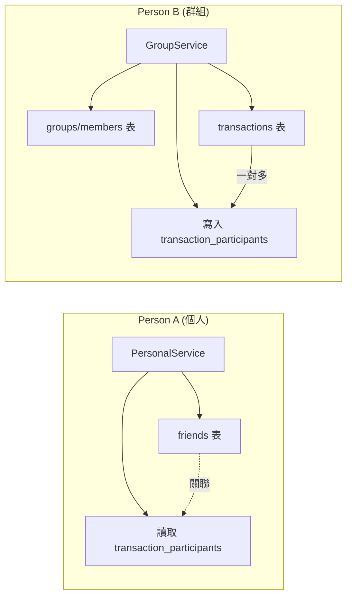

# 重構專案結構：區分個人與群組頁面

本計畫根據使用者需求，將專案 UI 拆分為三大部分：主頁框架、個人頁面、群組頁面。

## 擬議變更

### 1. 主頁框架 (Main Frames)
將 [AccountingGUI.py](file:///c:/PJ02/mysalf/ui/AccountingGUI.py) 進行模組化拆分，並將基礎框架保留在 [ui](file:///c:/PJ02/mysalf/ui/personal/friends_frame.py#10-18) 或移動到 `ui/main`。

*   **[MODIFY] [AccountingGUI.py](file:///c:/PJ02/mysalf/ui/AccountingGUI.py)**: 簡化主程式，負責導航與全局狀態。
*   **[NEW] [login_frame.py](file:///c:/PJ02/mysalf/ui/components/login_frame.py)**: (選用) 將登入邏輯獨立。

### 2. 個人頁面 (Personal Pages)
集中維護所有與「個人」相關的功能。

*   **[MOVE] [friends_frame.py](file:///c:/PJ02/mysalf/ui/group/friends_frame.py) -> [friends_frame.py](file:///c:/PJ02/mysalf/ui/personal/friends_frame.py)**: 好友功能歸類於個人。
*   **[KEEP] [personal_frame.py](file:///c:/PJ02/mysalf/ui/personal/personal_frame.py)**: 維持在個人資料夾。

## 兩人分工建議 (Division of Labor)

為了提高開發效率，建議將專案拆分為以下兩個角色：

### 角色 A：個人帳務與基礎架構 (Individual & Core Infra)
*   **後端服務**: [core/base.py](file:///c:/PJ02/mysalf/core/base.py), [core/models.py](file:///c:/PJ02/mysalf/core/models.py), [core/personal_service.py](file:///c:/PJ02/mysalf/core/personal_service.py)
*   **前端頁面**: `ui/personal/` (包含個人帳單摘要、我的好友清單)
*   **開發重點**: 確保資料庫穩定性、處理個人與好友的數據邏輯、QR 碼生成。

### 角色 B：群組協作與分帳運算 (Group & Split Logic)
*   **後端服務**: `core/group_service.py`
*   **前端頁面**: `ui/group/`, `ui/AccountingGUI.py` (主框架整合)
*   **開發重點**: 處理多人分帳演算法、交易確認流轉、群組動態管理、系統主頁導航。

## 資料庫分工與協作 (Database Collaboration)

兩位開發者共用同一個 `accounting.db` 檔案以確保數據一致性。

### 1. 權限劃分
| 資料表 | 負責人 | 權限內容 |
| :--- | :--- | :--- |
| `groups`, `group_members` | **Person B** | 建立群組、加入成員 |
| `transactions` | **Person B** | 建立消費實體 |
| `transaction_participants` | **共同維護** | B 寫入金額，A 讀取結算 |
| `friends` | **Person A** | 好友建立與查詢 |
| **Schema 修改** | **Person A** | 所有 `ALTER TABLE` 或 `CREATE TABLE` |

### 2. 資料流向圖

---

### 5. 核心系統模組化 (Core Modularization)
將 `core/main.py` 拆分為以下物理檔案以支持分工：
(清單同上)

---

> [!IMPORTANT]
> 註解將遵循既定開發規範，使用繁體中文清晰描述每個功能的運作原理。

## 6. 專案清理計畫 (Project Cleanup)

### 建議刪除項目 (To be Deleted)
*   **測試目錄**: `c:/PJ02/mysalf/test/` (包含所有過時的測試腳本)
*   **測試資料庫**: 
    - `c:/PJ02/mysalf/test_accounting.db`
    - `c:/PJ02/mysalf/test_splits.db`
    - `c:/PJ02/mysalf/test_twd.db`
    - `c:/PJ02/mysalf/data/test_accounting.db`
    - `c:/PJ02/mysalf/data/test_atomicity.db`
*   **輔助/修復工具**:
    - `c:/PJ02/mysalf/repair_db.py`
    - `c:/PJ02/mysalf/reset_data.py`

### 保留項目 (To be Kept)
*   **核心代碼**: `core/`, `ui/`
*   **正式數據**: `data/accounting.db`
*   **文檔**: `doc/`, `DEVELOPMENT_GUIDE.md`, `features.md`, `計劃書.txt`

## 7. Git 自動化工具 (Git Automation)
為了簡化協作流程，提供以下自動化工具：
*   **[NEW] [setup_git.bat](file:///c:/PJ02/mysalf/setup_git.bat)**: 一鍵連結遠端倉庫並推送。
*   **[NEW] [setup_git.py](file:///c:/PJ02/mysalf/setup_git.py)**: 內建防呆機制的 Git 設置腳本。

### 手動驗證
1. 確保 `AccountingGUI.py` 能正確引用的所有新路徑。
2. 檢查三個主要區塊（帳單、群組、好友）是否都能正常切換與顯示。

