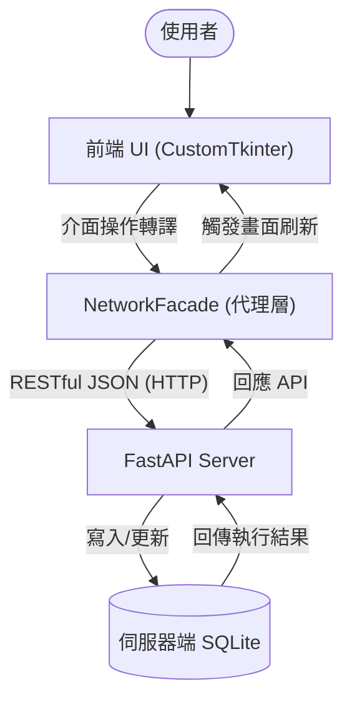
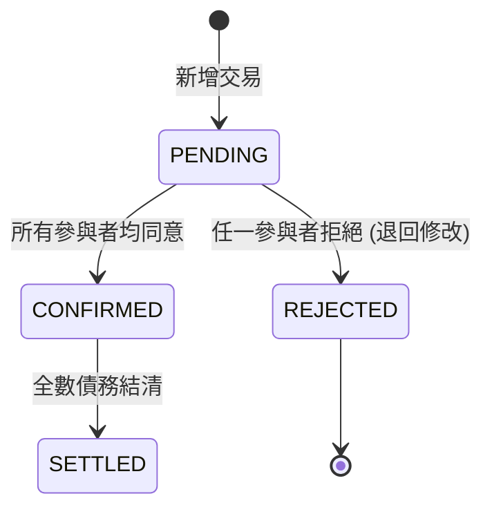

# Group Ledger - 專案技術手冊與完整說明文件

> [!IMPORTANT]
> 本文件為 Group Ledger 專案的權威技術手冊，所有內容皆對應實際的 Python 原始碼，不含任何未實作之提案構想。

---

## 1. 專案總覽 (Project Overview)

### 1.1 系統介紹
在多人共同活動（如集體旅遊、朋友聚餐、合租生活）中，消費記錄與後續的債務結算往往是件繁瑣的事。
**「多人群組本地帳務系統 (Group Ledger)」** 透過 **CustomTkinter** 現代化桌面介面與 **SQLite** 資料持久化，提供了一個整合個人記帳與群組分帳的解決方案。

### 1.2 確切實作價值
1. **多端即時同步 (Multi-device Sync)**：基於 **FastAPI** 構建的中央伺服器與 REST API，解決多裝置資料不一致的問題。
2. **狀態化帳本 (Lifecycle Management)**：每筆交易強制遵循 `PENDING` -> `CONFIRMED` -> `SETTLED` 生命週期，支援防呆的「一票否決 (REJECTED)」保護機制。
3. **智慧結算 (Greedy Debt Minimization)**：內建多方淨額抵銷演算法，自動將網狀的「A欠B、B欠C」化簡為最少次數的還款建議。
4. **高併發防護 (UUID)**：捨棄傳統自增整數，全面採用 UUID v4 作為交易與用戶的唯一識別碼，實現分散式離線也能無衝突新增帳務。

---

## 2. 系統架構 (System Architecture)

本系統採「本地為輔，伺服器為主」之混合架構（Hybrid Mode），透過代理人模式降低前端耦合：

### 2.1 連網模式數據流圖


---

## 3. 核心技術與演算法實作 (Core Implementations)

### 3.1 三階狀態機 (State Machine)
系統在 `backend/core/models.py` 中嚴格定義了交易的三大狀態。只有在參與者按下「確認」後，款項才會正式列入「待結算」餘額。若任意參與者發現異常點擊「拒絕」，將會退回重整。



### 3.2 代理人網路同步 (Network Facade)
原先系統將所有邏輯緊耦合於本地資料庫。為達到連網多端同步，我們實作了 `backend/core/network_facade.py` 作為中介 Proxy：
- 攔截前端所有 `propose_transaction` 或 `settle_debts` 呼叫。
- 利用 Python `requests` 模組透過 HTTP 將資料傳遞給位於 `backend/server/app.py` 的 FastAPI 服務器。

### 3.3 智慧結算與抵銷演算法 (Greedy Algorithm)
在 `backend/core/group_service.py` 中使用的算法核心：
1. **計算淨值 (Net Balance)**：收支相抵的總額。
2. **分離陣營**：將參與者分為「總負債人(Debtors)」與「總債權人(Creditors)」。
3. **貪婪配對**：由欠最多錢的人，優先還給代墊最多錢的人。持續循環，將原本最多需 N(N-1) 次的轉帳降到極簡次數。

---

## 4. 目錄結構與模組拆解

本專案採前端展示與後端業務切割的模組化概念：

```text
group ledger/
├── backend/                  # 核心業務與伺服器邏輯
│   ├── core/                 # 負責圖論結算、狀態躍遷與代理網路通訊
│   ├── data/                 # SQLite 實體資料庫存放區
│   └── server/               # app.py (FastAPI 進入點)
├── doc/                      # Schema 腳本 (DDL)
├── frontend/                 # UI 顯示層
│   └── ui/                   # 主體介面 (AccountingGUI.py 與各分頁 Frame)
├── tests/                    # 開發時期的流程整合測試 (如日本旅遊測試腳本)
├── requirements.txt          # Python 第三方套件依賴清單
└── 工具/                     # SOP 說明與自動化腳本 (bat)
```

**關鍵前端模組 (Frontend)**：
- `AccountingGUI.py`：單例入口，負責整體頁面路由。
- `analysis_frame.py`：利用 `matplotlib` 繪製消費圓餅圖。
- `group_frame.py`：對應群組內的交易清單與預算卡片動態顯示。
- `personal_frame.py` & `friends_frame.py`：個人專屬消費面板，以及點對點的好友名片QR Code顯示介面。

---

## 5. 技術棧清單 (True Tech Stack)

以下技術皆在專案的開發中真實引入與應用：

| 技術名稱 | 用途說明 | 實際套件名稱 |
| :--- | :--- | :--- |
| **FastAPI** | 實作高效能非同步 API 端點，使多端設備能同時向伺服器寫入帳務 | `fastapi`, `uvicorn` |
| **HTTP Client** | 負責串接 FastAPI，將 GUI 動作包裹為 REST 請求 | `requests` |
| **CustomTkinter** | 提供現代化、支援 DPI 與深色模式的圖形介面 | `customtkinter` |
| **SQLite 3** | 免安裝伺服器的關聯式資料持久化解決方案 | Python 內建 `sqlite3` |
| **Matplotlib** | 圖表生成，將後端匯總的報表動態畫至 UI | `matplotlib` |
| **Tkcalendar** | 在登錄消費時提供直觀的圖形化日曆選擇器 | `tkcalendar` |
| **Pillow / QRcode**| 生成使用者 ID 二維碼交接名片功能 | `pillow`, `qrcode` |

---

## 6. 開發與部署 SOP

1. **環境建置**：需安裝 Python 3.10 以上，並透過 `pip install -r requirements.txt` 安裝相依套件。
2. **伺服器啟動 (Server)**：執行 `工具/start_server.bat`，系統會於 localhost 拉起 Uvicorn 提供 8000 port 服務。
3. **客戶端啟動 (Client)**：執行 `工具/run_online.bat`，系統實例會被注入 `NetworkFacade` 並呼叫伺服器運作。
