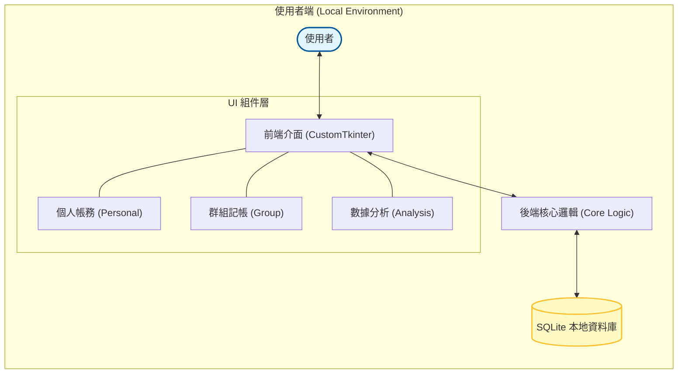
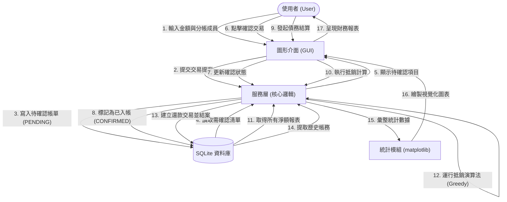
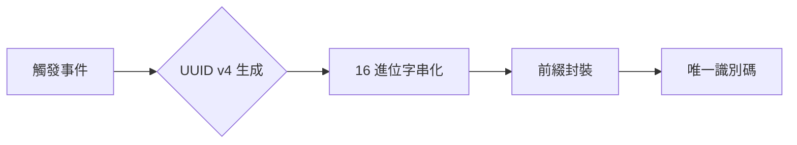
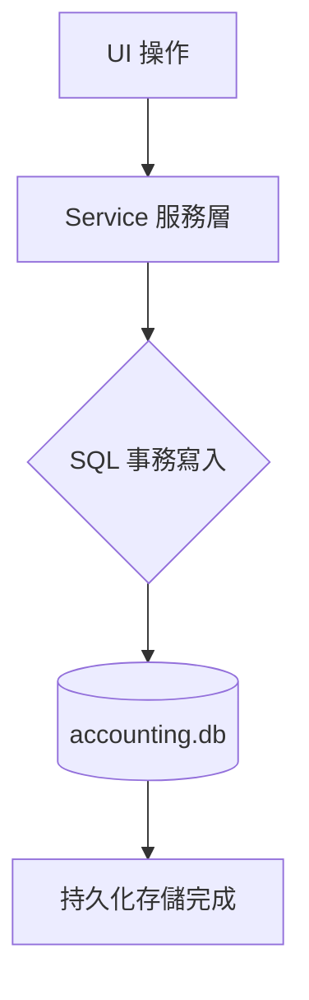
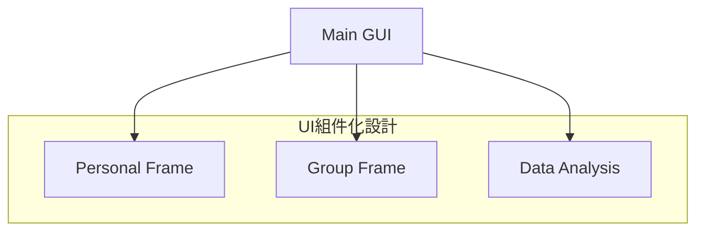
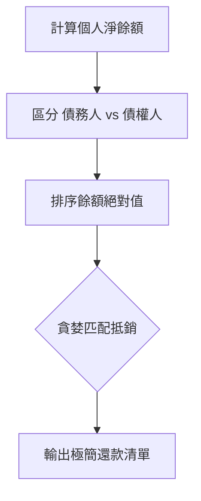
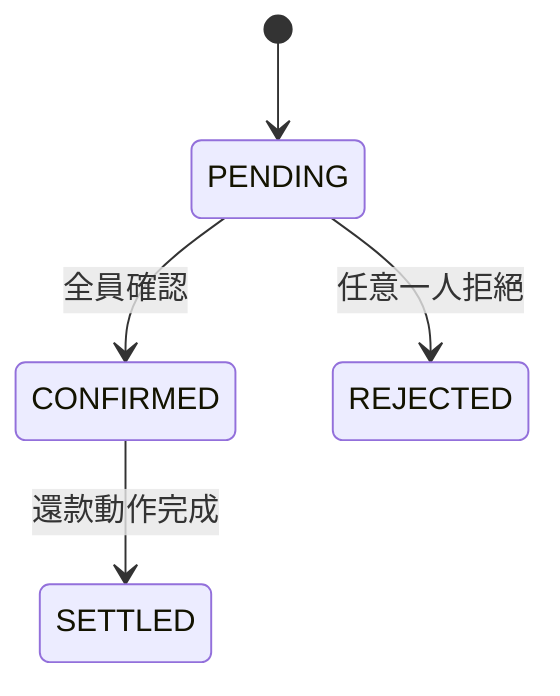

# group ledger - 專案完整說明手冊 (Full Documentation)
## 1. 系統介紹 (System Introduction)
### 1.1 專案情境與價值
在多人共同活動（如集體旅遊、朋友聚餐、合租生活）中，消費記錄與後續的債務結算往往是件繁瑣且容易出錯的事。雖然市面上已有許多分帳 App，但往往面臨隱私外洩、介面過於複雜、或必須依賴雲端伺服器才能運作的限制。
**「多人群組本地帳務系統 (group ledger)」** 應運而生，其核心目標是提供一個 **「隱私優先、離線可用」** 的個人與群組記帳平台。
### 專案價值主張：
1. **數據主權與隱私 (Privacy First)**
   - 所有帳務數據均儲存在使用者的本地 SQLite 資料庫中。
   - 數據不會上傳至任何第三方商業平台，確保個人消費習慣的絕對隱私。
2. **從個人到群組的無縫切換 (Dual-mode Integration)**
   - 系統整合了「個人私密帳務」與「多人共享帳務」兩種模式。
3. **三階狀態化債務管理 (Advanced State Machine)**
   - 每一筆交易都具備嚴謹的生命週期：`PENDING` (待確認) -> `CONFIRMED` (已成立) -> `SETTLED` (已清償)。
   - 實作了**「一票否決制 (Veto Power)」**：只要有一位參與者回報有誤 (REJECTED)，主表狀態即刻鎖定為異常。
4. **全域唯一標識符 (UUID Compliance)**
   - **功能作用**：確保在多人併發操作或離線記帳時，生成的 ID 具備 100% 碰撞防護，且在前綴區分下更具可讀性。
   - **核心程式碼** (於 `frontend/ui/AccountingGUI.py:L278`)：
     ```python
     tid = f"tx_{uuid.uuid4().hex[:12]}"
     ```
   - **視覺化流程**：
     ```mermaid
     graph LR
         A[發起新交易] --> B{uuid.uuid4}
         B --> C[hex 轉換與截取]
         C --> D[加上 tx_ 前綴]
         D --> E[(寫入資料庫)]
     ```

### 1.2 系統架構圖 (System Architecture)

### 1.3 核心技術實作與概念
#### 本地化優先架構 (Local-first Architecture)
系統核心基於 **SQLite** 非伺服器型資料庫，實作了「紀錄即持久化」的特性。
- **事務一致性**：透過 SQL Transaction 確保在處理多使用者分帳時，金額的增減具備原子性，避免出現數據不一致。
- **磁碟佔用極低**：即使擁有數千條帳務記錄，資料庫檔案大小仍保持在數 MB 以內，極具攜帶性。
#### 現代化桌面介面 (CustomTkinter GUI)
捨棄了傳統 Tkinter 沉悶的視覺風格，採用 **CustomTkinter** 框架建構現代化介面。
- **高 DPI 支援**：自動適應 Windows/macOS 的視網膜螢幕縮放，確保文字與圖表清晰。
- **佈局管理**：採用 Grid 佈局系統與 Frame 模組化設計，實現了響應式視窗縮放與深色/淺色模式的一鍵切換。
### 1.4 特色功能與演算法
#### 個人與群組雙模切換 (Dual-mode Switching)
系統提供無縫的介面切換機制，讓使用者能同時管理兩類完全不同的帳務：
- **個人模組**：專注於私密性，記錄食衣住行等日常瑣碎開銷。
- **群組模組**：專注於協作性，支援多人共同記帳、好友管理與分帳功能。
#### 債務生命週期狀態機 (Debt State Machine)
為了確保分帳的嚴謹性，系統實作了一套完整的債務狀態轉移邏輯：
- **Pending (待確認)**：當某人代付後，交易進入待確認狀態。
- **Confirmed (已確認)**：參與者確認金額無誤後，債務正式成立。
- **Settled (已結清)**：雙方完成轉帳並經由系統記錄後，債務宣告解除。
#### 數據分析與視覺化 (Data Analysis)
內建強大的統計分析引擎，協助使用者掌握財務狀況：
- **消費分布圖**：利用 Matplotlib 產生圓餅圖，直觀顯示各大類別的支出佔比。
- **動態過濾**：支援按日期、類別進行篩選，提供多維度的開支報告。
---
## 2. 專題提案 (Project Proposal)
### 2.1 專題題目
群組本地帳務系統 (Group Ledger)
### 2.2 動機
在多人共同活動（如集體旅遊、朋友聚餐、合租生活）中，消費記錄與後續的債務結算往往繁瑣且容易出錯。現有的通訊軟體缺乏結構化記錄，難以解決「對話紀錄翻不完」的資訊雜訊與帳務爭議。
### 2.3 目標
建立一個「隱私優先、離線可用」的帳務平台。透過整合「個人私密帳務」與「多人共享帳務」兩種模式，確保使用者能彈性管理財務，並利用演算法自動簡化債務。
### 2.4 解決什麼問題？
1. **隱私與安全**：解決雲端分帳 App 可能面臨的數據外洩疑慮，所有資料皆儲存在本地 SQLite。
2. **結算效率**：解決手動計算複雜網狀債務的困難，透過「多方淨額抵銷演算法」簡化轉帳次數。
3. **資訊一致性**：解決多人併發筆記時的確認衝突，透過「非同步驗證機制 (Pending -> Confirmed)」確保結算透明。
### 2.5 功能範圍
- **雙模切換**：整合個人日常開銷與群組分帳管理。
- **債務生命周期**：實作 Pending, Confirmed, Settled 的狀態轉移逻辑。
- **智慧結算**：內建貪婪演算法，提供網狀債務的極簡化路徑。
- **數據視覺化**：動態生成消費分布圓餅圖與趨勢報表。
- **快捷工具**：支援 QR Code 掃描加好友與快速記帳按鈕。
### 2.6 未來展望
- **自動同步**：雖然目前主打「隱私優先、離線可用」，但未來可考慮加密的本地同步機制。
- **AI 支出分類**：利用簡單的自然語言處理 (NLP) 對記帳文字進行自動標籤化，提升使用者體驗。
### 2.7 預期成果
1. **美觀的 GUI 介面**：採用 CustomTkinter 建構現代化、支援深色模式的桌面應用程式。
2. **精簡的清償清單**：將複雜的群組內債務簡化為最少的現金流動建議。
3. **完整的財務報表**：提供一目了然的月度消費分析與導出功能。

#### 2.8 技術實作補充 (前端與工具)
##### 2.8.1 components / common.py ：通用視窗元件
- **登入視窗 (LoginFrame)**：實作帶有「記住我」功能的登入介面，處理使用者名稱輸入與設定檔的初步載入。

##### 2.8.2 run.py / upload_changes.py ：系統啟動與同步工具
- **快速啟動 (run.py)**：作為使用者的直接捷徑，自動處理環境變數並啟動 `AccountingGUI`。
- **自動化上傳 (upload_changes.py)**：封裝 Git 指令，引導開發者以標準化格式提交變更，確保團隊開發不衝突。

#### 2.9 資料庫結構與變更 (Database Files)
##### 2.9.1 doc / schema.sql ：資料庫結構藍圖
- **DDL 定義**：包含 `groups`, `transactions`, `transaction_participants` 等表的完整結構，並透過外鍵級聯（Cascade）維護資料一致性。

##### 2.9.2 doc / migrations.sql ：資料庫變更紀錄
- **變更腳本**：記錄系統版本更迭過程中的資料庫結構異動（Schema Changes），確保舊版本資料庫能平滑升級。
---
## 3. 系統應用情境敘述 (Scenario Description)
### 3.1 綜合情境：日本五人旅遊分帳聯測
**實驗對象**：User_A (主揪), B, C, D, E (共 5 人)。
**驗證場景**：
1. **多階段確認**：User_A 預付 $100,000 機票。經測試驗證，主表狀態在 User_E（第 5 人）點擊前均精準維持 `PENDING`；全員確認後自動躍遷為 `CONFIRMED`。
2. **一票否決 (Veto)**：在餐費分攤中，若 User_C 回報金額有誤 (REJECTED)，主表立即變為紅色異常標記。
3. **還款自動聯動同步**：User_D 針對該帳單發起「手動還款」，系統核心狀態機自動掃描參與者分佈，並在各方清償後自動將原始萬元大帳單標記為 `SETTLED`。
---
## 4. 專題計畫書 (Project Plan)
### 4.1 摘要
本系統以 Python + Tkinter 桌面應用程式為實作基礎，採用 SQLite 關聯式資料庫管理帳本資料。針對多人群租、社交聚餐等情境中頻繁發生的代墊款項結算問題，設計一套具備非同步確認流程的分帳系統，解決「對話紀錄翻不完」的資訊雜訊。
### 4.2 執行方法與步驟
1. **資料蒐集與分析**：定義 User, Group, Transaction 資料結構。
2. **群組管理開發**：實作 group_service.py 與隔離機制。
3. **分帳與狀態機**：處理 Pending -> Confirmed 邏輯。
4. **自動化催告**：實作逾期掃描與動態期限建議。
5. **數據視覺化**：整合 matplotlib 與 tkcalendar。
### 4.3 數據流向圖 (Data Flow Diagram)

---
## 5. 深入技術報告 (Technical Deep Dive)
### 5.1 資料庫表結構 (Schema)
*   **groups**: 儲存 `group_id`, `name`, `join_code`, `budget`。
*   **transactions**: 儲存 `transaction_id`, `payer_id`, `amount`, `status`, `type`, `description`, `timestamp`。
*   **transaction_participants**: 儲存分帳細節與個人確認狀態。
### 5.2 核心演算法：多方淨額抵銷 (Greedy Debt Minimization)
核心原理：**不論中間經過多少次代墊，最後只需要讓「應付出的總額」流向「應收到的總額」即可。**
1. 計算每人的淨餘額 (Net Balance)。
2. 將使用者分為「債權人」與「債務人」兩份清單並排序。
3. 使用貪婪匹配，讓債務最高的人優先還款給債權最高的人，直到清帳。
### 5.3 UI 技術細節
- **雙擊穿透**：遞迴綁定 `CTkFrame` 與其子元件的事件。
- **依賴注入**：主介面實體化 `DebtSystem` 並將其傳遞給子 Frame，確保資料操作的一致性。
### 5.4 系統核心演算法位置對照表 (Algorithms & Formulas Mapping)
為了確保帳務處理的精準度與自動化，系統實作了多項核心演算法，具體對應位置如下：

| 功能項目 | 演算法/公式描述 | 原始碼對應位置 |
| :--- | :--- | :--- |
| **精準交易均分** | 採 `基數 + 餘數遞增` 邏輯，確保分帳總和與原始金額 100% 吻合，無 1 元誤差。 | [group_service.py:L105-108](file:///c:/PJ02/group%20ledger/backend/core/group_service.py#L105-L108) |
| **債務簡化與抵銷** | 使用 **貪婪演算法 (Greedy)**，藉由排序債務與債權清單，極小化結算時的轉帳總次數。 | [group_service.py:L226-243](file:///c:/PJ02/group%20ledger/backend/core/group_service.py#L226-L243) |
| **狀態機自動躍遷** | 實作多參與者狀態優先級權重判定，包含「一票否決 (Rejected)」與「全員確認」邏輯。 | [group_service.py:L149-178](file:///c:/PJ02/group%20ledger/backend/core/group_service.py#L149-L178) |
| **淨餘額計算** | 動態加總所有確認交易中個人的 `應收額 - 應付額`，得出即時帳務淨值。 | [group_service.py:L198-216](file:///c:/PJ02/group%20ledger/backend/core/group_service.py#L198-L216) |
| **剩餘預算監控** | 公式：`Remaining = Budget - SUM(Active Expenses)`，提供群組消費預警。 | [group_service.py:L89](file:///c:/PJ02/group%20ledger/backend/core/group_service.py#L89) |
| **隨機邀群碼** | 結合 `random.choices` 與資料庫唯一性遞迴檢查，生成 6 位不重複英數邀請碼。 | [group_service.py:L14-20](file:///c:/PJ02/group%20ledger/backend/core/group_service.py#L14-L20) |
| **個人全域債務對沖** | 跨群組針對特定好友進行全域債務加總，方便個人私下結帳參考。 | [personal_service.py:L131-137](file:///c:/PJ02/group%20ledger/backend/core/personal_service.py#L131-L137) |
| **全域唯一標識符** | 採用 **UUID v4** 技術生成 12 位隨機 Hex 字串，確保在離線記帳與高併發時 ID 不重複。 | [AccountingGUI.py:L278](file:///c:/PJ02/group%20ledger/frontend/ui/AccountingGUI.py#L278) |


### 5.5 核心技術實作詳解 (Core Technology Implementation Details)
以下展示系統中 8 項核心技術的具體實作邏輯、應用位置與流程圖：

#### 5.5.1 全域唯一標識符 (UUID v4)
- **功能作用**：捨棄易受系統時間影響的時間戳 ID，採用隨機 UUID v4 確保全域唯一性。
- **應用位置**：`frontend/ui/AccountingGUI.py:L278` (交易)、`backend/core/group_service.py:L15` (群組編號)。
- **核心實作**：
```python
# 產生 12 位隨機 Hex 並加上交易前綴
tid = f"tx_{uuid.uuid4().hex[:12]}"
```
- **視覺化邏輯**：


#### 5.5.2 本地資料持久化 (SQLite)
- **功能作用**：體現隱私優先架構，數據不出本地端，確保事務原子性。
- **應用位置**：`backend/core/base.py:L14-16` 與 `doc/schema.sql`。
- **核心實作**：
```python
# backend/core/base.py
def get_db_connection():
    conn = sqlite3.connect(SYSTEM_DB_PATH)
    conn.row_factory = sqlite3.Row
    return conn
```
- **視覺化邏輯**：


#### 5.5.3 現代化桌面 UI 框架 (CustomTkinter)
- **功能作用**：解決原生 Tkinter 美觀度不足與縮放模糊問題，原生支持深色模式。
- **應用位置**：`frontend/ui/AccountingGUI.py`。
- **核心實作**：
```python
# 設定外觀與顏色主題
ctk.set_appearance_mode("dark")
ctk.set_default_color_theme("blue")

class AccountingGUI(ctk.CTk):
    def __init__(self):
        super().__init__()
        self.title("Group Ledger v1.0")
```
- **視覺化邏輯**：


#### 5.5.4 債務簡化與抵銷演算法 (Greedy)
- **功能作用**：將群組內複雜的網狀債務，簡化為最精簡的還款建議路徑。
- **應用位置**：`backend/core/group_service.py:L235-243` (演算法核心迴圈)。
- **核心實作**：
```python
# 取債務與債權的最小值作為轉帳金額
while d_idx < len(debtors) and c_idx < len(creditors):
    pay_amt = min(abs(debtors[d_idx][1]), creditors[c_idx][1])
    settlement_plan.append({"from": d_id, "to": c_id, "amount": pay_amt})
```
- **視覺化邏輯**：


#### 5.5.5 債務生命週期狀態機 (State Machine)
- **功能作用**：透過嚴謹的狀態轉移與「一票否決制」，確保公帳結算的公正性。
- **應用位置**：`backend/core/group_service.py:L149-178`。
- **核心實作**：
```python
if any(s == "REJECTED" for s in statuses):
    new_main_status = "REJECTED" # 一票否決
elif all(s == "SETTLED" for s in statuses):
    new_main_status = "SETTLED"
```
- **視覺化邏輯**：


#### 5.5.6 數據趨勢與佔比統計 (Matplotlib)
- **功能作用**：將枯燥的數位轉換為圖形，直觀展示消費行為。
- **應用位置**：`frontend/ui/analysis/analysis_frame.py:L64-75`。
- **核心實作**：
```python
# 生成消費佔比圓餅圖
ax1.pie(group_sums.values(), labels=group_sums.keys(), autopct='%1.1f%%')
ax2.plot(dates, amts, marker='o', color='#3498db')
```
- **視覺化邏輯**：


#### 5.5.7 精準交易均分邏輯
- **功能作用**：處理除不盡的餘數（如 100 元三人分），確保總和精準。
- **應用位置**：`backend/core/group_service.py:L105-108`。
- **核心實作**：
```python
# 前 rem 位參與者多分配 1 元
splits[uid] = base + (1 if i < rem else 0)
```
#### 5.5.8 隨機邀群碼生成
- **功能作用**：生成高強度 6 位唯一邀請碼，避免遞推暴力破解。
- **應用位置**：`backend/core/group_service.py:L14-20`。
- **核心實作**：
```python
join_code = ''.join(random.choices(string.ascii_uppercase + string.digits, k=6))
```
---
## 6. 資料夾架構說明 (Project Structure)
```text
group ledger/
├── backend                               # 後端業務邏輯與資料層
│   ├── core                             # 核心邏輯 (base, db_update, group_service, models, personal_service)
│   └── data                             # 資料存放 (accounting.db, config.json)
├── doc                                   # 結構紀錄 (migrations.sql, schema.sql)
├── frontend                              # 前端介面 (AccountingGUI.py, analysis, components, group, personal)
├── tests                                 # 自動化測試與情境模擬實驗室 (NEW!)
├── requirements.txt                      # 依賴套件
├── run.py                                # 統一啟動入口 (NEW!)
├── README.md                             # 專案快速上手指南 (NEW!)
└── 工具                                  # 輔助腳本與技術手冊
```
---
*本文件由系統自動彙整，更新日期：2026-04-02*