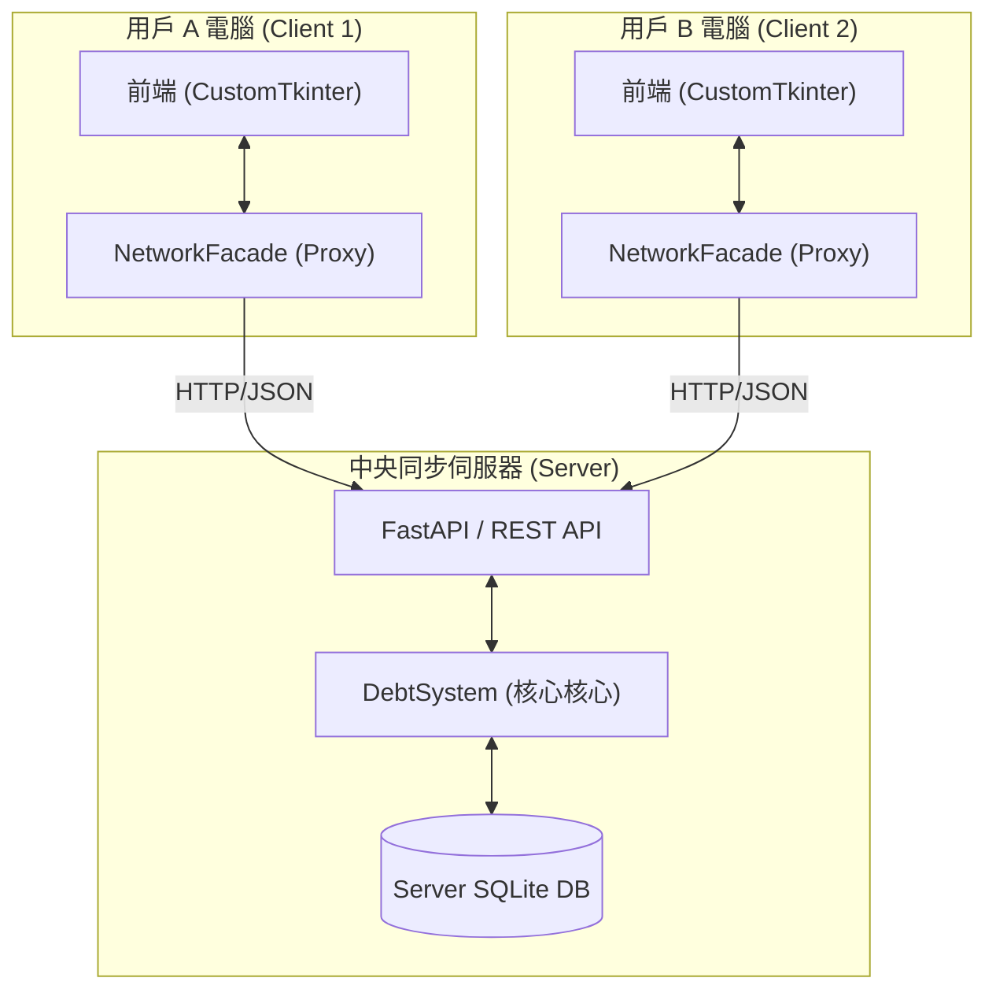
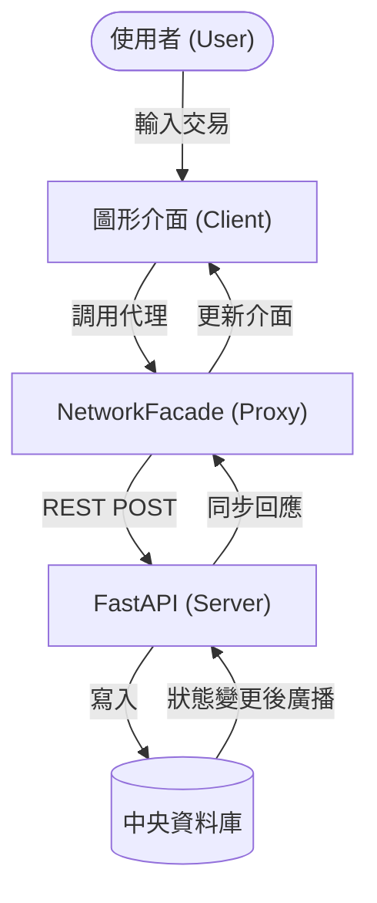
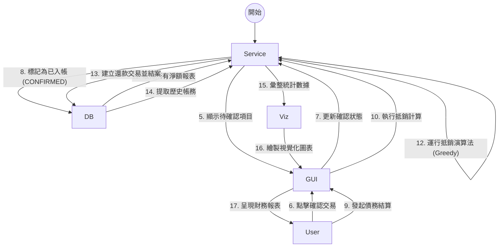

# Group Ledger 專案完整說明與技術手冊 (整合版)

> [!IMPORTANT]
> 本文件為 `工具/` 目錄下所有 Markdown 文件的 100% 無刪減整合版本，包含了完整的演算法公式、SOP 與架構圖。

<!-- 區塊開始: 系統介紹.md -->
## 來源單元：系統介紹

# 多人群組本地帳務系統 (Hybrid Mode)
## 1. 專案情境與價值

在多人共同活動（如集體旅遊、朋友聚餐、合租生活）中，消費記錄與後續的債務結算往往是件繁瑣且容易出錯的事。雖然市面上已有許多分帳 App，但往往面臨隱私外洩、介面過於複雜、或必須依賴雲端伺服器才能運作的限制。

**「多人群組本地帳務系統 (group ledger)」** 提供了一個 **「隱私優先、可選同步」** 的個人與群組記帳平台。

### 專案價值主張：
1. **數據主權與隱私 (Privacy First)**
   - 預設數據儲存在本地 SQLite。
   - 使用者可選擇啟動私有的中央伺服器進行同步，數據不經由第三方商業平台。

2. **[NEW] 多端即時同步 (Multi-device Sync)**
   - 透過全新的 **FastAPI 伺服器** 架構，多個使用者可以同時在不同裝置上記帳，並即時看到夥伴的更新。

3. **從個人到群組的無縫切換 (Dual-mode Integration)**
   - 使用者可在同一個介面管理私密開銷與共享分帳，無需切換 App。

4. **狀態化債務管理 (Lifecycle Management)**
   - 每筆交易具備 PENDING/CONFIRMED/SETTLED 完整生命週期，降低帳務糾葛。

---

## 2. 系統架構圖 (System Architecture)

### [NEW] 連網同步模式 (Online Mode)


---

## 3. [NEW] 核心技術實作與概念

### 3.1 [NEW] 代理人模式與 REST API (Proxy Pattern)
系統導入了 **NetworkFacade** 作為網絡代理。前端介面代碼無需修改，只需更換注入的物件，即可從「讀取本地文件」切換為「發送 HTTP 請求」至遠端伺服器，實現無縫的連網轉型。

### 3.2 高可靠 UUID 全域標識碼
為了支援多端併發操作，交易 ID 採用 12 位 UUID，確保不同電腦同時記帳時不會產生 ID 衝突。

### 3.3 現代化桌面介面 (CustomTkinter GUI)
採用 **CustomTkinter** 框架，支援跨平台的高 DPI 縮放與原生深色模式。

---

## 4. 特色功能與演算法

### 4.1 債務生命週期狀態機 (Debt State Machine)
- **Pending (待確認)**：代付後等待相關成員勾選確認。
- **Confirmed (已確認)**：債務正式生效，列入結算清單。
- **Settled (已結清)**：還款完成，紀錄存檔。

### 4.2 智慧結算與抵銷 (Simplified Settlement)
內建貪婪演算法，自動將網狀的「A欠B、B欠C」抵銷為「A欠C」，將轉帳次數極小化。

### 4.3 數據分析與視覺化 (Data Analysis)
利用 Matplotlib 產生消費分布圓餅圖與趨勢報表。

---

## 5. 總結

**「多人群組本地帳務系統」** 證明了在追求便利同步的同時，依然能保有數據隱私的控制權。不管是離線旅記還是多人長期合租，系統都能提供最穩健且清晰的帳務支援。
<!-- 區塊結束: 系統介紹.md -->

---


<!-- 區塊開始: 專題提案.md -->
## 來源單元：專題提案

# 專題
## 。專題題目
群組本地帳務系統 (Group Ledger)

## 。動機
在多人共同活動（如集體旅遊、朋友聚餐、合租生活）中，消費記錄與後續的債務結算往往繁瑣且容易出錯。現有的通訊軟體缺乏結構化記錄，難以解決「對話紀錄翻不完」的資訊雜訊與帳務爭議。

## 。目標
建立一個「隱私優先、離線可用」的帳務平台。透過整合「個人私密帳務」與「多人共享帳務」兩種模式，確保使用者能彈性管理財務，並利用演算法自動簡化債務。

## 解決什麼問題？
1. **隱私與安全**：解決雲端分帳 App 可能面臨的數據外洩疑慮，所有資料皆儲存在本地 SQLite。
2. **結算效率**：解決手動計算複雜網狀債務的困難，透過「多方淨額抵銷演算法」簡化轉帳次數。
3. **資訊一致性**：解決多人併發筆記時的確認衝突，透過「非同步驗證機制 (Pending -> Confirmed)」確保結算透明。

## 功能範圍
- **雙模切換**：整合個人日常開銷與群組分帳管理。
- **債務生命周期**：實作 Pending, Confirmed, Settled 的狀態轉移逻辑。
- **智慧結算**：內建貪婪演算法，提供網狀債務的極簡化路徑。
- **數據視覺化**：動態生成消費分布圓餅圖與趨勢報表。
- **快捷工具**：支援 QR Code 掃描加好友與快速記帳按鈕。

---

你可以想：
### 是否可以增加「自動同步」功能？
雖然目前主打「隱私優先、離線可用」，但未來可考慮加密的本地同步機制。
### 是否加入「AI 支出分類」？
利用簡單的自然語言處理 (NLP) 對記帳文字進行自動標籤化，提升使用者體驗。

---

預期成果（最後會長怎樣）
1. **美觀的 GUI 介面**：採用 CustomTkinter 建構現代化、支援深色模式的桌面應用程式。
2. **精簡的清償清單**：將複雜的群組內債務簡化為最少的現金流動建議。
3. **完整的財務報表**：提供一目了然的月度消費分析與導出功能。

===============================================

# 技術實作系統 (後端)
## 1. models.py ：系統的語義定義
功用:你只需要改這個檔案，全域都會生效。
```py!
import enum
class TransactionStatus(enum.Enum):
    """交易狀態枚舉：定義交易在系統中的生命週期"""
    PENDING = "待驗證"      # 剛提出，等待相關參與者確認
    CONFIRMED = "已確認"    # 所有參與者已確認，正式生效
    REJECTED = "已拒絕"     # 被參與者拒絕（如金額有誤）
    SETTLED = "已結清"      # 款項已實際清償

class TransactionType(enum.Enum):
    """交易類型枚舉：區分一般消費與還款行為"""
    EXPENSE = "消費"        # 一般購物、聚餐支出
    SETTLEMENT = "還款"     # 債務結清、轉帳還款
```
## 2. base.py ：資料庫的基礎設施
功用:負責資料持久化。
### 核心副函式解讀
- **連線管理 (_get_connection)**：集中封裝 SQLite 連接邏輯，確保系統所有服務層皆連動至同一個本地資料庫路徑，維持資料一致性。
- **結構初始化 (_init_db)**：負責建立群組、成員、交易及參與者等五張核心資料表，並定義欄位約束，確保資料庫在初次執行時即可自動佈署完畢。

## 3. group_service.py ：核心業務邏輯
功用:負責處理分帳、預算與結算。
### 核心副函式解讀
- **餘額分析 (get_group_balances)**：遍歷所有已確認交易，動態匯總每位成員的債權與債務，為結算演算法提供基準數據。
- **清單摘要 (generate_group_bill_summary)**：將枯燥的資料轉化為「人話」摘要，包含應收/應付明細及具體的轉帳路徑，方便複製轉傳至 Line/TG 群組。
- **異步狀態同步 (confirm_transaction)**：實作狀態機的自動觸發邏輯，當最後一位成員提交確認後，系統會自動將整筆交易提升至已確認狀態。
- **催帳通知 (get_notification_message)**：針對特定交易生成包含金額、時間與未確認成員名單的格式化訊息。

## 4. db_update.py ：資料庫校驗與更新工具
功用:負責在系統環境變更時，自動校驗並補齊資料庫遺漏的欄位。
### 核心副函式解讀
- **校驗更新 (update_schema)**：透過 `PRAGMA table_info` 檢查各表結構，若發現遺漏欄位（如 `join_code`, `description`, `location`）則發起 `ALTER TABLE` 命令進行動態補齊。

## 5. main.py ：債務系統整合門面 (Facade)
功用:繼承並整合 `PersonalService` 與 `GroupService`，為 UI 層提供單一、統一的 API 接口。
### 核心副函式解讀
- **批量結算 (settle_specific_debts)**：支援使用者自選多筆交易進行一鍵結清，並自動產生對應的還款記錄。
- **累積餘額計算 (calculate_balances)**：計算群組內各成員的最終損益餘額，支援跨交易狀態的綜合統計。
- **逾期掃描 (check_overdue_transactions)**：**自動化期限建議系統**，根據金額大小（500/2000 為界）自動判斷 7/14/30 天的還款期限並產出通知清單。

## 6. personal_service.py ：個人帳務與好友管理
功用:專責個人私帳紀錄、好友關係維護（QR Code 生成）以及個人維度的債務匯總。
### 核心副函式解讀
- **社交整合 (generate_qr_path)**：將 User ID 轉換為二維條碼圖片，方便線下掃碼互加。
- **個人債務匯總 (get_personal_debts)**：區分「應付 (Payables)」與「應收 (Receivables)」兩大類別，從全域交易中過濾出與個人直接相關的財務項。
- **結清申請 (request_settlement)**：債務人向債權人主動發起還款確認請求，實現點對點的財務結算確認機制。

===

# 技術實作系統 (前端)
## 1. AccountingGUI.py ：系統門面與分頁驅動核心
功用:繼承自 `ctk.CTk`，作為整個應用程式的單一進入點。管理全域狀態、多分頁佈局並同步各組件數據。
### 核心副函式解讀
- **數據聯動 (refresh_ui)**：採用「依賴注入」模式，將後端系統實體傳遞給子組件。當切換群組時，統一觸發子 Frame 的 `refresh()`，確保全域資料同步。
- **背景守護執行緒 (run_scheduler)**：啟動獨立執行緒執行每日逾期檢查，不阻塞 UI 渲染主執行續，提升操作流暢度。

## 2. Analysis / Calendar ：數據統計與視覺化
功用:將後端 SQL 數據轉換為直觀的圓餅圖 (Matplotlib) 與日曆視圖 (tkcalendar)。
### 核心副函式解讀
- **畫布嵌入 (update_chart)**：利用 Matplotlib 的 `FigureCanvasTkAgg` 將統計圖表直接動態嵌入 CustomTkinter 的視窗控制項中。

## 3. components / dialogs.py ：模組化彈窗系統
功用:封裝所有互動式的輸入介面（如：加入群組、發起交易、好友 QR Code）。
### 核心副函式解讀
- **回調機制 (Callback Pattern)**：透過將後端動作作為 `callback` 參數傳入彈窗，實現 UI 層與業務邏輯層的完整解耦。

## 4. group_frame.py ：群組動態與預算管理
功用:負責顯示特定群組的所有交易流、成員名單及預算執行狀況。整合了「一鍵結算」與「匯出帳單」功能。
### 核心副函式解讀
- **智慧結算交互 (handle_settle)**：提供「逐筆結清」與「自動抵銷」雙模式選擇，並將建議的還款路徑視覺化。
- **背景數據與催帳 (refresh/handle_notify)**：動態刷新預算卡片警示，並產出可供複製的催帳訊息摘要。

## 5. personal_frame.py ：個人帳單儀表板
功用:匯總使用者在所有群組及私帳下的財務狀態。包含財務總覽卡片與「待辦驗證匣」。
### 核心副函式解讀
- **淨資產計算 (load_real_data)**：橫向加總所有群組的應收與應付項，計算出使用者的全域個人淨資產淨額。
- **一鍵銷帳應對 (do_confirm)**：針對還款請求進行原子化確認，自動連動後端進行正式的資料庫銷帳處理。

## 6. friends_frame.py ：好友社交與欠款管理
功用:維護雙向好友關係，並以卡片形式顯示與每位好友的獨立債務損益。
### 核心副函式解讀
- **結清申請 (open_repay_dialog)**：引導使用者選擇還款方式（現金/轉帳等），並主動向債權人發起結算確認請求。
- **社交優先權 (refresh)**：根據「帳務重要度」（債務金額絕對值）自動對好友清單進行排序顯示。

## 7. components / common.py ：通用視窗元件
功用:定義系統各處通用的基礎介面組件，保持視覺風格一致。
### 核心副函式解讀
- **登入視窗 (LoginFrame)**：實作帶有「記住我」功能的登入介面，處理使用者名稱輸入與設定檔的初步載入。

## 8. run.py / upload_changes.py ：系統啟動與同步工具
功用:管理應用程式的生命週期以及開發進度的雲端同步。
### 核心副函式解讀
- **快速啟動 (run.py)**：作為使用者的直接捷徑，自動處理環境變數並啟動 `AccountingGUI`。
- **自動化上傳 (upload_changes.py)**：封裝 Git 指令，引導開發者以標準化格式提交變更，確保團隊開發不衝突。

## 9. doc / schema.sql ：資料庫結構藍圖
功用:定義整個系統的數據骨架，確保資料表的關聯性與完整性。
### 核心副函式解讀
- **DDL 定義**：包含 `groups`, `transactions`, `transaction_participants` 等表的完整結構，並透過外鍵級聯（Cascade）維護資料一致性。

## 10. doc / migrations.sql ：資料庫變更紀錄
功用:記錄系統版本更迭過程中的資料庫結構異動（Schema Changes），確保舊版本資料庫能平滑升級。
### 核心副函式解讀
- **變更腳本**：包含 `ALTER TABLE` 與 `INSERT` 等指令，標註了各版本的結構偏移，是系統維修與擴充的重要依據。

<!-- 區塊結束: 專題提案.md -->

---


<!-- 區塊開始: 計劃書.md -->
## 來源單元：計劃書

# 多人分帳系統：連網同步機制與債務抵銷演算法實作
## 專題計畫書

### 摘要
本系統以 Python + Tkinter 桌面應用程式為實作基礎。針對多人群組中頻繁發生的代墊款項結算問題，設計了一套具備 **[NEW] 多端連網同步** 與 **非同步確認流程** 的分帳系統。

系統的核心設計包含三個面向：
1. **[NEW] 多人網路同步 (Sync Mode)**：透過 FastAPI 實作中央伺服器，解決跨裝置數據不一致的問題。
2. **非同步驗證機制**：採用交易狀態機（Pending → Confirmed），確保帳務透明。
3. **債務抵銷演算法**：利用圖論簡化算法將複雜債務極簡化。

---

### 1. 前言
在多人群租或社交情境中，代墊款項本質上是高度碎片化的交易。本系統透過 **[NEW] FastAPI 後端同步架構**，不僅解決了本地端紀錄的局限性，更實現了即時的群組動態對帳。

---

### 2. 執行方法及步驟

#### 2.1 資料蒐集與分析
*   **使用者與群組模型**：採用 UUID 作為唯一識別碼。
*   **資料庫建置**：同時維護本地與伺服器端的 SQLite 資料庫。

#### 2.2 [NEW] 多人同步與隔離機制
*   **[NEW] 代理人模式 (Proxy Pattern)**：實作 `network_facade.py`，將所有 GUI 呼叫透明地導向伺服器。
*   **[NEW] REST API 封裝**：定義完整的 REST 控制器，處理群組建立、加入與交易同步。

#### 2.3 分帳計算與交易狀態機
*   **交易驗證**：交易預設為 Pending，須經成員確認才轉為 Confirmed。
*   **狀態機自動躍遷**：一旦全員點擊確認，伺服器自動更新主表狀態。

#### 2.4 自動化催告與期限控管
*   **動態還款期限**：依金額建議還款天數。
*   **[NEW] 線上連通檢查**：客戶端啟動時自動檢查伺服器連線狀態。

---

### 3. [NEW] 連網模式數據流圖 (DFD)



---

### 4. [NEW] 技術棧總整理

| 類別 | 技術 / 套件 | [NEW] 標註 |
| :--- | :--- | :--- |
| **後端框架** | FastAPI / Uvicorn | [NEW] |
| **網路通訊** | Requests (HTTP/JSON) | [NEW] |
| **GUI 框架** | CustomTkinter | |
| **資料庫** | SQLite 3 | |
| **演算法** | 貪婪抵銷演算法 | |

---

### 5. 預期成果 (已達成)
1. **[NEW] 多人即時同步**：解決了「對話紀錄翻不完」的痛點，多裝置即時同步。
2. **三階狀態機帳本**：確保每筆支出的確認透明度。
3. **極簡化還款路徑**：自動計算最優還款建議。
4. **現代化視覺 UI**：支援深色模式與動態報表。


### 資料流關鍵說明：
1.  **狀態機轉換**：數據的核心狀態流向為 `PENDING` (待確認) -> `CONFIRMED` (已入帳/待結) -> `SETTLED` (已結清)。
2.  **非同步確認**：交易發起後不會立即改變餘額，必須經過 `transaction_participants` 表中的成員確認後，數據才會流向「待結算」池。
3.  **抵銷邏輯**：在結算過程中，數據會先匯總成淨額 (Net Balances)，再由演算法計算出最精簡的轉帳路徑，產生類型為 `SETTLEMENT` 的新交易流。

##### 4.6.2 債務抵銷演算法介紹
本系統採用的簡化結算模式（SIMPLIFIED）核心使用了 **貪婪演算法 (Greedy Algorithm)** 來極小化群組動態結算時的轉帳次數。

## 1. 演算法名稱
我們稱之為 **「多方淨額抵銷演算法」(Greedy Debt Minimization)**。

## 2. 核心原理
該演算法的核心思想是：**不論中間經過多少次代墊，最後只需要讓「應付出的總額」流向「應收到的總額」即可。**

這是一個典型的抵銷邏輯：
- 如果 A 欠 B 100 元，B 欠 C 100 元。
- 傳統方式：需要兩次轉帳（A->B, B->C）。
- 抵銷方式：只需要 A 轉帳 100 元給 C。其餘債務自動消失。

## 3. 運行步驟
系統在 `group_service.py` 中的 `settle_debts` 方法按以下步驟執行：

1.  **計算淨餘額 (Net Balance)**：
    統計群組內每個人所有的應收與應付，算出一個最終數字。正數代表應收（債權人），負數代表應付（債務人）。
2.  **分類與排序**：
    將所有人分為「債務人清單」與「債權人清單」，並根據金額大小進行排序。
3.  **貪婪匹配 (Greedy Matching)**：
    讓金額最大的債務人優先配對金額最大的債權人，直接進行轉帳操作。
4.  **動態更新**：
    每次配對後，更新該兩人的餘額，若有人歸零則移出清單，重複直到所有人餘額都處理完畢。

## 4. 為何選擇此演算法？
-   **直觀高效**：演算法時間複雜度為 $O(N \log N)$，對於一般群組（數十人以內）可以在毫秒內完成。
-   **最小轉帳次數**：在大多數情況下，能從網狀的 $N(N-1)$ 個交易路徑縮減到不超過 $N-1$ 次交易。

---
> [!TIP]
> 這種演算法與知名分帳 App "Splitwise" 的結算邏輯非常相似，能有效降低社交場合中频繁轉帳的尷尬與麻煩。

---

### 5. 技術棧總整理

| 類別 | 技術 / 套件 | 用途 |
| :--- | :--- | :--- |
| **程式語言** | Python 3.x | 全端開發語言[cite: 4] |
| **GUI 框架** | Tkinter | 桌面應用程式介面[cite: 4] |
| **日曆元件** | tkcalendar | 日曆視圖介面[cite: 4] |
| **資料庫** | SQLite | 本地端帳本資料儲存[cite: 4] |
| **視覺化** | matplotlib | 圖表生成[cite: 4] |
| **QR Code** | qrcode | 個人識別與加好友[cite: 4] |
| **版本控制** | Git | 程式碼管理與協作[cite: 4] |

---

### 6. 預期成果
1. **非同步驗證帳本**：解決多人記帳的時序混亂與確認衝突[cite: 4]。
2. **UX 核心結算模組**：保留原始債權，並提供可選的債務化簡模式[cite: 4]。
3. **自動到期提醒系統**：啟動時自動掃描，以客觀文字提醒清償項目[cite: 4]。
4. **視覺化月度報表**：提供圖表統計與完整的技術文件[cite: 4]。
5. **全局記帳與私帳功能**：提供隨時可用的快速記帳按鈕，並支持個人私密消費紀錄[cite: 4]。

---

### 參考文獻
[1] Leslie Lamport, Time, Clocks, and the Ordering of Events in a Distributed System, 1978.[cite: 4]
[2] Andrew S. Tanenbaum, Distributed Systems: Principles and Paradigms, 2017.[cite: 4]
[3] Jakob Nielsen, Usability Engineering, 1994.[cite: 4]
[4] SQLite Documentation, https://www.sqlite.org/docs.html[cite: 4]
[5] Tkinter Documentation, Python Software Foundation.[cite: 4]
[6] matplotlib Documentation, https://matplotlib.org/stable/index.html[cite: 4]
<!-- 區塊結束: 計劃書.md -->

---


<!-- 區塊開始: 深入技術報告.md -->
## 來源單元：深入技術報告

# 🛠️ group ledger 極詳細技術報告 (Deep Dive)

本文件針對 `group ledger` 系統的資料結構、服務層 API、核心演算法以及前端事件流進行極致細節的拆解。

---

## 1. 資料庫架構詳解 (Database Schema)

系統使用 SQLite 3，核心包含以下 5 張表，彼此透過外鍵 (`Foreign Key`) 邏輯關聯。

### A. 群組管理 (`groups`)
*   `group_id` (TEXT, PK): 內部唯一識別碼 (採用 UUID 生成)。
*   `name` (TEXT): 群組名稱。
*   `join_code` (TEXT): 6 位大寫英數邀群碼。
*   `budget` (REAL): 總預算金額。

### B. 交易主表 (`transactions`)
*   `transaction_id` (TEXT, PK): 交易唯一碼 (採用 UUID v4 生成)。
*   `group_id` (TEXT): 所屬群組，若為 `PERSONAL` 則代表個人私帳。
*   `payer_id` (TEXT): 付款人 ID。
*   `amount` (REAL): 總金額。
*   `type` (TEXT): `EXPENSE` (支出) 或 `SETTLEMENT` (還款)。
*   `status` (TEXT): `PENDING` (待確認) 或 `CONFIRMED` (已確認) 或 `SETTLED` (已結清)。
*   `timestamp` (DATETIME): 交易發生時間。

---

## 2. 核心服務 API (Core Service API)

### 2.1 GroupService (群組服務)
*   `propose_transaction(...)`：計算精準分帳餘數，並寫入雙表。
*   `settle_debts(...)`：執行「智慧補償演算法」，自動插入結算紀錄。

### 2.2 PersonalService (個人服務)
*   `get_personal_debts(user_id)`：雙向掃描應收與應付項。

---

## 3. [NEW] 分佈式同步架構 (Distributed Sync)

為了實作多人同時在線，我們在原本的本地架構上疊加了連網層：

### 3.1 [NEW] 代理人模式 (Network Facade)
系統實作了 **NetworkDebtSystem** 類別，它完美封裝了通訊細節。前端 UI 呼叫方法時，代理物件會自動：
1. 將參數序列化為 JSON。
2. 發送 HTTP POST/GET 請求至伺服器。
3. 解析回應並回傳給 GUI。

### 3.2 [NEW] FastAPI 動態路由
伺服器端採用 **FastAPI** 框架，透過非同步事件迴圈處理併發請求：
*   **路由對齊**：伺服器端的 Entry Point 完全對應本地 Service 的方法簽名。
*   **集中化驗證**：所有狀態機躍遷（如 CONFIRMED 轉換）都在伺服器端完成，確保數據一致性。

---

## 4. 演算法深入：智慧結算 (SIMPLIFIED Mode)

為了減少多餘轉帳，我們實作了**淨額抵銷演算法**：
1.  **收支相抵**：`Balance(User) = Σ(應收) - Σ(應付)`。
2.  **貪婪配對**：讓最大債務人與最大債權人優先抵銷，確保轉帳次數最優。

---

## 5. 優化細節：UUID 與防衝突

為了支援多人同步，交易 ID 改用：
`f"tx_{uuid.uuid4().hex[:12]}"`
這在分散式環境下提供了極高的碰撞防護，即便多個 Client 在同一秒內新增帳務，也能確保 ID 全體唯一。

---

## 6. 使用技術簡介 (Tech Stack)

*   **[NEW] FastAPI & Uvicorn**：提供高效能的後端 API 服務與連網同步核心。
*   **[NEW] Requests**：客戶端用於與伺服器進行 REST API 通訊的套件。
*   **CustomTkinter**：現化的桌面 UI 框架。
*   **SQLite 3**：穩定可靠的本地/伺服器端數據持久化方案。
*   **Matplotlib**：數據分析與視覺化繪圖。
*   **Tkcalendar**：日曆日期選擇。
�相同事件
f.bind("<Double-1>", lambda e: show_details(tid))
l.bind("<Double-1>", lambda e: show_details(tid))
```

### 4.2 依賴注入 (Dependency Injection)
`AccountingGUI` 持有一個單例的 `system` 物件。在建立 `GroupFrame(scroll, self.system)` 時將其傳入。這樣子組件不需要自己去處理資料庫連線，所有的資料操作都透過 `self.system` 呼叫對應 Service，達到了良好的**內聚性 (Cohesion)**。

---

## 5. 優化細節：UUID 與防衝突
為了能在未來實現離線同步，交易 ID 棄用了單純的自增型整數 (`AUTOINCREMENT`)，改用：
`f"tx_{uuid.uuid4().hex[:8]}"`
這大幅降低了兩個裝置在「同一秒鐘」記帳時發生 ID 碰撞的機率，是系統穩定性的基礎。

---

## 6. 使用技術簡介 (Tech Stack)

以下是本專案所使用的關鍵第三方技術庫及其用途簡述：

*   **CustomTkinter**：基於 Python 內建 Tkinter 的現代化封裝庫。提供更美觀的深色模式、圓角按鈕與跨平台一致的高級組件，是本專案 UI 的核心。
*   **SQLite 3**：嵌入式關聯型資料庫。無需伺服器即可運作，資料直接儲存在本地檔案中，非常適合中小型隨身記帳軟體。
*   **UUID (uuid4)**：隨機生成全體唯一識別碼的演算法。用於確保每筆交易在即便沒有網路連線時也能生成不重複的標識符。
*   **Pyperclip**：跨平台的剪貼簿存取工具。讓程式能把文字（如帳單摘要）「貼」到您的電腦剪貼簿，方便您轉傳至通訊軟體。
*   **QRcode**：二維條碼生成庫。負責將使用者的唯一 ID 轉換為名片 QR Code，提升好友添加的便利性。
*   **Matplotlib**：Python 最負盛名的數據繪圖庫。本專案用它來動態生成支出比例圓餅圖，並將畫布嵌入至 GUI 介面中。
*   **Tkcalendar**：專為 Tkinter 設計的日曆選擇組件。提供直觀的視覺選擇介面，取代傳統的手動輸入日期，減少格式出錯。
*   **Pillow (PIL)**：強大的圖像處理庫。用於處理與保存 QR Code 的圖片緩衝區，確保圖片能正確縮放與顯示。


<!-- 區塊結束: 深入技術報告.md -->

---


<!-- 區塊開始: 資料夾架構.md -->
## 來源單元：資料夾架構

```text
group ledger/
├── .gitignore                            # Git 忽略規則
├── README.md                             # 專案首頁說明與核心亮點
├── requirements.txt                      # Python 套件列表 (含 fastapi, uvicorn, customtkinter)
├── run.py                                # 應用程式啟動入口 (支援 --host 參數切換模式)
├── upload_changes.py                     # 自動化 Git 上傳變更腳本
├── backend                               # 後端業務邏輯、伺服器與資料層
│   ├── core                             # 核心邏輯目錄
│   │   ├── base.py                     # 基礎服務類別，負責資料庫連線處理
│   │   ├── db_update.py                # 資料庫架構更新與維護腳本
│   │   ├── group_service.py            # 群組記帳邏輯 (支援雙模式結算)
│   │   ├── main.py                     # 核心邏輯總匯
│   │   ├── models.py                   # 資料模型定義與狀態列舉 (PENDING/CONFIRMED/SETTLED)
│   │   ├── network_facade.py           # [NEW] 網路代理類別，將 UI 呼叫轉發至伺服器
│   │   └── personal_service.py         # 個人記帳、好友關係與個人支出流水
│   ├── data                             # 資料庫存放區
│   │   ├── accounting.db                # 本地模式資料庫
│   │   └── server_accounting.db         # [NEW] 伺服器端同步中心資料庫
│   └── server                           # [NEW] 中央同步伺服器
│       └── app.py                       # 基於 FastAPI 實作的中央同步服務
├── doc                                   # 專案開發紀錄與資料庫詳情
│   ├── evolution_history.md             # [NEW] 專案演進紀錄 (包含架構升級歷程)
│   ├── migrations.sql                   # SQL 變更歷史同步紀錄
│   └── schema.sql                       # 全域資料表 DDL 定義
├── frontend                              # 前端圖形介面層 (Vite/React 風格重構預備)
│   └── ui                               # 使用者介面主要目錄
│       ├── AccountingGUI.py             # 主 GUI 入口與分頁導覽
│       ├── analysis                     # 報表與日曆視圖 (含 Matplotlib 繪圖)
│       ├── components                   # 共用 Dialogs 與 LoginFrame
│       ├── group                        # 群組管理與同步結算分頁
│       └── personal                     # 個人摘要與好友系統分頁
├── tests                                 # 自動化測試與診斷環境
│   ├── online_diagnostic_suite.py       # [NEW] 線上同步連線健康診斷指令集
│   ├── test_japan_trip.py               # 五人日本行全自動情境演練
│   └── test_master_suite.py             # 核心邏輯全面壓力測試
├── tmp                                   # 開發過渡期的調試腳本與暫存檔 (不進入版本控制)
└── 工具                                  # 開發輔助、營運腳本與標準文件
    ├── run.bat                           # 啟動(預設本地)主程式
    ├── run_online.bat                    # [NEW] 啟動連網同步模式 GUI
    ├── start_server.bat                  # [NEW] 啟動 FastAPI 中央同步服務
    ├── sync_latest.bat                   # 一鍵更新代碼
    ├── update_db.bat                     # 一鍵執行資料更新
    ├── upload_changes.bat                # 一鍵推送到 Git
    ├── 專案完整說明文件.md                 # 專案詳細架構與邏輯說明文件
    ├── 專題提案.md                         # 資工系實務專題提案書
    ├── 日本五人旅遊情境模擬.md             # 專題演練用的標準劇本
    ├── 深入技術報告.md                     # 狀態機與演算法深度解析
    ├── 系統介紹.md                        # 高階功能概述與價值說明
    ├── 計劃書.md                          # 規格定義與開發時程表
    └── 資料夾架構.md                       # (本文件) 紀錄當前專案目錄與檔案說明
```


<!-- 區塊結束: 資料夾架構.md -->

---


<!-- 區塊開始: 前置作業SOP.md -->
## 來源單元：前置作業SOP

# 🛠️ Split-it-Smart 前置作業 SOP (工程配置與同步)

本手冊引導開發者在「開始寫程式前」完成必要的環境設定與進度同步。

---

## 1. 環境配置 (Environment Setup)
*一次性操作：新成員加入時執行*

1.  **安裝 Python**：確保您的電腦已安裝 [Python 3.10+](https://www.python.org/)。
2.  **正式下載專案**：
    在桌面打開終端機，執行以下指令 (⚠️ 請勿下載 ZIP 壓縮檔)：
    ```bash
    git clone https://github.com/HuangRuihong/PJ02.git
    ```
3.  **安裝必要套件**：進入 `group ledger` 資料夾後執行：
    ```bash
    pip install -r requirements.txt
    ```
    > [!NOTE]
    > **[NEW]**：我們新增了 `fastapi` 與 `uvicorn` 等連網套件，請確保安裝正確。

---

## 2. 每日開工同步 (Daily Sync)
*例行操作：每次開始寫代碼前務必執行*

1.  **一鍵同步進度**：雙擊根目錄的 **`sync_latest.bat`**。
    *   **代碼更新**：自動執行 `git pull` 獲取夥伴的最新成果。
    *   **結構更新**：自動執行 `update_db.bat` 對齊資料庫最新的 `schema.sql`。

2.  **[NEW] 狀態診斷分析**：
    *   若需進行聯網開發，請執行 **`start_server.bat`**。
    *   檢查終端機是否顯示 `Uvicorn running on http://0.0.0.0:8000`。

---

## ⚠️ 注意事項 
*   **不要下載 ZIP**：若使用 ZIP 下載，將無法執行一鍵同步腳本。
*   **同步優先**：先同步、後開發，能有效減少代碼衝突。
*   **[NEW] 伺服器優先**：在進行「連網模式」聯測前，務必先啟動中央伺服器。

---
*前置作業完成後，即可依照「完成後作業 SOP」開始開發與上傳成果。*

<!-- 區塊結束: 前置作業SOP.md -->

---


<!-- 區塊開始: 完成後作業SOP.md -->
## 來源單元：完成後作業SOP

# 🚀 Split-it-Smart 完成後作業 SOP (開發、提交與上傳)

本手冊引導開發者在「開發過程中」與「完成功能後」如何正確提交並分享成果。

---

## 1. 分工開發規範 (Development)

*   **角色 A (個人功能)**：`ui/personal/`, `core/personal_service.py`
*   **角色 B (群組功能)**：`ui/group/`, `core/group_service.py`, `ui/AccountingGUI.py`
*   **[NEW] 角色 S (伺服器開發)**：`backend/server/app.py`, `core/network_facade.py`

---

## 2. 功能驗證 (Verification)
*在推送前，請確保以下兩項測試皆通過：*

1.  **本地模式測試**：
    雙擊 **`run.bat`** 確認程式可正常啟動。
2.  **[NEW] 連網同步測試**：
    *   先開啟 **`start_server.bat`**。
    *   再開啟 **`run_online.bat`**。
    *   測試 API 呼叫是否正常（觀察伺服器終端機的 HTTP Logs）。

---

## 3. 提交與上傳 (Commit & Push)

1.  **一鍵自動上傳 (推薦)**：雙擊 **`upload_changes.bat`**。
2.  **手動上傳 (進階)**：
    ```bash
    git add .
    git commit -m "功能名稱: 描述修改內容"
    git push origin master
    ```

---

## 4. 核心準則 (Core Rules)
*   **[NEW] 結構同步**：若修改資料庫，必須更新 `doc/schema.sql` 與伺服器端的 `server_accounting.db`。
*   **代碼隔離**：請勿將個人測試用的 `.db` 檔案推送到 Git。
*   **通知夥伴**：完成後，請通知夥伴同步最新進度。

---
*辛苦了！您的貢獻已成功同步至 GitHub 雲端。*

<!-- 區塊結束: 完成後作業SOP.md -->

---


<!-- 區塊開始: 日本五人旅遊情境模擬.md -->
## 來源單元：日本五人旅遊情境模擬

# 💴 日本五人旅遊：全功能聯測情境手冊 (Scenario)

本文件定義了 Group Ledger 系統在處理 5 人大型旅遊時的標準操作流程。我們將透過這個場景，驗證系統在 **[NEW] 多人連線同步**、一票否決、以及最終結清時的正確性。

---

## 👥 角色定義
*   **User_A (主揪)**：負責訂大筆的機票與飯店。
*   **User_B / C / D / E**：一般參與者。

---

## 📅 階段一：[NEW] 聯網環境準備
在開始模擬前，需確保同步中心已就緒：
1.  **啟動伺服器**：雙擊 `工具/start_server.bat`。
2.  **開啟多個客戶端**：多次雙擊 `工具/run_online.bat`，分別登入為 A, B, C, D, E。

---

## ✈️ 階段二：大型支出預付 (同步測試)
**情境：** User_A 刷卡購買了 5 個人的機票，共 $100,000 元。

1.  **動作**：User_A 在其視窗發起交易。
2.  **[NEW] 即時同步驗證**：
    *   觀察 B, C, D, E 的視窗，應能在重新進入群組頁面後即時看到該筆 `PENDING` 帳單。
3.  **多方確認**：全員點擊確認後，伺服器端自動將狀態躍遷為 `CONFIRMED`。

---

## 🍱 階段三：旅遊中（一票否決測試）
**情境：** 在新宿吃拉麵，User_B 付了 $5,000 元。

1.  **動作**：User_B 發起交易。
2.  **衝突處理測試**：User_C 發現金額有誤，點擊「有誤 (REJECTED)」。
3.  **[NEW] 全域紅標回傳**：此時所有參與者的介面上，該筆交易應立即顯示為紅色異常標記。

---

## 🏨 階段四：返台結算（還款聯動）
**情境：** 旅程結束，User_D 還錢給 User_A。

1.  **動作**：User_D 在好友名單點擊「還款」。
2.  **自動化聯動**：當所有人還清後，機票大帳單應自動變為 `SETTLED` (灰色)。

---

## 🚀 測試執行腳本
*   **本地測試**：執行 `python test_japan_trip.py`。
*   **[NEW] 連網壓力測試**：執行 `python tests/online_diagnostic_suite.py` 檢查伺服器健康度。

<!-- 區塊結束: 日本五人旅遊情境模擬.md -->

---
