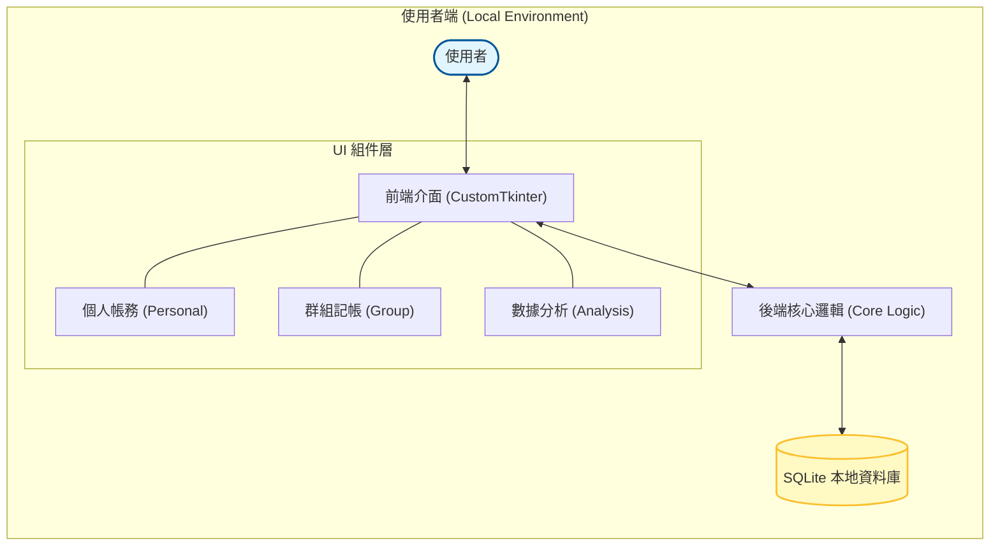

# 多人群組本地帳務系統
## 1. 專案情境與價值

在多人共同活動（如集體旅遊、朋友聚餐、合租生活）中，消費記錄與後續的債務結算往往是件繁瑣且容易出錯的事。雖然市面上已有許多分帳 App，但往往面臨隱私外洩、介面過於複雜、或必須依賴雲端伺服器才能運作的限制。

**「多人群組本地帳務系統 (group ledger)」** 應運而生，其核心目標是提供一個 **「隱私優先、離線可用」** 的個人與群組記帳平台。

### 專案價值主張：
1. **數據主權與隱私 (Privacy First)**
   - 所有帳務數據均儲存在使用者的本地 SQLite 資料庫中。
   - 數據不會上傳至任何第三方商業平台，確保個人消費習慣的絕對隱私。

2. **從個人到群組的無縫切換 (Dual-mode Integration)**
   - 系統整合了「個人私密帳務」與「多人共享帳務」兩種模式。
   - 使用者可以在同一個介面中管理自己的日常零用開銷，同時處理與朋友間的複雜分帳，無需在多個 App 間切換。

3. **狀態化債務管理 (Lifecycle Management)**
   - 每一筆交易都具備完整的生命週期（Pending -> Confirmed -> Settled）。
   - 透過「參與者確認機制」減少記帳爭議，確保結算過程的透明性。

---

## 2. 系統架構圖 (System Architecture)

---

## 3. 核心技術實作與概念

### 3.1 本地化優先架構 (Local-first Architecture)
系統核心基於 **SQLite** 非伺服器型資料庫，實作了「紀錄即持久化」的特性。
- **事務一致性**：透過 SQL Transaction 確保在處理多使用者分帳時，金額的增減具備原子性，避免出現數據不一致。
- **磁碟佔用極低**：即使擁有數千條帳務記錄，資料庫檔案大小仍保持在數 MB 以內，極具攜帶性。

### 3.2 現代化桌面介面 (CustomTkinter GUI)
捨棄了傳統 Tkinter 沉悶的視覺風格，採用 **CustomTkinter** 框架建構現代化介面。
- **高 DPI 支援**：自動適應 Windows/macOS 的視網膜螢幕縮放，確保文字與圖表清晰。
- **佈局管理**：採用 Grid 佈局系統與 Frame 模組化設計，實現了響應式視窗縮放與深色/淺色模式的一鍵切換。

---

## 4. 特色功能與演算法

### 4.1 個人與群組雙模切換 (Dual-mode Switching)
系統提供無縫的介面切換機制，讓使用者能同時管理兩類完全不同的帳務：
- **個人模組**：專注於私密性，記錄食衣住行等日常瑣碎開銷。
- **群組模組**：專注於協作性，支援多人共同記帳、好友管理與分帳功能。

### 4.2 債務生命週期狀態機 (Debt State Machine)
為了確保分帳的嚴謹性，系統實作了一套完整的債務狀態轉移邏輯：
- **Pending (待確認)**：當某人代付後，交易進入待確認狀態。
- **Confirmed (已確認)**：參與者確認金額無誤後，債務正式成立。
- **Settled (已結清)**：雙方完成轉帳並經由系統記錄後，債務宣告解除。

### 4.3 數據分析與視覺化 (Data Analysis)
內建強大的統計分析引擎，協助使用者掌握財務狀況：
- **消費分布圖**：利用 Matplotlib 產生圓餅圖，直觀顯示各大類別的支出佔比。
- **動態過濾**：支援按日期、類別進行篩選，提供多維度的開支報告。

---

## 5. 總結

**「多人群組本地帳務系統 (group ledger)」** 成功證明了在追求功能便利的同時，無需以犧牲數據隱私為代價。透過 Python 與 SQLite 的高效結合，我們打造出一個既能滿足個人私密記帳，又能支撐群組帳務協作的現代化財務管理工具。

這不僅是一個記帳程式，更是一個關於「數據自主權」的實踐。未來，本系統將持續優化性能，並探索更多智慧化的分析算法，讓每一位使用者的財務紀錄都能變得更清晰、更有價值。