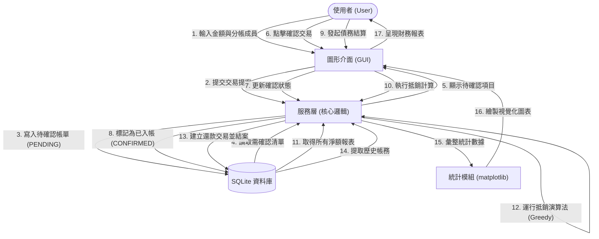

# 多人分帳系統：非同步驗證機制與債務抵銷演算法實作
## 專題計畫書

### 摘要
本系統以 Python + Tkinter 桌面應用程式為實作基礎，採用 SQLite 關聯式資料庫管理帳本資料[cite: 4]。針對多人群租、社交聚餐等情境中頻繁發生的代墊款項結算問題，設計一套具備非同步確認流程的分帳系統，解決「對話紀錄翻不完」的資訊雜訊[cite: 4]。

系統的核心設計包含三個面向：
1. **非同步驗證機制**：採用交易狀態機（Pending → Confirmed），所有支出須經相關分帳成員確認後才正式寫入帳本[cite: 4]。
2. **債務抵銷演算法**：將群組內網狀的墊付關係化簡為最精簡的清償清單[cite: 4]。
3. **數據統計與報表**：提供視覺化統計圖表與月度報表，確保月底結算一目了然[cite: 4]。

---

### 1. 前言
在多人群租或社交圈中，代墊款項（如日用品、餐費）本質上是一系列低頻率、高碎片化的非同步交易[cite: 4]。現有通訊軟體的對話紀錄缺乏結構化資料，難以解決「併發紀錄」與「對帳不一致」的痛點[cite: 4]。

本系統以本地端桌面應用程式為架構，透過交易狀態欄位（Transaction State）實現非同步確認流程，並搭配債務抵銷演算法（Debt Simplification Algorithm），將雜亂的網狀債務簡化為最精簡的現金流[cite: 4]。

---

### 2. 背景
在合租與社交情境中，代墊款項具備高頻率、小額且非同步的特性[cite: 4]。傳統通訊軟體雜亂的對話紀錄，常因資訊不對稱與時序混亂，導致月底對帳困難且易生爭議[cite: 4]。本系統旨在建立一套結構化的本地端記帳架構，提升結算的可信度與效率[cite: 4]。

---

### 3. 動機及目的

#### 3.1 動機
解決多人群組中，頻繁且瑣碎的代墊款項（Advanced Payments）結算難題[cite: 4]。核心架構採用「待確認（Pending）」狀態，經相關成員按下確認，或在特定時效內無異議後，交易才正式寫入帳本（Confirmed）[cite: 4]。

#### 3.2 目的
建立具備非同步確認機制的本地端帳本架構，解決併發紀錄下的確認衝突，提供自動化、可追蹤的對帳邏輯，確保財務透明[cite: 4]。

---

### 4. 執行方法及步驟

#### 4.1 資料蒐集與分析
* **4.1.1 使用者與群組模型**：紀錄 UserID、名稱、GroupID 以及群組成員名單[cite: 4]。
* **4.1.2 交易資料結構**：定義金額、付款人、分帳成員、時間戳記與交易狀態[cite: 4]。
* **4.1.3 資料庫建置**：採用 SQLite 關聯式資料庫，透過外鍵（Foreign Key）綁定關聯，確保資料完整性[cite: 4]。

#### 4.2 群組管理與隔離機制開發
* **4.2.1 群組生命週期管理**：透過後端業務邏輯（group_service.py）實作群組管理功能[cite: 4]。
* **4.2.2 邀請與授權**：產生專屬邀請連結或 QR Code，驗證後方可存取群組帳本[cite: 4]。
* **4.2.3 數據隔離**：嚴格透過 GroupID 過濾，防止不同群組帳務混淆[cite: 4]。

#### 4.3 分帳計算與交易狀態機模組
* **4.3.1 彈性分帳**：支援平分與自訂金額分攤，並處理零頭誤差（Rounding Error）[cite: 4]。
* **4.3.2 交易驗證**：任何支出預設為 Pending，須經確認才轉為 Confirmed，每次啟動應用程式時自動掃描待確認項[cite: 4]。
* **4.3.3 結算原則**：預設保留「原始債權」，另提供「債務抵銷模式」作為可選功能，利用圖論演算法簡化轉帳次數，避免社交摩擦[cite: 4]。
* **4.3.4 個人私帳模式 (NEW)**：支援不分帳的個人消費紀錄，系統將 group_id 標記為內部識別碼，此類帳務僅顯示於個人流水，不參與群組結算[cite: 4]。

#### 4.4 自動化催告與期限控管機制
* **4.4.1 動態還款期限**：依金額自動建議期限（例如 500 元內建議 5 天），僅作提示不具強制力[cite: 4]。
* **4.4.2 啟動自動提醒**：本地端啟動時自動掃描帳務，於主畫面顯示逾期提示[cite: 4]。
* **4.4.3 通知內容設計**：僅包含客觀資訊，保持中立友善，不使用法律威脅文字[cite: 4]。

#### 4.5 數據統計與視覺化分析模組
* **4.5.1 消費特徵統計**：計算總花費、墊付頻率與淨收支[cite: 4]。
* **4.5.2 視覺化圖表**：透過 matplotlib 生成圓餅圖（開銷佔比）與長條圖（墊付頻率）[cite: 4]。
* **4.5.3 日曆視圖**：使用 tkcalendar 提供日曆介面，點開特定日期即可查看交易紀錄[cite: 4]。

#### 4.6 數據流圖與演算法說明
本節詳細描述系統內部的數據流轉邏輯與核心抵銷演算法。

##### 4.6.1 數據流向圖 (Data Flow Diagram)
本圖表描述了「多人分帳系統」中，從使用者發起交易到最終結算的數據流轉過程。

### 資料流關鍵說明：
1.  **狀態機轉換**：數據的核心狀態流向為 `PENDING` (待確認) -> `CONFIRMED` (已入帳/待結) -> `SETTLED` (已結清)。
2.  **非同步確認**：交易發起後不會立即改變餘額，必須經過 `transaction_participants` 表中的成員確認後，數據才會流向「待結算」池。
3.  **抵銷邏輯**：在結算過程中，數據會先匯總成淨額 (Net Balances)，再由演算法計算出最精簡的轉帳路徑，產生類型為 `SETTLEMENT` 的新交易流。

##### 4.6.2 債務抵銷演算法介紹
本系統採用的簡化結算模式（SIMPLIFIED）核心使用了 **貪婪演算法 (Greedy Algorithm)** 來極小化群組動態結算時的轉帳次數。

## 1. 演算法名稱
我們稱之為 **「多方淨額抵銷演算法」(Greedy Debt Minimization)**。

## 2. 核心原理
該演算法的核心思想是：**不論中間經過多少次代墊，最後只需要讓「應付出的總額」流向「應收到的總額」即可。**

這是一個典型的抵銷邏輯：
- 如果 A 欠 B 100 元，B 欠 C 100 元。
- 傳統方式：需要兩次轉帳（A->B, B->C）。
- 抵銷方式：只需要 A 轉帳 100 元給 C。其餘債務自動消失。

## 3. 運行步驟
系統在 `group_service.py` 中的 `settle_debts` 方法按以下步驟執行：

1.  **計算淨餘額 (Net Balance)**：
    統計群組內每個人所有的應收與應付，算出一個最終數字。正數代表應收（債權人），負數代表應付（債務人）。
2.  **分類與排序**：
    將所有人分為「債務人清單」與「債權人清單」，並根據金額大小進行排序。
3.  **貪婪匹配 (Greedy Matching)**：
    讓金額最大的債務人優先配對金額最大的債權人，直接進行轉帳操作。
4.  **動態更新**：
    每次配對後，更新該兩人的餘額，若有人歸零則移出清單，重複直到所有人餘額都處理完畢。

## 4. 為何選擇此演算法？
-   **直觀高效**：演算法時間複雜度為 $O(N \log N)$，對於一般群組（數十人以內）可以在毫秒內完成。
-   **最小轉帳次數**：在大多數情況下，能從網狀的 $N(N-1)$ 個交易路徑縮減到不超過 $N-1$ 次交易。

---
> [!TIP]
> 這種演算法與知名分帳 App "Splitwise" 的結算邏輯非常相似，能有效降低社交場合中频繁轉帳的尷尬與麻煩。

---

### 5. 技術棧總整理

| 類別 | 技術 / 套件 | 用途 |
| :--- | :--- | :--- |
| **程式語言** | Python 3.x | 全端開發語言[cite: 4] |
| **GUI 框架** | Tkinter | 桌面應用程式介面[cite: 4] |
| **日曆元件** | tkcalendar | 日曆視圖介面[cite: 4] |
| **資料庫** | SQLite | 本地端帳本資料儲存[cite: 4] |
| **視覺化** | matplotlib | 圖表生成[cite: 4] |
| **QR Code** | qrcode | 個人識別與加好友[cite: 4] |
| **版本控制** | Git | 程式碼管理與協作[cite: 4] |

---

### 6. 預期成果
1. **非同步驗證帳本**：解決多人記帳的時序混亂與確認衝突[cite: 4]。
2. **UX 核心結算模組**：保留原始債權，並提供可選的債務化簡模式[cite: 4]。
3. **自動到期提醒系統**：啟動時自動掃描，以客觀文字提醒清償項目[cite: 4]。
4. **視覺化月度報表**：提供圖表統計與完整的技術文件[cite: 4]。
5. **全局記帳與私帳功能**：提供隨時可用的快速記帳按鈕，並支持個人私密消費紀錄[cite: 4]。

---

### 參考文獻
[1] Leslie Lamport, Time, Clocks, and the Ordering of Events in a Distributed System, 1978.[cite: 4]
[2] Andrew S. Tanenbaum, Distributed Systems: Principles and Paradigms, 2017.[cite: 4]
[3] Jakob Nielsen, Usability Engineering, 1994.[cite: 4]
[4] SQLite Documentation, https://www.sqlite.org/docs.html[cite: 4]
[5] Tkinter Documentation, Python Software Foundation.[cite: 4]
[6] matplotlib Documentation, https://matplotlib.org/stable/index.html[cite: 4]